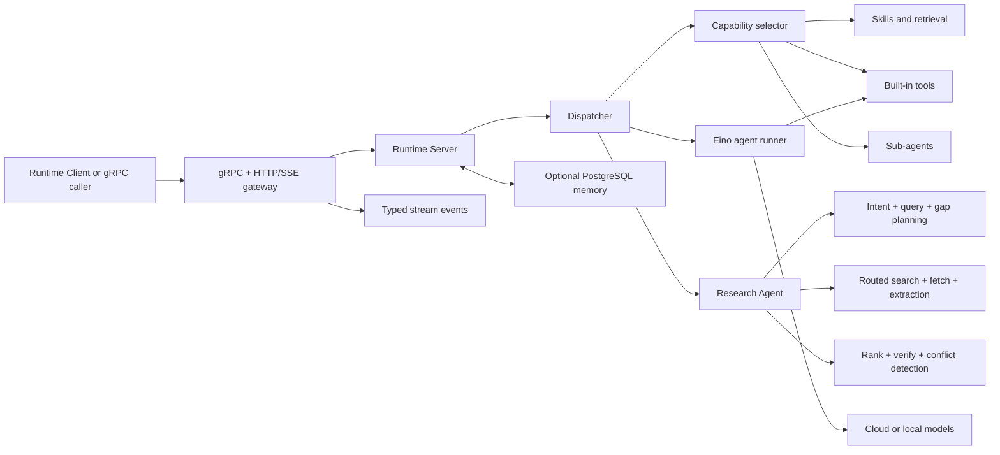

# Athena Agent Runtime

[English](README.md) | [简体中文](README.zh-CN.md)

GA guide: [Personal Agent OS 1.0 Runtime](doc/personal-agent-os-ga-v1.0.md) | [简体中文](doc/personal-agent-os-ga-v1.0.zh-CN.md)

Code guide: [Understand `agent-runtime` by subsystem and package](doc/code-guide/README.md)

Architecture: [Agent OS versioned delivery plan v0.2-v1.0](doc/athena-agent-os-version-roadmap-v0.2-v1.0.md) | [Agent OS v0.2 detailed architecture](doc/agent-os-architecture-plan-v0.2.md) | [Agent OS v0.3 effect-centric architecture](doc/agent-os-architecture-plan-v0.3.md) | [v0.3 evidence review](doc/v0.3-evidence-review.md) | [v0.3 protocol ADR](doc/adr/0001-v0.3-semantics-carriage.md) | [v0.2 compatibility matrix](doc/v0.2-compatibility-matrix.md) | [v0.2 release readiness](doc/v0.2-release-readiness.md) | [Athena Agent Architecture v2](doc/architecture-v2.md) | [Research Agent v3](doc/research-agent-v3.md) | [Research Agent v2](doc/research-agent-v2.md) | [Personal AI Operating System Specification v1.0](doc/personal-ai-os-spec-v1.md)

Browser usage: [Common Browser Commands](https://github.com/good-fish-man/athena-launcher/blob/main/docs/browser-command-guide.md)

Athena Agent Runtime is the execution and orchestration engine of the Athena agent platform. It accepts structured agent requests over gRPC or HTTP, selects relevant tools and skills, invokes language or image models, coordinates sub-agents, and streams typed execution events back to callers.

This repository contains the runtime only. User accounts, model bindings, agents, API keys, and the browser UI are managed by [`agent-runtime-client`](https://github.com/good-fish-man/agent-runtime-client) and [`athena-agent-ui`](https://github.com/good-fish-man/athena-agent-ui).

## Runtime in Action

The Runtime emits typed research progress, query, evidence, confidence, and final-answer events. The Athena UI renders those events as an inspectable evidence trail instead of an opaque loading state.


## Highlights

- gRPC API with an HTTP/SSE gateway.
- OpenAI-compatible model routing, including local Ollama models.
- Built-in file, shell, web, planning, task, and image-generation tools.
- Relevance-based tool and skill selection instead of sending every capability to the model.
- Fail-closed loading of human-approved, immutable Runtime Artifacts pinned by the current RunManifest; artifacts can organize but never grant capabilities.
- Skills, knowledge retrieval, uploaded-file context, and sub-agent orchestration.
- Project workspace tools for reading, searching, editing, and writing code.
- Optional PostgreSQL-backed long-term memory and background memory review.
- Local Diffusers image generation and generated-file serving.
- Trace propagation and source-aware error chains across HTTP, gRPC, tools, and models.
- Local-only administration endpoints for configuration, restart, and local-model lifecycle.
- Signed, versioned Capability Providers with fail-closed Registry grants,
  bounded host-mediated execution, and provenance-rich invocation audits.

## Architecture



Request flow:

1. The transport layer accepts a request and propagates `X-Trace-Id` into gRPC metadata and context.
2. The server resolves model configuration and optional memory context.
3. The dispatcher validates the reserved Runtime Artifact Bundle, consumes it before generic prompt rendering, and selects only reviewed plans whose required capabilities are already available.
4. For news, travel, comparison, or explicit research requests, the Research Agent plans source-aware queries, searches and fetches within a runtime budget, ranks and verifies evidence, and performs follow-up rounds while material gaps remain.
5. The Eino runner executes the model/tool loop and coordinates sub-agents when configured.
6. Results are returned as a completion or typed stream events such as `meta`, `delta`, `tool_call`, `error`, and `done`.

## Requirements

- Go 1.25 or newer.
- PostgreSQL only when the memory module is enabled.
- Docker only when sandboxed skills or commands are enabled.
- Ollama for local LLM/embedding models, or Python model dependencies for local Diffusers image models.

## Quick Start

```bash
git clone https://github.com/good-fish-man/agent-runtime.git
cd agent-runtime
cp config.yaml config.local.yaml
export DEFAULT_API_KEY="your-api-key"
AGENT_RUNTIME_CONFIG=config.local.yaml go run ./cmd/server
```

Default addresses:

| Service | Address |
| --- | --- |
| gRPC | `127.0.0.1:18080` |
| HTTP gateway | `http://127.0.0.1:18081` |
| Health check | `http://127.0.0.1:18081/healthz` |

Verify the service:

```bash
curl http://127.0.0.1:18081/healthz
```

For a complete local Athena installation, use [`athena-launcher`](https://github.com/good-fish-man/athena-launcher) instead of starting each service manually.

## Interfaces

### gRPC

The protocol is defined in [`proto/agent/runtime/v1/runtime.proto`](proto/agent/runtime/v1/runtime.proto). The main RPCs are:

- `Run` and `RunStream` for rich, configured runs.
- `RunAgent` and `RunAgentStream` for agent task execution.
- `Resume` and `Stop` for interruptible/checkpointed execution.
- `HealthCheck` for readiness checks.

See [`doc/grpc-client.md`](doc/grpc-client.md) for client examples.

### HTTP/SSE

| Method | Path | Purpose |
| --- | --- | --- |
| `GET` | `/healthz` | Runtime health |
| `POST` | `/run` | Rich completion or SSE run |
| `POST` | `/agent` | Agent completion or SSE run |
| `GET` | `/generated/*` | Generated image/file access |

Local administration routes are under `/admin/*` and reject non-loopback requests.

## Configuration

The default file is [`config.yaml`](config.yaml). Set `AGENT_RUNTIME_CONFIG` to use another file. Relative skill paths are resolved from the configuration file directory.

```yaml
server:
  grpc_addr: ":18080"
  http_addr: ":18081"
  default_model:
    provider: "openai"
    name: "gpt-4o-mini"
    api_key: "${DEFAULT_API_KEY}"
    api_base: "https://api.openai.com/v1"

memory:
  enabled: true
  auto_migrate: true

research:
  enabled: true
  providers: ["web", "github", "wikipedia", "arxiv", "news"]
  max_queries: 6
  max_pages: 8
  max_rounds: 3
  timeout_sec: 30

skills:
  dir: "skills"
  config_path: "config/skills-config.yaml"

plugins:
  enabled: true
  require_signature: true

```

Memory is enabled by default when the database is enabled. Athena Launcher installs and configures PostgreSQL automatically; standalone deployments must also set `db.enabled: true` and provide a reachable database. If the database is unavailable, the runtime continues without persistent memory and logs the connection error.

Environment overrides:

| Variable | Meaning |
| --- | --- |
| `AGENT_RUNTIME_CONFIG` | Configuration file path |
| `GRPC_ADDR`, `HTTP_ADDR` | Listen addresses |
| `DEFAULT_MODEL`, `DEFAULT_API_KEY`, `DEFAULT_API_BASE` | Fallback model settings |
| `SKILLS_DIR`, `GLOBAL_SKILLS_DIR`, `SKILLS_CONFIG_PATH` | Skill locations |
| `ATHENA_AGENT_BROWSER_BIN` | Verified `agent-browser` executable installed by Athena Launcher |
| `ATHENA_INTERNAL_SERVICE_TOKEN` | Shared local token used only for Runtime-to-Client task creation |
| `ATHENA_RUNTIME_CLIENT_INTERNAL_URL` | Internal scheduled-task endpoint (defaults to local Client `:8090`) |
| `ATHENA_RUNTIME_CLIENT_GOAL_URL` | Token-protected persistent-goal endpoint used by the declarative goal tool |
| `ATHENA_RESEARCH_CACHE_DIR` | Persistent public research-evidence cache directory |
| `ATHENA_RESEARCH_PROVIDERS` | Comma-separated Provider allowlist (`web,github,wikipedia,arxiv,news`) |
| `ATHENA_RESEARCH_MAX_QUERIES`, `ATHENA_RESEARCH_MAX_PAGES`, `ATHENA_RESEARCH_MAX_ROUNDS`, `ATHENA_RESEARCH_TIMEOUT_SEC` | Research budget overrides |
| `ATHENA_PLUGINS_ENABLED`, `ATHENA_PLUGINS_DIR` | Enable the signed Provider loader and set the immutable package root |
| `ATHENA_PLUGIN_REGISTRY_PATH`, `ATHENA_PLUGIN_TRUST_STORE_PATH`, `ATHENA_PLUGIN_AUDIT_PATH` | Registry grants, trusted Ed25519 keys, and invocation audit paths |
| `ATHENA_PLUGIN_REQUIRE_SIGNATURE` | Require a trusted package signature; defaults to `true` |
| `research.model_planning`, `research.semantic_verification`, `research.advisor_timeout_sec`, `research.max_advisor_claims` | V3 model-advisor settings in `config.yaml` |
| `ATHENA_GITHUB_TOKEN` or `GITHUB_TOKEN` | Optional GitHub API token for a higher search rate limit |
| `SANDBOX_IMAGE` | Default sandbox image |

Do not commit API keys. In the full platform, model credentials are resolved by `agent-runtime-client` and sent only with server-to-server requests.

## Built-in Capabilities

Runtime registers provider-independent capabilities rather than exposing implementation names as configuration. Stable IDs such as `internet.search`, `internet.fetch`, and `filesystem.read` are resolved to model-safe adapters (`internet_search`, etc.) at execution time. `GET /capabilities` returns the catalog, schemas, risk, provider, and availability. Requests and Sub-Agents configure abilities exclusively through `capabilities`; implementation tools are private Runtime providers.

The runtime can select `Glob`, `Grep`, `Read`, `Edit`, `Write`, `Bash`, web search/fetch, planning, task, and question tools. Public release archives include browser automation, CSV analysis, MarkItDown, S3 upload, and skill creation. The repository's PowerPoint skill source is excluded from releases because its third-party terms restrict redistribution.

Tools and skills are selected from the current prompt and recent context. Filesystem tools are scoped to the request's `project_dir`.

`DesktopAction` never accesses the Runtime host. It returns a structured request to the Athena desktop app, which searches only user-authorized local folders or opens an installed application by name, then sends the result back to the Agent. This design also works when Runtime is remote and never sends authorized folder roots in the initial request.

Research-heavy requests do not rely only on the model deciding whether to browse. The dispatcher invokes a three-layer Research Agent: the Decision Layer analyzes intent, creates queries, detects gaps, and plans follow-ups; the Search System routes source classes, searches, fetches, and extracts bounded content; the Evidence Layer deduplicates sources, ranks authority/relevance/freshness/corroboration, verifies claims, detects conflicts, and caches complete reports. Request cancellation remains fatal, while individual provider failures degrade to partial evidence.

V3 optionally asks the current request model to fill remaining query gaps and semantically review the strongest claims. All model output is constrained by code-owned source IDs, query budgets, timeouts, and allowlists; malformed or failed advice falls back to V2. Streaming requests expose one live research progress card, and advisor token usage is included in the final usage totals. See [Research Agent v3](doc/research-agent-v3.md).

The default adaptive budget permits up to 6 Provider searches, 8 page fetches, 3 research rounds, and 30 seconds. Work stops early when source count, domain diversity, authority, specialized-source requirements, and confidence are sufficient. V2 has independent public-web, GitHub API, Wikipedia API, arXiv API, and GDELT news Providers with per-Provider timeout and circuit breaking. Recent news reports are cached for 5 minutes and other public research reports for 1 hour in a memory-plus-disk cache. The model receives exact URLs, ranked sources, attributable claims, unresolved conflicts, remaining gaps, stop reason, and budget usage; raw page text remains bounded and explicitly untrusted.

### Signed Capability Providers

Runtime loads only `ACTIVE` entries from the v0.8 Provider Registry. Every
entry must resolve to an immutable `provider_id/version` directory, contain no
symlinks or executable assets, match the signed manifest/SBOM/asset payload and
trusted machine-scan digest, verify against an Ed25519 trust key, pass its
health check, support the current platform/runtime version, and stay within the
Registry's permission and resource grants. Registration is transactional: one
invalid capability rolls back the whole Provider without disturbing built-in
capabilities or other Providers.

External Providers never receive Runtime credentials directly and cannot run
generated code. Network requests are host-mediated, restricted to exact granted
domains, protected against private-network resolution and redirect escape, and
bounded by input/output size, timeout, and concurrency. Each invocation emits a
JSONL audit record containing Provider/version, capability, trace, permission
and resource snapshots, user/task provenance, manifest/input/output/Observation
hashes, timing, outcome, and Observation reference. Repeated failures open a
Provider-local circuit instead of destabilizing Runtime. Administrators can
reload the Registry through the loopback-only `POST /admin/plugins/reload`.

Server-side research uses `internet.search` and `internet.fetch` and never opens the user's local browser as a fallback. Local `browser.*` capabilities are exposed only when the user explicitly asks to open, navigate, observe, or interact with a visible page. An unknown named site may hand off URL discovery to Search System, then resume the original browser task in the same session. Authenticated pages switch to `browser.login`, where the user completes password, CAPTCHA, 2FA, or QR login; credentials and cookie values are never tool arguments. Athena Launcher installs the native browser CLI; standalone development must install `agent-browser` or set `ATHENA_AGENT_BROWSER_BIN`. See [Common Browser Commands](https://github.com/good-fish-man/athena-launcher/blob/main/docs/browser-command-guide.md).

`ScheduledTaskCreate` lets a user create durable ticket, product-stock, and explicitly selected appointment monitors during chat. Background runs are restricted to read-only web tools; purchases, reservations, appointment submission, CAPTCHA, queues, and payment require interactive user confirmation.

## Development

```bash
go test ./...
go vet ./...
go build -o bin/server ./cmd/server
```

Generate protobuf code after changing the protocol using your normal `protoc` toolchain, then commit both the `.proto` file and generated Go files.

## Observability

Inbound trace headers are propagated through HTTP, gRPC, database/model calls, and stream events. Errors are wrapped at each layer and logged once at the transport boundary with operation names and source locations. Pass `X-Trace-Id`, `X-Request-Id`, or `X-Correlation-Id` to correlate a request across services.

## Related Projects

- [`agent-runtime-client`](https://github.com/good-fish-man/agent-runtime-client): HTTP API, users, agents, model bindings, and persistence.
- [`athena-agent-ui`](https://github.com/good-fish-man/athena-agent-ui): browser management and chat interface.
- [`athena-launcher`](https://github.com/good-fish-man/athena-launcher): desktop installer and local service manager.

## License

Athena Agent Runtime is licensed under the [Apache License 2.0](LICENSE). See [NOTICE](NOTICE) for attribution and [THIRD_PARTY_NOTICES.md](THIRD_PARTY_NOTICES.md) for bundled components governed by separate terms.
