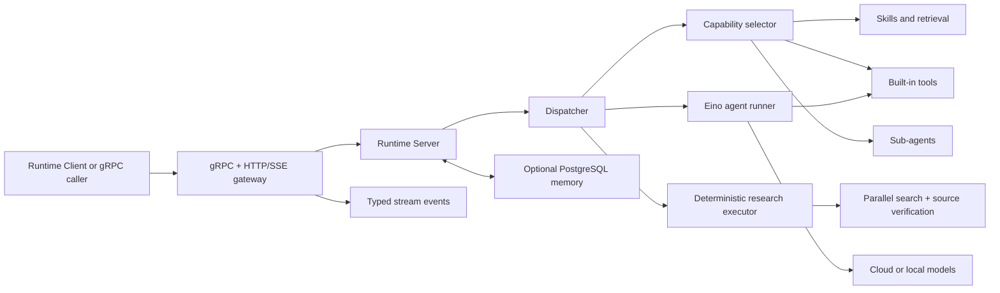

# Athena Agent Runtime

[English](README.md) | [简体中文](README.zh-CN.md)

Architecture: [Athena Agent Architecture v2](doc/architecture-v2.md) | [Personal AI Operating System Specification v1.0](doc/personal-ai-os-spec-v1.md)

Athena Agent Runtime is the execution and orchestration engine of the Athena agent platform. It accepts structured agent requests over gRPC or HTTP, selects relevant tools and skills, invokes language or image models, coordinates sub-agents, and streams typed execution events back to callers.

This repository contains the runtime only. User accounts, model bindings, agents, API keys, and the browser UI are managed by [`agent-runtime-client`](https://github.com/good-fish-man/agent-runtime-client) and [`athena-agent-ui`](https://github.com/good-fish-man/athena-agent-ui).

## Highlights

- gRPC API with an HTTP/SSE gateway.
- OpenAI-compatible model routing, including local Ollama models.
- Built-in file, shell, web, planning, task, and image-generation tools.
- Relevance-based tool and skill selection instead of sending every capability to the model.
- Skills, knowledge retrieval, uploaded-file context, and sub-agent orchestration.
- Project workspace tools for reading, searching, editing, and writing code.
- Optional PostgreSQL-backed long-term memory and background memory review.
- Local Diffusers image generation and generated-file serving.
- Trace propagation and source-aware error chains across HTTP, gRPC, tools, and models.
- Local-only administration endpoints for configuration, restart, and local-model lifecycle.

## Architecture



Request flow:

1. The transport layer accepts a request and propagates `X-Trace-Id` into gRPC metadata and context.
2. The server resolves model configuration and optional memory context.
3. The dispatcher selects relevant tools and up to the most relevant skills for the current request.
4. For news, travel, comparison, or explicit research requests, the research executor builds bounded date/locale-aware queries, searches in parallel, opens diverse sources, and injects verified evidence before model reasoning.
5. The Eino runner executes the model/tool loop and coordinates sub-agents when configured.
6. Results are returned as a completion or typed stream events such as `meta`, `delta`, `tool_call`, `error`, and `done`.

## Requirements

- Go 1.25 or newer.
- PostgreSQL only when the memory module is enabled.
- Docker only when sandboxed skills or commands are enabled.
- Ollama for local LLM/embedding models, or Python model dependencies for local Diffusers image models.

## Quick Start

```bash
git clone https://github.com/good-fish-man/agent-runtime.git
cd agent-runtime
cp config.yaml config.local.yaml
export DEFAULT_API_KEY="your-api-key"
AGENT_RUNTIME_CONFIG=config.local.yaml go run ./cmd/server
```

Default addresses:

| Service | Address |
| --- | --- |
| gRPC | `127.0.0.1:18080` |
| HTTP gateway | `http://127.0.0.1:18081` |
| Health check | `http://127.0.0.1:18081/healthz` |

Verify the service:

```bash
curl http://127.0.0.1:18081/healthz
```

For a complete local Athena installation, use [`athena-launcher`](https://github.com/good-fish-man/athena-launcher) instead of starting each service manually.

## Interfaces

### gRPC

The protocol is defined in [`proto/agent/runtime/v1/runtime.proto`](proto/agent/runtime/v1/runtime.proto). The main RPCs are:

- `Run` and `RunStream` for rich, configured runs.
- `RunAgent` and `RunAgentStream` for agent task execution.
- `Resume` and `Stop` for interruptible/checkpointed execution.
- `HealthCheck` for readiness checks.

See [`doc/grpc-client.md`](doc/grpc-client.md) for client examples.

### HTTP/SSE

| Method | Path | Purpose |
| --- | --- | --- |
| `GET` | `/healthz` | Runtime health |
| `POST` | `/run` | Rich completion or SSE run |
| `POST` | `/agent` | Agent completion or SSE run |
| `GET` | `/generated/*` | Generated image/file access |

Local administration routes are under `/admin/*` and reject non-loopback requests.

## Configuration

The default file is [`config.yaml`](config.yaml). Set `AGENT_RUNTIME_CONFIG` to use another file. Relative skill paths are resolved from the configuration file directory.

```yaml
server:
  grpc_addr: ":18080"
  http_addr: ":18081"
  default_model:
    provider: "openai"
    name: "gpt-4o-mini"
    api_key: "${DEFAULT_API_KEY}"
    api_base: "https://api.openai.com/v1"

memory:
  enabled: true
  auto_migrate: true

skills:
  dir: "skills"
  config_path: "config/skills-config.yaml"

```

Memory is enabled by default when the database is enabled. Athena Launcher installs and configures PostgreSQL automatically; standalone deployments must also set `db.enabled: true` and provide a reachable database. If the database is unavailable, the runtime continues without persistent memory and logs the connection error.

Environment overrides:

| Variable | Meaning |
| --- | --- |
| `AGENT_RUNTIME_CONFIG` | Configuration file path |
| `GRPC_ADDR`, `HTTP_ADDR` | Listen addresses |
| `DEFAULT_MODEL`, `DEFAULT_API_KEY`, `DEFAULT_API_BASE` | Fallback model settings |
| `SKILLS_DIR`, `GLOBAL_SKILLS_DIR`, `SKILLS_CONFIG_PATH` | Skill locations |
| `ATHENA_AGENT_BROWSER_BIN` | Verified `agent-browser` executable installed by Athena Launcher |
| `ATHENA_INTERNAL_SERVICE_TOKEN` | Shared local token used only for Runtime-to-Client task creation |
| `ATHENA_RUNTIME_CLIENT_INTERNAL_URL` | Internal scheduled-task endpoint (defaults to local Client `:8090`) |
| `SANDBOX_IMAGE` | Default sandbox image |

Do not commit API keys. In the full platform, model credentials are resolved by `agent-runtime-client` and sent only with server-to-server requests.

## Built-in Capabilities

Runtime registers provider-independent capabilities rather than exposing implementation names as configuration. Stable IDs such as `internet.search`, `internet.fetch`, and `filesystem.read` are resolved to model-safe adapters (`internet_search`, etc.) at execution time. `GET /capabilities` returns the catalog, schemas, risk, provider, and availability. Requests and Sub-Agents configure abilities exclusively through `capabilities`; implementation tools are private Runtime providers.

The runtime can select `Glob`, `Grep`, `Read`, `Edit`, `Write`, `Bash`, web search/fetch, planning, task, and question tools. Public release archives include browser automation, CSV analysis, MarkItDown, S3 upload, and skill creation. The repository's PowerPoint skill source is excluded from releases because its third-party terms restrict redistribution.

Tools and skills are selected from the current prompt and recent context. Filesystem tools are scoped to the request's `project_dir`.

`DesktopAction` never accesses the Runtime host. It returns a structured request to the Athena desktop app, which searches only user-authorized local folders or opens an installed application by name, then sends the result back to the Agent. This design also works when Runtime is remote and never sends authorized folder roots in the initial request.

Research-heavy requests do not rely only on the model deciding whether to browse. The dispatcher runs a code-controlled retrieval phase first: it resolves the user's local date, creates a bounded query plan, searches concurrently, deduplicates hosts and URLs, opens a limited set of sources, and records coverage failures without aborting the whole answer. Request cancellation remains fatal and immediately stops the phase. The evidence is bounded and marked as untrusted page content before it reaches the model.

The retrieval phase implements Agent Protocol v1.0 as code-owned limits: at most 2 searches, 3 page fetches, 6 planner iterations, and 20 seconds per pass. Search results are cached for 5 minutes and fetched pages for 1 hour. Every call becomes a compact Observation containing status, latency, summary, confidence, cache state, and error code. Sources are ranked by an explainable domain trust score, and only compressed facts, exact URLs, timestamps, and observations enter the model context. When a limit is reached, Runtime answers from the best evidence already collected instead of continuing an unbounded tool loop.

Public research uses `BrowserSearch`, `BrowserRead`, `BrowserAction`, and `BrowserClose` as a real-browser fallback when lightweight search is blocked. It discovers real result URLs, opens source pages, and permits only limited reversible navigation. Authenticated pages switch to `BrowserLogin`, where the user completes password, CAPTCHA, 2FA, or QR login. Credentials and cookies are never accepted as tool arguments. Athena Launcher installs the native browser CLI; standalone development must install `agent-browser` or set `ATHENA_AGENT_BROWSER_BIN`.

`ScheduledTaskCreate` lets a user create durable ticket, product-stock, and explicitly selected appointment monitors during chat. Background runs are restricted to read-only web tools; purchases, reservations, appointment submission, CAPTCHA, queues, and payment require interactive user confirmation.

## Development

```bash
go test ./...
go vet ./...
go build -o bin/server ./cmd/server
```

Generate protobuf code after changing the protocol using your normal `protoc` toolchain, then commit both the `.proto` file and generated Go files.

## Observability

Inbound trace headers are propagated through HTTP, gRPC, database/model calls, and stream events. Errors are wrapped at each layer and logged once at the transport boundary with operation names and source locations. Pass `X-Trace-Id`, `X-Request-Id`, or `X-Correlation-Id` to correlate a request across services.

## Related Projects

- [`agent-runtime-client`](https://github.com/good-fish-man/agent-runtime-client): HTTP API, users, agents, model bindings, and persistence.
- [`athena-agent-ui`](https://github.com/good-fish-man/athena-agent-ui): browser management and chat interface.
- [`athena-launcher`](https://github.com/good-fish-man/athena-launcher): desktop installer and local service manager.

## License

Athena Agent Runtime is licensed under the [Apache License 2.0](LICENSE). See [NOTICE](NOTICE) for attribution and [THIRD_PARTY_NOTICES.md](THIRD_PARTY_NOTICES.md) for bundled components governed by separate terms.
