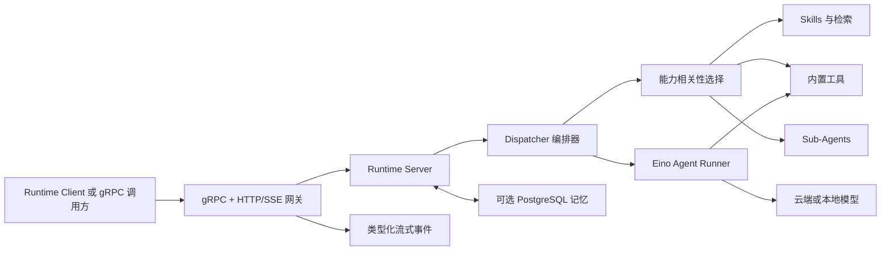

# Athena Agent Runtime

[English](README.md) | [简体中文](README.zh-CN.md)

Athena Agent Runtime 是 Athena Agent 平台的执行与编排引擎。它通过 gRPC 或 HTTP 接收结构化 Agent 请求，按相关性选择工具和 Skills，调用语言或图片模型，协调 Sub-Agents，并将类型化执行事件流式返回给调用方。

本仓库只包含 Runtime。用户、模型绑定、Agent、API Key 和浏览器管理界面由 [`agent-runtime-client`](https://github.com/good-fish-man/agent-runtime-client) 与 [`athena-agent-ui`](https://github.com/good-fish-man/athena-agent-ui) 提供。

## 核心能力

- gRPC API 与 HTTP/SSE 网关。
- OpenAI 兼容模型路由，包括本地 Ollama 模型。
- 文件、Shell、联网、计划、任务和图片生成工具。
- 根据请求相关性选择 Tools 与 Skills，而不是一次性把所有能力发送给模型。
- Skills、知识库检索、上传文件上下文和 Sub-Agent 编排。
- 面向项目目录的代码读取、搜索、编辑和写入能力。
- 可选的 PostgreSQL 长期记忆与后台记忆整理。
- 本地 Diffusers 图片生成和生成文件访问。
- HTTP、gRPC、工具与模型调用之间的 Trace 传递和带源码位置的错误链。
- 仅允许本机访问的配置、重启和本地模型生命周期管理接口。

## 架构



请求流程：

1. 接入层接收请求，并把 `X-Trace-Id` 传入 gRPC metadata 和 context。
2. Server 解析模型配置，并按需加载长期记忆。
3. Dispatcher 为当前请求选择相关 Tools 和最多若干个最相关 Skills。
4. Eino Runner 执行模型/工具循环，并在配置后协调 Sub-Agents。
5. 返回完整结果，或返回 `meta`、`delta`、`tool_call`、`error`、`done` 等流式事件。

## 环境要求

- Go 1.25 或更高版本。
- 仅在启用记忆模块时需要 PostgreSQL。
- 仅在使用沙箱 Skills 或命令时需要 Docker。
- 本地 LLM/Embedding 模型需要 Ollama，本地 Diffusers 图片模型需要对应 Python 依赖。

## 快速开始

```bash
git clone https://github.com/good-fish-man/agent-runtime.git
cd agent-runtime
cp config.yaml config.local.yaml
export DEFAULT_API_KEY="your-api-key"
AGENT_RUNTIME_CONFIG=config.local.yaml go run ./cmd/server
```

默认地址：

| 服务 | 地址 |
| --- | --- |
| gRPC | `127.0.0.1:18080` |
| HTTP 网关 | `http://127.0.0.1:18081` |
| 健康检查 | `http://127.0.0.1:18081/healthz` |

验证服务：

```bash
curl http://127.0.0.1:18081/healthz
```

如果需要完整的本地 Athena 环境，建议直接使用 [`athena-launcher`](https://github.com/good-fish-man/athena-launcher)，不需要手工逐个启动服务。

## 接口

### gRPC

协议定义位于 [`proto/agent/runtime/v1/runtime.proto`](proto/agent/runtime/v1/runtime.proto)，主要 RPC 包括：

- `Run`、`RunStream`：执行包含完整配置的请求。
- `RunAgent`、`RunAgentStream`：执行 Agent 任务。
- `Resume`、`Stop`：恢复或停止可中断任务。
- `HealthCheck`：健康与就绪检查。

调用示例参见 [`doc/grpc-client.md`](doc/grpc-client.md)。

### HTTP/SSE

| 方法 | 路径 | 用途 |
| --- | --- | --- |
| `GET` | `/healthz` | Runtime 健康检查 |
| `POST` | `/run` | 完整返回或 SSE 执行 |
| `POST` | `/agent` | Agent 完整返回或 SSE 执行 |
| `GET` | `/generated/*` | 访问生成的图片或文件 |

本地管理接口位于 `/admin/*`，非本机请求会被拒绝。

## 配置

默认配置文件为 [`config.yaml`](config.yaml)。通过 `AGENT_RUNTIME_CONFIG` 可指定其他文件。Skills 的相对路径以配置文件所在目录为基准解析。

```yaml
server:
  grpc_addr: ":18080"
  http_addr: ":18081"
  default_model:
    provider: "openai"
    name: "gpt-4o-mini"
    api_key: "${DEFAULT_API_KEY}"
    api_base: "https://api.openai.com/v1"

memory:
  enabled: true
  auto_migrate: true

skills:
  dir: "skills"
  config_path: "config/skills-config.yaml"
```

数据库启用时，长期记忆默认开启。Athena Launcher 会自动安装并配置 PostgreSQL；独立部署时还需要设置 `db.enabled: true` 并提供可连接的数据库。数据库不可用时，runtime 会记录连接错误并降级为无持久记忆模式，不会阻止基础对话服务启动。

环境变量覆盖：

| 变量 | 说明 |
| --- | --- |
| `AGENT_RUNTIME_CONFIG` | 配置文件路径 |
| `GRPC_ADDR`、`HTTP_ADDR` | 监听地址 |
| `DEFAULT_MODEL`、`DEFAULT_API_KEY`、`DEFAULT_API_BASE` | 兜底模型配置 |
| `SKILLS_DIR`、`GLOBAL_SKILLS_DIR`、`SKILLS_CONFIG_PATH` | Skills 路径 |
| `SANDBOX_IMAGE` | 默认沙箱镜像 |

不要提交 API Key。完整平台中，模型凭据由 `agent-runtime-client` 解析，只通过服务间请求传递给 Runtime。

## 内置能力

Runtime 可按需选择 `Glob`、`Grep`、`Read`、`Edit`、`Write`、`Bash`、联网搜索、计划、任务和提问工具。公开发行包包含浏览器自动化、CSV 分析、MarkItDown、S3 上传和 Skill 创建等 Skills。仓库中的 PowerPoint Skill 受第三方条款限制，不会进入公开发行包。

Tools 和 Skills 会根据当前描述与最近上下文进行筛选。文件工具的访问范围由请求中的 `project_dir` 限定。

## 开发

```bash
go test ./...
go vet ./...
go build -o bin/server ./cmd/server
```

修改协议后，请使用项目采用的 `protoc` 工具链重新生成代码，并同时提交 `.proto` 和生成的 Go 文件。

## 日志与定位

入口 Trace Header 会贯穿 HTTP、gRPC、数据库/模型调用和流式事件。错误在每一层追加业务操作与源码位置，最终只在接入边界输出一次完整错误链。可传入 `X-Trace-Id`、`X-Request-Id` 或 `X-Correlation-Id`，跨服务关联同一次请求。

## 相关项目

- [`agent-runtime-client`](https://github.com/good-fish-man/agent-runtime-client)：HTTP API、用户、Agent、模型绑定和持久化。
- [`athena-agent-ui`](https://github.com/good-fish-man/athena-agent-ui)：浏览器管理与聊天界面。
- [`athena-launcher`](https://github.com/good-fish-man/athena-launcher)：桌面安装器和本地服务管理器。

## 许可证

Athena Agent Runtime 使用 [Apache License 2.0](LICENSE)。版权声明参见 [NOTICE](NOTICE)，使用独立条款的内置组件参见 [THIRD_PARTY_NOTICES.md](THIRD_PARTY_NOTICES.md)。
