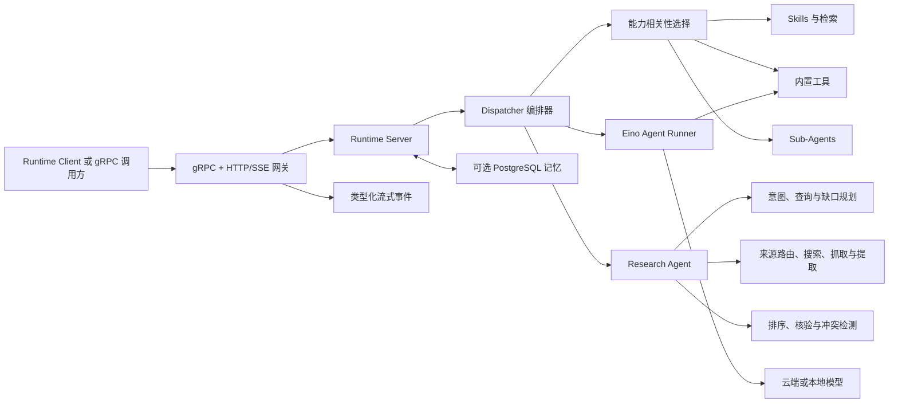

# Athena Agent Runtime

[English](README.md) | [简体中文](README.zh-CN.md) | [Research Agent v3](doc/research-agent-v3.md) | [Research Agent v2](doc/research-agent-v2.md)

架构设计：[Agent OS 分版本落地计划 v0.2-v1.0](doc/athena-agent-os-version-roadmap-v0.2-v1.0.zh-CN.md) | [Agent OS v0.2 详细架构](doc/agent-os-architecture-plan-v0.2.zh-CN.md) | [v0.2 跨仓库兼容矩阵](doc/v0.2-compatibility-matrix.zh-CN.md) | [v0.2 发布就绪报告](doc/v0.2-release-readiness.zh-CN.md) | [Athena Agent Architecture v2](doc/architecture-v2.md) | [Personal AI Operating System Specification v1.0](doc/personal-ai-os-spec-v1.md)

浏览器使用：[常见浏览器命令](https://github.com/good-fish-man/athena-launcher/blob/main/docs/browser-command-guide.md#简体中文)

Athena Agent Runtime 是 Athena Agent 平台的执行与编排引擎。它通过 gRPC 或 HTTP 接收结构化 Agent 请求，按相关性选择工具和 Skills，调用语言或图片模型，协调 Sub-Agents，并将类型化执行事件流式返回给调用方。

本仓库只包含 Runtime。用户、模型绑定、Agent、API Key 和浏览器管理界面由 [`agent-runtime-client`](https://github.com/good-fish-man/agent-runtime-client) 与 [`athena-agent-ui`](https://github.com/good-fish-man/athena-agent-ui) 提供。

## Runtime 实际效果

Runtime 会输出类型化的研究进度、查询词、证据、置信度和最终回答事件。Athena UI 将这些事件展示为可检查的证据链，而不是一个无法解释的等待动画。


## 核心能力

- gRPC API 与 HTTP/SSE 网关。
- OpenAI 兼容模型路由，包括本地 Ollama 模型。
- 文件、Shell、联网、计划、任务和图片生成工具。
- 根据请求相关性选择 Tools 与 Skills，而不是一次性把所有能力发送给模型。
- Skills、知识库检索、上传文件上下文和 Sub-Agent 编排。
- 面向项目目录的代码读取、搜索、编辑和写入能力。
- 可选的 PostgreSQL 长期记忆与后台记忆整理。
- 本地 Diffusers 图片生成和生成文件访问。
- HTTP、gRPC、工具与模型调用之间的 Trace 传递和带源码位置的错误链。
- 仅允许本机访问的配置、重启和本地模型生命周期管理接口。

## 架构



请求流程：

1. 接入层接收请求，并把 `X-Trace-Id` 传入 gRPC metadata 和 context。
2. Server 解析模型配置，并按需加载长期记忆。
3. Dispatcher 为当前请求选择相关 Tools 和最多若干个最相关 Skills。
4. 新闻、旅行、对比或显式调研请求会先进入 Research Agent：生成按来源分类的查询计划，在预算内搜索和抓取，排序并核验证据，并在仍有重要缺口时自动补查。
5. Eino Runner 执行模型/工具循环，并在配置后协调 Sub-Agents。
6. 返回完整结果，或返回 `meta`、`delta`、`tool_call`、`error`、`done` 等流式事件。

## 环境要求

- Go 1.25 或更高版本。
- 仅在启用记忆模块时需要 PostgreSQL。
- 仅在使用沙箱 Skills 或命令时需要 Docker。
- 本地 LLM/Embedding 模型需要 Ollama，本地 Diffusers 图片模型需要对应 Python 依赖。

## 快速开始

```bash
git clone https://github.com/good-fish-man/agent-runtime.git
cd agent-runtime
cp config.yaml config.local.yaml
export DEFAULT_API_KEY="your-api-key"
AGENT_RUNTIME_CONFIG=config.local.yaml go run ./cmd/server
```

默认地址：

| 服务 | 地址 |
| --- | --- |
| gRPC | `127.0.0.1:18080` |
| HTTP 网关 | `http://127.0.0.1:18081` |
| 健康检查 | `http://127.0.0.1:18081/healthz` |

验证服务：

```bash
curl http://127.0.0.1:18081/healthz
```

如果需要完整的本地 Athena 环境，建议直接使用 [`athena-launcher`](https://github.com/good-fish-man/athena-launcher)，不需要手工逐个启动服务。

## 接口

### gRPC

协议定义位于 [`proto/agent/runtime/v1/runtime.proto`](proto/agent/runtime/v1/runtime.proto)，主要 RPC 包括：

- `Run`、`RunStream`：执行包含完整配置的请求。
- `RunAgent`、`RunAgentStream`：执行 Agent 任务。
- `Resume`、`Stop`：恢复或停止可中断任务。
- `HealthCheck`：健康与就绪检查。

调用示例参见 [`doc/grpc-client.md`](doc/grpc-client.md)。

### HTTP/SSE

| 方法 | 路径 | 用途 |
| --- | --- | --- |
| `GET` | `/healthz` | Runtime 健康检查 |
| `POST` | `/run` | 完整返回或 SSE 执行 |
| `POST` | `/agent` | Agent 完整返回或 SSE 执行 |
| `GET` | `/generated/*` | 访问生成的图片或文件 |

本地管理接口位于 `/admin/*`，非本机请求会被拒绝。

## 配置

默认配置文件为 [`config.yaml`](config.yaml)。通过 `AGENT_RUNTIME_CONFIG` 可指定其他文件。Skills 的相对路径以配置文件所在目录为基准解析。

```yaml
server:
  grpc_addr: ":18080"
  http_addr: ":18081"
  default_model:
    provider: "openai"
    name: "gpt-4o-mini"
    api_key: "${DEFAULT_API_KEY}"
    api_base: "https://api.openai.com/v1"

memory:
  enabled: true
  auto_migrate: true

research:
  enabled: true
  providers: ["web", "github", "wikipedia", "arxiv", "news"]
  max_queries: 6
  max_pages: 8
  max_rounds: 3
  timeout_sec: 30

skills:
  dir: "skills"
  config_path: "config/skills-config.yaml"

```

数据库启用时，长期记忆默认开启。Athena Launcher 会自动安装并配置 PostgreSQL；独立部署时还需要设置 `db.enabled: true` 并提供可连接的数据库。数据库不可用时，runtime 会记录连接错误并降级为无持久记忆模式，不会阻止基础对话服务启动。

环境变量覆盖：

| 变量 | 说明 |
| --- | --- |
| `AGENT_RUNTIME_CONFIG` | 配置文件路径 |
| `GRPC_ADDR`、`HTTP_ADDR` | 监听地址 |
| `DEFAULT_MODEL`、`DEFAULT_API_KEY`、`DEFAULT_API_BASE` | 兜底模型配置 |
| `SKILLS_DIR`、`GLOBAL_SKILLS_DIR`、`SKILLS_CONFIG_PATH` | Skills 路径 |
| `ATHENA_AGENT_BROWSER_BIN` | Athena Launcher 安装并校验的 `agent-browser` 可执行文件 |
| `ATHENA_INTERNAL_SERVICE_TOKEN` | 仅用于 Runtime 向 Client 创建任务的本机共享令牌 |
| `ATHENA_RUNTIME_CLIENT_INTERNAL_URL` | 内部定时任务地址，默认使用本机 Client `:8090` |
| `ATHENA_RUNTIME_CLIENT_GOAL_URL` | 声明式长期 Goal 工具调用的受保护内部地址 |
| `ATHENA_RESEARCH_CACHE_DIR` | 公开研究证据的持久化缓存目录 |
| `ATHENA_RESEARCH_PROVIDERS` | Provider 白名单，使用逗号分隔（`web,github,wikipedia,arxiv,news`） |
| `ATHENA_RESEARCH_MAX_QUERIES`、`ATHENA_RESEARCH_MAX_PAGES`、`ATHENA_RESEARCH_MAX_ROUNDS`、`ATHENA_RESEARCH_TIMEOUT_SEC` | 研究预算覆盖参数 |
| `research.model_planning`、`research.semantic_verification`、`research.advisor_timeout_sec`、`research.max_advisor_claims` | `config.yaml` 中的 V3 模型顾问配置 |
| `ATHENA_GITHUB_TOKEN` 或 `GITHUB_TOKEN` | 可选 GitHub API Token，用于提高搜索限额 |
| `SANDBOX_IMAGE` | 默认沙箱镜像 |

不要提交 API Key。完整平台中，模型凭据由 `agent-runtime-client` 解析，只通过服务间请求传递给 Runtime。

## 内置能力

Runtime 以供应商无关的能力注册取代实现工具名配置。`internet.search`、`internet.fetch`、`filesystem.read` 等稳定 ID 会在执行时解析为模型可调用的适配器（如 `internet_search`）。`GET /capabilities` 返回能力目录、输入输出、风险、Provider 和可用状态。请求与 Sub-Agent 只能通过 `capabilities` 配置能力，具体工具仅作为 Runtime 内部 Provider。

Runtime 可按需选择 `Glob`、`Grep`、`Read`、`Edit`、`Write`、`Bash`、联网搜索、计划、任务和提问工具。公开发行包包含浏览器自动化、CSV 分析、MarkItDown、S3 上传和 Skill 创建等 Skills。仓库中的 PowerPoint Skill 受第三方条款限制，不会进入公开发行包。

Tools 和 Skills 会根据当前描述与最近上下文进行筛选。文件工具的访问范围由请求中的 `project_dir` 限定。

`DesktopAction` 不会访问 Runtime 所在主机。它只向 Athena 桌面端返回结构化请求，由桌面端在用户明确授权的本地目录中查询文件，或按名称打开已安装应用，再把结果回传给 Agent。该设计同样支持远程 Runtime，并且初始请求不会上传授权目录路径。

研究型请求不再只依赖模型自行判断是否联网。Dispatcher 会调用三层 Research Agent：Decision Layer 负责意图分析、查询规划、缺口检测和后续补查；Search System 负责来源路由、搜索、抓取和有限内容提取；Evidence Layer 负责来源去重，按权威性、相关性、时效性和交叉佐证排序，提取并核验主张、检测冲突和缓存完整报告。用户取消仍会立即终止执行，单个 Provider 失败则降级为部分证据。

V3 可以让当前请求模型在剩余预算内补充查询，并对关键主张做语义核验。模型输出仍受来源 ID、查询预算、超时和白名单约束；非 JSON、超时或调用失败都会自动回退 V2。流式请求会显示一张持续更新的研究进度卡，Advisor 消耗的 token 也会计入最终用量。详见 [Research Agent v3](doc/research-agent-v3.md)。

默认自适应预算最多允许 6 次 Provider 搜索、抓取 8 个网页、执行 3 轮研究和耗时 30 秒；来源数量、域名多样性、权威来源、专业来源要求和置信度足够时会提前结束。V2 已提供独立的公共网页、GitHub API、Wikipedia API、arXiv API 和 GDELT 新闻 Provider，并为每个 Provider 增加超时和熔断。新闻报告缓存 5 分钟，其他公开研究报告通过内存加磁盘缓存保存 1 小时。模型最终收到准确 URL、已排序来源、可追溯主张、未解决冲突、剩余缺口、停止原因和预算使用情况；网页原文仍会被限制长度并标记为不可信内容。

服务端联网研究只使用 `internet.search` 和 `internet.fetch`，搜索失败时不会打开用户的本地浏览器兜底。只有用户明确要求打开、导航、观察或操作可见页面时，Runtime 才会暴露本地 `browser.*` 能力。对于只有网站名称但没有准确网址的浏览器任务，Browser Runtime 可以把网址发现交给 Search System，再在同一个 Session 中继续原任务。遇到认证页面时切换到 `browser.login`，由用户自行完成密码、验证码、二次验证或扫码登录；账号密码和 Cookie 值不会作为工具参数传输。Athena Launcher 会安装原生浏览器 CLI；独立开发环境必须自行安装 `agent-browser` 或设置 `ATHENA_AGENT_BROWSER_BIN`。常见表达参见[浏览器命令手册](https://github.com/good-fish-man/athena-launcher/blob/main/docs/browser-command-guide.md#简体中文)。

`ScheduledTaskCreate` 支持用户在聊天中创建持久化的票务、商品库存和已明确选择的号源监控。后台执行只允许只读联网工具；购买、预订、挂号提交、验证码、排队和付款必须由用户在交互式会话中确认。

## 开发

```bash
go test ./...
go vet ./...
go build -o bin/server ./cmd/server
```

修改协议后，请使用项目采用的 `protoc` 工具链重新生成代码，并同时提交 `.proto` 和生成的 Go 文件。

## 日志与定位

入口 Trace Header 会贯穿 HTTP、gRPC、数据库/模型调用和流式事件。错误在每一层追加业务操作与源码位置，最终只在接入边界输出一次完整错误链。可传入 `X-Trace-Id`、`X-Request-Id` 或 `X-Correlation-Id`，跨服务关联同一次请求。

## 相关项目

- [`agent-runtime-client`](https://github.com/good-fish-man/agent-runtime-client)：HTTP API、用户、Agent、模型绑定和持久化。
- [`athena-agent-ui`](https://github.com/good-fish-man/athena-agent-ui)：浏览器管理与聊天界面。
- [`athena-launcher`](https://github.com/good-fish-man/athena-launcher)：桌面安装器和本地服务管理器。

## 许可证

Athena Agent Runtime 使用 [Apache License 2.0](LICENSE)。版权声明参见 [NOTICE](NOTICE)，使用独立条款的内置组件参见 [THIRD_PARTY_NOTICES.md](THIRD_PARTY_NOTICES.md)。
