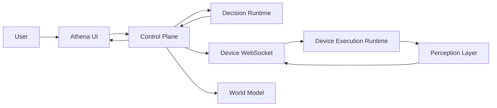
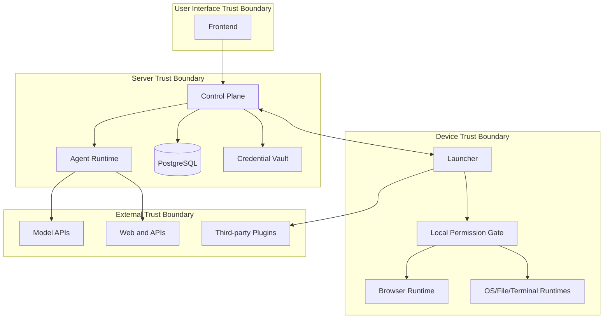
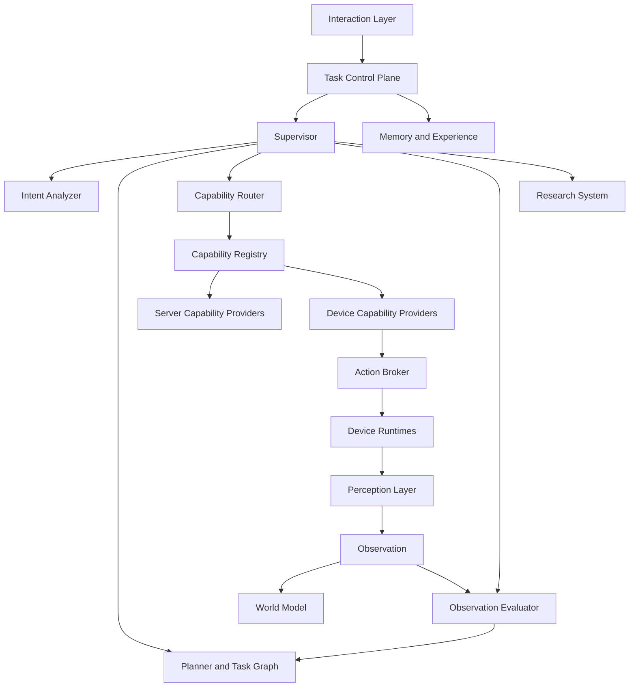

# Athena Agent OS Architecture Plan

[中文评审版](./agent-os-architecture-plan-v0.2.zh-CN.md)

> Delivery order, release scope, and release gates are governed by the [Athena Agent OS version roadmap](./athena-agent-os-version-roadmap-v0.2-v1.0.md). This document explains the `v0.2` target architecture; the roadmap takes precedence if the documents conflict.

| Field | Value |
| --- | --- |
| Target release | `v0.2.0` |
| Document version | `0.1-draft` |
| Status | Architecture review |
| Baseline | Athena `v0.1.5` |
| Scope | Digital Agent OS |
| Out of scope | Robot motion, smart-home hardware, unrestricted self-modification |

## 1. Document purpose

This document defines the target architecture for evolving Athena from an agent application into a digital Agent Operating System. It is an architecture plan, not an implementation schedule.

It answers the following questions:

1. Which service owns each responsibility and each durable state.
2. How natural-language goals become controlled, observable actions.
3. How capabilities, plugins, tasks, observations, and world state are represented.
4. How browser, desktop, file, terminal, research, memory, and future physical runtimes fit together.
5. How the system remains safe, debuggable, resumable, and independently deployable.
6. Which parts of Athena `v0.1.5` are retained, adapted, or replaced.

## 2. Architecture decision summary

The proposed architecture makes the following primary decisions.

### 2.1 Keep the current repositories

The current repositories remain independent deployable units:

- `agent-runtime`: decision and reasoning plane.
- `agent-runtime-client`: API, identity, persistence, task control, and device control plane.
- `athena-launcher`: desktop device runtime and local perception plane.
- `frontend/agent-ui`: presentation and user-interaction plane.
- `logx`: shared observability and structured-error library.

The logical name of `agent-runtime-client` becomes **Athena Control Plane** in architecture documents. Renaming the repository is not required for `v0.2.0`.

### 2.2 Add a neutral protocol package

A new small repository or independently versioned Go module named `athena-protocol` is recommended. It owns:

- Protobuf contracts.
- JSON schemas.
- Generated Go types.
- Generated TypeScript types.
- Protocol conformance fixtures.
- Compatibility and schema-validation tests.

No business logic belongs in this package. This removes the current direct dependency from `agent-runtime-client` to generated code inside `agent-runtime` and prevents Action/Observation definitions from drifting between services.

### 2.3 Separate control, decision, execution, and perception



- **Control Plane** owns durable tasks, identity, policy workflow, device routing, approvals, events, and world projections.
- **Decision Runtime** understands goals, creates plans, selects capabilities, evaluates observations, and produces the next decision.
- **Execution Runtime** performs typed actions but never decides the user's goal.
- **Perception Layer** describes the observed world but never decides what should happen next.
- **Frontend** renders state and collects user decisions but never executes actions itself.

### 2.4 Use capabilities, not tools, as the public abstraction

An agent sees stable capability contracts such as `browser.navigate@1`. A tool, SDK, browser binary, API, or operating-system command is only a provider implementation.

### 2.5 Use an event-driven task model

Every goal becomes a durable Task. Every decision and environmental change becomes an event. Current state is a projection of those events. An interrupted task can be reconstructed and resumed without asking the model to infer what happened.

### 2.6 Treat the World Model as observed state, not absolute truth

Every world fact carries source, confidence, observation time, scope, revision, and optional expiry. Conflicting observations are retained and reconciled rather than silently overwritten.

### 2.7 Keep the kernel non-pluggable

The following are Agent OS kernel responsibilities and must not be replaceable by arbitrary plugins:

- Protocol validation.
- Identity and tenant isolation.
- Policy enforcement.
- Task state transitions.
- Event persistence.
- Capability permission enforcement.
- World Model consistency rules.
- Audit logging.

Capabilities, runtimes, perception providers, ontology packs, and skills may be extensible.

## 3. Goals and non-goals

### 3.1 Goals for `v0.2.0`

- Understand conversational, research, browser, desktop, file, terminal, planning, and scheduled-task intents.
- Select only capabilities relevant to the current task.
- Execute multi-step goals through a bounded Plan/Action/Observation/Evaluation loop.
- Preserve task state across frontend closure, service restart, and device reconnection.
- Maintain a user-scoped World Model for active digital environments.
- Require explicit approval for consequential operations.
- Provide complete traces for model, capability, device, database, and plugin operations.
- Allow independently installed capability and perception plugins.
- Preserve current users, agents, models, chat history, and browser sessions during migration.

### 3.2 Non-goals for `v0.2.0`

- General robot motion planning.
- Safety certification for physical machinery.
- Fully autonomous financial transactions.
- CAPTCHA or anti-bot bypass.
- Automatically enabling generated source code.
- Persisting hidden model reasoning or chain-of-thought.
- Making every internal package a plugin.
- Creating one code path per website.

## 4. Core design principles

1. The model proposes; deterministic code validates and controls.
2. No action is successful until the environment confirms it through an Observation.
3. Every side effect is associated with a Task, Step, Action, user, device, trace, and policy decision.
4. Capabilities are stable contracts; providers are replaceable implementations.
5. Simple tasks use a fast path. Multi-agent planning is used only when complexity warrants it.
6. Search and interactive browser control remain separate systems.
7. Perception is independent from execution and decision-making.
8. User data and device state are isolated by default.
9. At-least-once delivery plus idempotency is used instead of claiming impossible exactly-once delivery.
10. Dynamic state expires unless refreshed.
11. Core protocol changes require coordinated releases across Runtime, Control Plane, Launcher, and Frontend.
12. Failures are first-class task events, not only log messages.

## 5. System context

### 5.1 Actors

- End user.
- Administrator.
- Athena Desktop device.
- Remote Athena Control Plane.
- Model provider.
- Search and content providers.
- Capability plugin publisher.
- Future robot or IoT device.

### 5.2 Trust boundaries



The Control Plane never assumes that a model-generated action is safe. The Launcher never assumes that a server-routed action is locally permitted. Either layer may raise the required risk level or block execution; neither may silently lower it.

## 6. Repository and component responsibilities

### 6.1 `agent-runtime`: Decision Plane

Owns:

- Intent analysis.
- Domain classification.
- Supervisor Agent.
- Task-plan generation and plan revision.
- Specialist-agent selection.
- Capability selection and argument generation.
- Research orchestration.
- Observation evaluation.
- Response synthesis.
- Model adapters and context budgeting.

Does not own:

- User authentication.
- Durable Task state.
- Device WebSocket connections.
- Device credentials.
- Browser or operating-system execution.
- Authoritative user configuration.

The Runtime should become horizontally scalable and mostly stateless. It receives an immutable Decision Request and emits structured Decision Events.

### 6.2 `agent-runtime-client`: Control Plane

Owns:

- HTTP/gRPC API presented to clients.
- Users, roles, agents, models, credentials, conversations, and chat history.
- Durable Task and Step aggregates.
- Task event log and current projections.
- Device registration, pairing, binding, status, and capability inventory.
- Action dispatch and Observation correlation.
- Approval workflow.
- World Model persistence and queries.
- Scheduled-task coordination.
- Runtime invocation and stream mediation.
- Usage accounting and audit records.

It is the only service allowed to transition durable Task status.

### 6.3 `athena-launcher`: Device Data Plane

Owns:

- Device identity and revocable device token.
- Persistent outbound WebSocket connection.
- Local capability inventory.
- Browser, desktop, file, terminal, audio, and vision execution adapters.
- Local permission gate.
- Local process management.
- Local browser/profile/session state.
- Perception providers and artifact capture.
- Local plugin host.
- Device-local secrets that must not leave the machine.

Does not own:

- User-goal planning.
- Agent selection.
- Long-term server memory.
- Final policy approval.

### 6.4 `frontend/agent-ui`: Presentation Plane

Owns:

- Authentication experience.
- Agent, model, credential, device, and plugin management UI.
- Task plan and execution timeline.
- Action, Observation, progress, source, and error rendering.
- Approval and manual-takeover interactions.
- World Model inspection UI.
- Accessibility, localization, voice, and media experiences.

It must not contain capability execution logic or act as a relay required for background execution.

### 6.5 `logx`: Observability Foundation

Owns:

- Context-aware structured logging.
- Trace and request IDs.
- Structured error wrapping.
- Error-chain formatting.
- Timing spans.
- gRPC, HTTP, database, and model instrumentation adapters.

It must not depend on Athena business packages.

### 6.6 `athena-protocol`: Shared Contracts

Proposed packages:

```text
athena-protocol/
├── proto/athena/os/v1/
├── schema/json/
├── gen/go/
├── gen/typescript/
├── fixtures/
├── conformance/
└── docs/
```

The module version and wire protocol version are independent. For example, module `v0.2.1` may still implement wire protocol `athena.agent.v4`.

## 7. Logical architecture



## 8. Agent OS Kernel

The Agent OS Kernel is a set of deterministic components spanning the Decision Plane and Control Plane.

### 8.1 Task Controller

The Task Controller owns the durable Task aggregate. It:

- Creates Tasks from authenticated requests.
- Assigns monotonically increasing Task revisions.
- Applies validated events.
- Enforces legal state transitions.
- Schedules the next decision tick.
- Pauses for approval, user input, offline devices, or external events.
- Detects deadlines and cancellation.
- Reconstructs Tasks after restart.

### 8.2 Supervisor

The Supervisor receives a Decision Request containing the goal, current plan, relevant world state, recent events, budgets, available capabilities, and memory summary.

It returns one of the following typed decisions:

- `ANSWER`: produce a final user-facing response.
- `ASK_USER`: request missing information.
- `PLAN_CREATE`: create an initial Task Graph.
- `PLAN_PATCH`: add, replace, skip, or reorder Steps.
- `ACTION_PROPOSE`: request one or more executable capabilities.
- `WAIT`: wait for a time or event.
- `DELEGATE`: invoke a specialist agent.
- `FAIL`: terminate with a structured failure.

The Supervisor does not directly mutate database state or execute capabilities.

### 8.3 Intent Analyzer

The Intent Analyzer produces:

```json
{
  "goal": "Open YouTube and play the second suitable AI Agent tutorial",
  "domains": ["browser"],
  "mode": "execute",
  "entities": {
    "site": ["YouTube"],
    "topic": ["AI Agent tutorial"],
    "ordinal": ["2"]
  },
  "constraints": ["use the current browser session"],
  "expected_outcome": ["a matching video is visibly playing"],
  "confidence": 0.94,
  "missing_information": []
}
```

Rules and model inference may both contribute. Deterministic rules handle explicit commands, safety signals, active-session references, and language-independent entities. Model inference handles ambiguous goals. The result must pass schema validation.

### 8.4 Planner and Task Graph

A Task Graph is a directed acyclic graph for planned work. Runtime loops may patch the graph but may not create circular dependencies.

```json
{
  "task_id": "task-01",
  "goal": "Play the second suitable AI Agent tutorial",
  "revision": 3,
  "steps": [
    {
      "step_id": "step-open",
      "kind": "capability",
      "goal": "Open or reuse YouTube",
      "depends_on": [],
      "success_conditions": ["active page host is youtube.com"]
    },
    {
      "step_id": "step-search",
      "kind": "capability",
      "goal": "Search for AI Agent tutorial",
      "depends_on": ["step-open"],
      "success_conditions": ["page model contains a video result collection"]
    },
    {
      "step_id": "step-play",
      "kind": "capability",
      "goal": "Play the second suitable result",
      "depends_on": ["step-search"],
      "success_conditions": ["media playback state is playing"]
    }
  ]
}
```

Each Step includes:

- Goal and normalized intent.
- Dependencies.
- Required capability classes.
- Preconditions.
- Success and failure conditions.
- Retry policy.
- Time and token budget.
- Risk ceiling.
- Assigned specialist agent.
- Current state and attempts.
- Produced artifacts.

### 8.5 Fast path

The following requests should not require a multi-agent graph unless a complication occurs:

- Ordinary conversation.
- One read-only capability call.
- One explicit browser navigation.
- One application launch.
- A direct answer from current context.

The Task still exists, but it may contain one implicit Step. This avoids unnecessary model calls and latency.

### 8.6 Observation Evaluator

The evaluator compares an Observation with the Step's success conditions. It outputs:

- `SATISFIED`.
- `PARTIALLY_SATISFIED`.
- `NOT_SATISFIED`.
- `INDETERMINATE`.
- `INTERVENTION_REQUIRED`.

Deterministic checks run first. Model-assisted evaluation is used only for semantic or visual ambiguity. The model cannot convert a failed device status into success.

## 9. Multi-agent model

Specialist agents are logical roles in the Decision Plane. They do not need to be separate processes.

### 9.1 Initial specialist agents

- **Conversation Agent**: direct communication and clarification.
- **Planning Agent**: decomposition, dependencies, constraints, and scheduling.
- **Research Agent**: query planning, evidence gathering, verification, and synthesis.
- **Browser Agent**: plans interactive browser operations against semantic page state.
- **Desktop Agent**: plans application and window operations.
- **File Agent**: plans file discovery, reading, transformation, and writes.
- **Automation Agent**: long-running and scheduled workflows.

### 9.2 Context distribution

The Supervisor passes only the minimum context required by a specialist:

- Current Step goal.
- Relevant world slice.
- Allowed capabilities.
- Risk and budget limits.
- Relevant recent events.
- Required output schema.

Specialists return structured proposals and summaries. They do not mutate the global Task Graph directly.

### 9.3 Reasoning privacy

Athena stores:

- Structured plans.
- Decision type.
- Decision summary.
- Selected capability and validated arguments.
- Evidence references.
- Evaluation outcome.

Athena does not require, expose, or persist unrestricted hidden chain-of-thought.

## 10. Capability architecture

### 10.1 Capability descriptor

```json
{
  "id": "browser.navigate",
  "major_version": 1,
  "description": "Navigate an existing or new browser tab to a URL",
  "input_schema": "athena://schema/browser.navigate.input.v1.json",
  "output_schema": "athena://schema/browser.observation.v1.json",
  "execution_location": "device",
  "side_effect": "reversible",
  "default_risk": "MEDIUM",
  "permissions": ["browser.control", "network.outbound"],
  "supports_progress": true,
  "supports_cancel": true,
  "provider_constraints": {
    "platforms": ["darwin", "windows", "linux"]
  }
}
```

### 10.2 Capability identity

- Stable identity: `namespace.name`.
- Major contract version: explicit in descriptor and negotiation.
- Provider identity is separate, for example `athena.browser.agent-browser`.
- Model function names are generated aliases, not canonical IDs.
- Capabilities are selected by exact compatible major version.

### 10.3 Capability instance

A Capability Instance represents an available implementation on a server or device:

- Instance ID.
- Capability ID and supported version.
- Provider and plugin version.
- Device or worker ID.
- Health and availability.
- Permission grants.
- Capacity and concurrency limits.
- Estimated latency and cost.
- Last successful invocation.

### 10.4 Registry layers

1. **Catalog**: all definitions known to the system.
2. **Provider Registry**: installed implementations.
3. **Instance Registry**: currently available server/device instances.
4. **Task Capability View**: policy-filtered capabilities visible to the current task.

The model receives only the Task Capability View.

### 10.5 Routing

Provider selection considers:

- User and tenant ownership.
- Requested device.
- Capability version.
- Health and online status.
- Permission grants.
- Policy decision.
- Data locality.
- Estimated cost and latency.
- Active session affinity.

The router must explain its choice through a machine-readable `RouteDecision`.

## 11. Plugin architecture

> This section defines the long-term Provider/Plugin safety boundary. `v0.2` only delivers interfaces and permission boundaries for built-in providers; the general out-of-process Plugin Host, third-party SDK, and public registry are deferred to `v0.8`.

### 11.1 Plugin types

- Capability Provider Plugin.
- Device Runtime Plugin.
- Perception Provider Plugin.
- Search Provider Plugin.
- Ontology Pack.
- Skill Pack.
- UI Extension, deferred until a strict frontend sandbox exists.

### 11.2 Plugin isolation

Athena must not use Go's in-process `plugin` mechanism as the public plugin architecture because it is not portable and cannot isolate crashes or permissions.

Preferred model:

- Plugin runs as a child process or managed sidecar.
- Local communication uses gRPC over a Unix socket or named pipe.
- A constrained JSON-RPC over stdio adapter may support simple plugins.
- Plugin process has a minimal environment and working directory.
- Network, filesystem, credential, and device permissions are explicitly granted.
- Resource limits and deadlines are enforced by the host.

### 11.3 Plugin manifest

```yaml
schema: athena.plugin.v1
id: com.example.maps
version: 1.2.0
publisher: example
runtime:
  protocol: grpc
  executable:
    darwin-arm64: bin/maps-darwin-arm64
    windows-amd64: bin/maps-windows-amd64.exe
capabilities:
  - maps.route@1
permissions:
  - network.outbound
  - location.approximate
health:
  timeout_ms: 3000
signature:
  algorithm: ed25519
  key_id: example-release-key
```

### 11.4 Plugin lifecycle

`DISCOVERED -> VALIDATED -> INSTALLED -> DISABLED -> STARTING -> HEALTHY -> DEGRADED -> STOPPED -> UNINSTALLED`

Installation requires checksum and signature validation. An administrator or owning user grants requested permissions. Updating a plugin creates a new immutable version and supports rollback.

### 11.5 Plugin failure behavior

- Plugin crashes never terminate the host service.
- In-flight actions fail with a structured provider error.
- The Capability Instance becomes unhealthy.
- The router may choose another compatible provider.
- Repeated crashes open a circuit breaker.

## 12. Action/Observation Protocol v4

### 12.1 Envelope

All WebSocket and internal task events use a common envelope:

```json
{
  "protocol": "athena.agent.v4",
  "schema": "athena.action.v1",
  "message_id": "msg-01",
  "correlation_id": "action-01",
  "trace_id": "arc-...",
  "task_id": "task-01",
  "step_id": "step-01",
  "sequence": 4,
  "sent_at": "2026-08-14T10:00:00Z",
  "type": "ACTION",
  "payload": {}
}
```

### 12.2 Message types

- `HELLO`.
- `WELCOME`.
- `CAPABILITY_SNAPSHOT`.
- `HEARTBEAT` and `HEARTBEAT_ACK`.
- `ACTION` and `ACTION_ACK`.
- `PROGRESS`.
- `OBSERVATION`.
- `CANCEL` and `CANCEL_ACK`.
- `APPROVAL_REQUEST` and `APPROVAL_DECISION`.
- `WORLD_PATCH` when emitted independently from an Action.
- `ERROR` for protocol-level failures.

### 12.3 Action payload

```json
{
  "action_id": "action-01",
  "capability": "browser.navigate",
  "capability_version": 1,
  "provider_instance_id": "instance-device-browser-01",
  "session_id": "browser-session-01",
  "idempotency_key": "task-01:step-01:attempt-1",
  "deadline": "2026-08-14T10:01:00Z",
  "arguments": {
    "url": "https://www.youtube.com"
  },
  "preconditions": [
    {"type": "world_revision", "scope": "browser-session-01", "revision": 18}
  ],
  "expected_observations": [
    {"path": "page.host", "operator": "equals", "value": "www.youtube.com"}
  ],
  "policy": {
    "risk": "MEDIUM",
    "decision": "ALLOW",
    "decision_id": "policy-01"
  }
}
```

### 12.4 Observation payload

```json
{
  "action_id": "action-01",
  "status": "SUCCEEDED",
  "started_at": "2026-08-14T10:00:01Z",
  "observed_at": "2026-08-14T10:00:04Z",
  "execution": {
    "provider": "athena.browser.agent-browser",
    "attempt": 1,
    "duration_ms": 2830
  },
  "facts": {
    "page": {
      "url": "https://www.youtube.com/",
      "title": "YouTube",
      "host": "www.youtube.com"
    }
  },
  "world_patch": {
    "base_revision": 18,
    "operations": []
  },
  "artifacts": [],
  "uncertainty": {
    "confidence": 0.99,
    "reasons": []
  }
}
```

### 12.5 Delivery semantics

- Delivery is at least once.
- Device stores terminal Observations by idempotency key for a bounded retention period.
- Duplicate Action returns the previous terminal Observation.
- Sequence detects missing or reordered events but is not the deduplication key.
- `ACTION_ACK` confirms receipt, not success.
- `PROGRESS` is never evidence of completion.
- Only a terminal Observation ends an Action attempt.
- Cancellation is best effort and must produce a terminal status when the device is reachable.

### 12.6 Protocol validation

Messages are rejected when:

- Schema or protocol version is unsupported.
- User/device binding is invalid.
- Capability was not advertised.
- Capability major version is incompatible.
- Deadline has passed.
- Sequence or identifiers are malformed.
- Input fails schema validation.
- Policy decision is missing or insufficient.
- Preconditions fail.

## 13. Task and Step state model

### 13.1 Task states

```text
CREATED
  -> UNDERSTANDING
  -> PLANNING
  -> READY
  -> EXECUTING
  -> OBSERVING
  -> EVALUATING
  -> COMPLETED
```

Additional states:

- `WAITING_APPROVAL`.
- `WAITING_USER`.
- `WAITING_DEVICE`.
- `WAITING_EVENT`.
- `RETRYING`.
- `FAILED`.
- `CANCELING`.
- `CANCELLED`.

### 13.2 Step states

- `PENDING`.
- `BLOCKED`.
- `READY`.
- `RUNNING`.
- `WAITING_APPROVAL`.
- `WAITING_USER`.
- `WAITING_DEVICE`.
- `VERIFYING`.
- `SUCCEEDED`.
- `SKIPPED`.
- `FAILED`.
- `CANCELLED`.

### 13.3 Transition authority

- Control Plane applies all durable transitions.
- Runtime proposes plan and evaluation transitions.
- Device reports Action execution status only.
- Frontend submits user commands and approval decisions only.
- Database constraints reject invalid final-state reversals.

### 13.4 Retry model

Each Step declares:

- Maximum attempts.
- Retryable error categories.
- Backoff strategy.
- Whether arguments may be changed.
- Whether a fresh Observation is required before retry.
- Whether user approval must be renewed.

Retries create new Action IDs but retain the Step ID. Consequential actions are not automatically retried unless the provider can prove idempotency.

## 14. World Model

### 14.1 Purpose

The World Model answers: "What does Athena currently believe about the user's digital environment, and why?"

It is not a replacement for source systems. It stores useful observed projections for decision-making.

### 14.2 Core records

#### Entity

- Stable entity ID.
- Type and ontology version.
- Scope and owner.
- Display label.
- External references.
- Creation and last-observed time.

Examples: Device, BrowserSession, Window, Tab, Page, Media, File, Directory, Application, Conversation, UserLocation.

#### Relation

- Subject entity.
- Predicate.
- Object entity or literal.
- Source Observation.
- Confidence.
- Valid-from and valid-until.

Examples: `session.contains_tab`, `tab.displays_page`, `application.running_on_device`, `file.located_in_directory`.

#### State

- Entity and property path.
- Typed value.
- Revision.
- Source and provenance.
- Confidence.
- Observed time.
- Expiry time.
- Sensitivity classification.

#### Event

An immutable statement that something happened: navigation completed, tab closed, file changed, application launched, device disconnected.

#### Artifact

Metadata for screenshots, files, source documents, audio, and generated outputs. Sensitive bytes may be transient or stored in a dedicated encrypted artifact store.

### 14.3 Scope hierarchy

World state is partitioned by:

```text
tenant
  -> user
      -> device
          -> workspace
              -> session
                  -> task
```

A Task may query broader scopes only when policy permits. One user must never receive another user's World Model slice.

### 14.4 WorldPatch

```json
{
  "scope": "browser-session-01",
  "base_revision": 18,
  "observed_at": "2026-08-14T10:00:04Z",
  "source": {
    "device_id": "device-01",
    "observation_id": "observation-01",
    "provider": "browser.perception"
  },
  "operations": [
    {
      "op": "upsert_entity",
      "entity": {
        "id": "tab-cdp-target-123",
        "type": "browser.tab",
        "label": "YouTube"
      }
    },
    {
      "op": "set_state",
      "entity_id": "tab-cdp-target-123",
      "path": "page.url",
      "value": "https://www.youtube.com/",
      "confidence": 0.99,
      "ttl_seconds": 30
    }
  ]
}
```

### 14.5 Reconciliation

- Patch with current base revision applies normally.
- Stale patch may append evidence but cannot overwrite a newer exclusive state without reconciliation.
- Higher-confidence observation does not automatically replace a newer observation.
- Device disconnect expires volatile states but retains historical events.
- Closing a tab emits a tombstone rather than renumbering remaining tabs.
- Stable IDs must come from runtime identity such as CDP target ID, not visible list position.

### 14.6 Query model

The Decision Runtime requests a bounded World Slice:

```json
{
  "task_id": "task-01",
  "scopes": ["device-01", "browser-session-01"],
  "entity_types": ["browser.session", "browser.tab", "browser.page", "browser.media"],
  "freshness": "PT30S",
  "max_entities": 100,
  "include_provenance": true
}
```

The Control Plane enforces scope, freshness, sensitivity, and size limits before returning the slice.

## 15. Perception architecture

### 15.1 Layer model

```text
Perception Layer
├── Perception Orchestrator
│   ├── Domain Classifier
│   ├── Intent Signal Analyzer
│   ├── Confidence Evaluator
│   ├── Capture Policy
│   └── Observation Budget
├── Browser Perception
│   ├── Accessibility / ARIA
│   ├── Focused DOM
│   ├── Visual Capture / OCR
│   └── Spatial Mapping
├── Desktop Perception
├── File Perception
├── Terminal Perception
├── Vision Perception
└── Audio Perception
```

### 15.2 Perception output

Perception produces:

- Semantic facts.
- Candidate entities and relations.
- Spatial references.
- Artifacts and hashes.
- Confidence and uncertainty.
- Intervention signals.
- Proposed WorldPatch.

It does not output the next user-goal action.

### 15.3 Observation budget

Budgets are decided before capture and include:

- Maximum semantic elements.
- Maximum content characters.
- Maximum screenshots.
- Maximum image dimensions and bytes.
- Maximum OCR characters.
- Maximum execution time.
- Sensitive-content redaction policy.

Perception starts with semantic evidence, escalates to visual evidence when confidence is insufficient, and uses coordinate evidence only when semantic targeting fails.

### 15.4 Freshness

An Observation includes a page or environment revision. An Action against a dynamic UI must either target the same revision or re-resolve its semantic target before execution.

## 16. Runtime architecture

### 16.1 Common Runtime interface

Every Runtime adapter implements the conceptual interface:

```text
DescribeCapabilities()
Validate(action)
Prepare(action)
Execute(action, progressSink)
Cancel(actionID)
Observe(actionContext)
Health()
CloseSession(sessionID)
```

Execution and perception remain separate modules even if one process hosts both.

### 16.2 Browser Runtime

The current Browser Runtime is retained and adapted.

Execution path:

```text
Typed Browser Action
  -> Browser Session Manager
  -> Semantic Target Resolver
  -> agent-browser provider
  -> Chrome/CDP
```

Direct CDP is used for event subscription, target identity, and observation refresh. `agent-browser` remains the primary interaction provider until a native CDP provider is justified.

Browser state includes:

- Profile.
- Workspace.
- Browser session.
- Window.
- Stable tab/target ID.
- Navigation state.
- Cookie/auth state metadata.
- Downloads.
- Manual takeover state.

Opening another website reuses the active browser session by default and creates a new tab only when requested by Task policy. Navigation never relies on tab index as identity.

### 16.3 Desktop Runtime

Capabilities include:

- Application discovery, open, focus, and close.
- Window list, focus, move, and resize.
- Clipboard operations with explicit policy.
- Screenshot and active-window observation.
- Keyboard and pointer operations as low-level fallback only.

Application aliases are runtime-discovered rather than hard-coded in the Agent prompt.

### 16.4 File Runtime

Capabilities include:

- Scoped search.
- Metadata and content read.
- Create, update, move, copy, and delete.
- Directory import and workspace registration.
- Change preview and patch application.

Every path is normalized, resolved against an approved scope, and protected against traversal and symlink escape. Writes support dry-run and post-write hash verification.

### 16.5 Terminal Runtime

Terminal execution is disabled by default for ordinary users. When enabled:

- Command is represented as executable plus argument list, not an unvalidated shell string.
- Working directory and environment are explicit.
- Network and filesystem permissions are scoped.
- Output is bounded and streamed.
- Timeout and cancellation are mandatory.
- Elevated privileges require a distinct capability and approval.

### 16.6 Future physical runtimes

Robot, IoT, camera, and sensor runtimes will use the same Capability and Observation envelopes but require a separate safety architecture, simulation environment, hardware interlocks, and emergency-stop channel. They are not loaded into the digital Runtime by default.

## 17. Research architecture

Research and Browser Interaction remain distinct capability families.

```text
Research Agent
  -> Intent Analyzer
  -> Query Planner
  -> Source Router
  -> Search Providers
  -> Result Aggregator
  -> Fetch and Content Extraction
  -> Evidence Ranker
  -> Claim and Contradiction Verification
  -> Gap Detector
  -> Follow-up Planner
  -> Knowledge Synthesizer
```

The Research System returns structured evidence with URL, title, publisher, publication time, retrieval time, excerpts, claims, authority score, freshness, and verification status.

Interactive Browser Runtime is used only when:

- A page requires an authenticated user session.
- JavaScript interaction is necessary.
- The user explicitly asks to control a visible browser.
- Search/fetch providers cannot retrieve the required authorized content.

Research budgets include maximum queries, pages, bytes, model tokens, elapsed time, and follow-up rounds.

## 18. Memory, knowledge, and skills

### 18.1 Memory classes

- **Conversation Memory**: recent conversational context.
- **User Memory**: user-approved preferences and durable facts.
- **Task Memory**: plan, events, artifacts, and outcomes for one Task.
- **Episodic Experience**: reusable success and failure patterns.
- **Semantic Knowledge**: indexed documents and verified research artifacts.
- **World State**: current observed environment, separate from long-term memory.

These classes have different retention, privacy, and retrieval rules and must not share one generic table.

### 18.2 Skill definition

A Skill is a versioned, reusable workflow template with:

- Input and output schemas.
- Preconditions.
- Required capabilities.
- Task Graph template.
- Risk ceiling.
- Evaluation suite.
- Owner and visibility.
- Version and activation state.

Skills do not bypass capability policy.

### 18.3 Skill generation

Repeated successful Tasks may produce an inactive Skill Candidate. Activation requires:

1. Schema validation.
2. Static permission analysis.
3. Replay against recorded fixtures.
4. Evaluation thresholds.
5. User or administrator approval.
6. Versioned publication.

Generated executable code is out of scope for automatic activation in `v0.2.0`.

## 19. Ontology architecture

Ontology is introduced incrementally from observed digital entities rather than designed as a complete physical-world taxonomy in advance.

### 19.1 Core ontology

- `system.device`.
- `task.task` and `task.step`.
- `browser.profile`, `browser.session`, `browser.window`, `browser.tab`, `browser.page`, `browser.element`, `browser.media`.
- `desktop.application`, `desktop.window`.
- `filesystem.directory`, `filesystem.file`.
- `terminal.session`, `terminal.process`.
- `research.source`, `research.claim`, `research.evidence`.

### 19.2 Ontology pack

An Ontology Pack contains versioned entity types, property schemas, relation schemas, validation rules, and optional display metadata. It cannot add executable behavior by itself.

## 20. Policy and Human-in-the-Loop

### 20.1 Risk levels

- `LOW`: read-only observation with limited privacy impact.
- `MEDIUM`: reversible navigation or local state change.
- `HIGH`: consequential submission, deletion, account modification, credential use, or external communication.
- `CRITICAL`: financial transaction, privilege elevation, safety-sensitive physical action, or irreversible large-scale operation.

### 20.2 Policy decisions

- `ALLOW`.
- `ASK_USER`.
- `BLOCK`.

`WAITING_USER` is a Task/Action status for manual login, CAPTCHA, QR, 2FA, or takeover. It is not a policy decision.

### 20.3 Policy evaluation inputs

- Authenticated user and role.
- Capability descriptor.
- Provider and device trust.
- Arguments and target.
- Side effects.
- Current world state.
- Data sensitivity.
- Prior approval scope and expiry.
- Task risk ceiling.
- Administrator policy.
- Device-local permission policy.

### 20.4 Approval scope

Approval records include exact capability, normalized target, argument digest, allowed attempts, expiry, user, Task, Step, and Action. Material argument changes invalidate approval.

### 20.5 Credentials

- Credentials are stored encrypted in the Control Plane vault or device-native secure storage.
- Models never receive raw passwords, tokens, or cookies.
- A credential-reference capability resolves secrets immediately before provider execution.
- Logs and Observations contain only credential IDs and outcome metadata.
- CAPTCHA, QR, and 2FA switch to manual takeover unless an explicitly permitted first-party mechanism exists.

## 21. Data architecture

### 21.1 Control Plane database ownership

Proposed logical tables:

```text
os_task
os_task_step
os_task_event
os_action
os_observation
os_artifact
os_approval
os_device
os_device_capability
os_capability_definition
os_capability_instance
os_world_entity
os_world_relation
os_world_state
os_world_event
```

Existing `agent_control_*` tables should be migrated or renamed through database migrations; they must not be silently abandoned.

`os_skill*`, `os_experience*`, and `os_plugin*` belong to later releases. `v0.2` only preserves compatibility reads for existing skills and establishes built-in provider boundaries; it does not implement learned skills, the Experience Engine, or a public Plugin Host.

### 21.2 Event log and projections

- `os_task_event` is append-only.
- Task, Step, Action, and World Model current tables are projections.
- The command transaction writes the event and outbox record atomically.
- A projector updates read models idempotently.
- Projection revision is checked on update.
- Rebuild tooling can recreate projections from events.

### 21.3 Artifact storage

Small metadata stays in PostgreSQL. Large screenshots, media, documents, and generated files use an artifact store abstraction:

- Local encrypted directory for single-machine mode.
- S3-compatible object storage for remote mode.
- Transient in-memory transport for screenshots that must not persist.

### 21.4 Retention

Retention is independently configurable for chat, task events, observations, world history, audit records, screenshots, model prompts, and plugin logs.

## 22. Service communication

### 22.1 Frontend to Control Plane

- REST for CRUD and command submission.
- SSE for Task and chat event streams.
- Optional WebSocket only if bidirectional low-latency UI features later require it.
- Frontend reconnects using last event ID.

### 22.2 Control Plane to Agent Runtime

gRPC streaming is retained. New RPC concepts:

- `Decide(DecisionRequest) returns stream DecisionEvent`.
- `Evaluate(EvaluationRequest) returns EvaluationResult`.
- `Research(ResearchRequest) returns stream ResearchEvent`.
- `Health` and `Capabilities`.

Runtime RPC is authenticated service-to-service and includes Task revision and Trace ID.

### 22.3 Control Plane to Launcher

Outbound device WebSocket remains the transport. Device authenticates with a revocable device-specific token obtained through a pairing flow. Deployment-wide shared `device_token` is removed from the target architecture.

### 22.4 Pairing flow

1. Launcher creates a device key pair and displays a short-lived pairing code.
2. Authenticated user enters or confirms the code.
3. Control Plane binds the device to the user or organization.
4. Control Plane issues a revocable device credential.
5. Launcher stores it in OS secure storage.
6. Device reconnects and advertises signed capability inventory.

## 23. Error model and observability

### 23.1 Structured error

```json
{
  "code": "BROWSER_TARGET_STALE",
  "category": "precondition",
  "operation": "BrowserRuntime.ResolveTarget",
  "message": "The selected page element no longer exists",
  "retryable": true,
  "origin": {
    "service": "athena-launcher",
    "component": "browser-runtime",
    "file": "target_resolver.go",
    "line": 142,
    "function": "Resolve"
  },
  "cause": {},
  "metadata": {
    "target_ref": "@e12",
    "page_revision": 18
  }
}
```

Error formatting must visually distinguish wrapper operations from the root cause. Internal errors preserve source location; user responses expose a safe message and Trace ID.

### 23.2 Required spans

- HTTP/gRPC request.
- Task decision tick.
- Model request and stream.
- Specialist-agent invocation.
- Capability routing.
- Policy evaluation.
- Action queue and device dispatch.
- Device execution.
- Perception capture.
- Observation evaluation.
- Database transaction.
- Plugin invocation.

Each span records start, end, duration, status, Task ID, Step ID, Action ID, user-safe error code, and Trace ID.

### 23.3 Metrics

- Task success, failure, cancellation, and intervention rates.
- Time to first response and Task completion time.
- Model latency, tokens, and cost by model, user, agent, and Task.
- Capability latency and success by provider.
- Device online, reconnect, and heartbeat health.
- Action retry and deduplication counts.
- Observation freshness and WorldPatch conflict counts.
- Approval wait time.
- Plugin crash and circuit-breaker counts.

## 24. Security architecture

### 24.1 Threats considered

- Prompt injection from webpages and documents.
- Malicious plugins.
- Cross-user device routing.
- Credential leakage to models or logs.
- Replay of Actions.
- Path traversal and symlink escape.
- Browser session takeover.
- Unauthorized terminal execution.
- Observation spoofing.
- Excessive screenshot or document persistence.

### 24.2 Required controls

- Tenant and user checks on every durable object.
- Device-specific credentials and revocation.
- Signed or checksummed plugin packages.
- Capability allowlists and schema validation.
- Action deadline, nonce, idempotency, and sequence validation.
- Local permission enforcement on Launcher.
- Prompt-injection labels on untrusted content.
- Separation of content instructions from system policy.
- Secret redaction before model and log transport.
- Encrypted credential and artifact storage.
- Immutable audit events for approvals and high-risk actions.
- Rate, concurrency, token, and storage limits.

## 25. Deployment architecture

### 25.1 Local mode

Launcher manages embedded PostgreSQL, Agent Runtime, Control Plane, and Frontend. Device communication still uses the same authenticated protocol to avoid a separate local-only execution path.

### 25.2 Remote mode

Launcher connects to a configured remote Control Plane and must not install, start, stop, or kill local server components. Remote endpoint and device credential persist across restarts.

### 25.3 Multi-device mode

One user may own multiple devices. Routing requires an explicit device when more than one compatible active device exists, unless user policy identifies a default device.

### 25.4 High availability

- Control Plane instances share PostgreSQL and a distributed event/notification mechanism.
- Device WebSocket ownership is registered with a lease.
- Action broker routes to the instance holding the device connection.
- Runtime workers are stateless and horizontally scalable.
- Task timers and scheduled jobs use database-backed leases.

## 26. Failure and recovery behavior

### 26.1 Runtime failure

The Control Plane retains Task state and may retry a Decision call against another Runtime worker. A Decision Request includes Task revision to prevent stale decisions from applying.

### 26.2 Control Plane restart

Tasks reconstruct from events. Pending Actions are reconciled with device or idempotency records. Consequential unknown outcomes become `WAITING_USER`, not automatic retry.

### 26.3 Launcher disconnect

Device becomes offline after lease expiry. Running Steps move to `WAITING_DEVICE` unless their deadline expires. On reconnect, capability inventory and pending-action reconciliation run before new dispatch.

### 26.4 Browser target change

Stable target ID and page revision detect closure or navigation. Semantic target is re-resolved against a fresh Observation. Athena never falls back to clicking the same ordinal position without verification.

### 26.5 Model timeout

The Decision tick fails with a retryable model error. The Task Controller applies model fallback policy or pauses. It does not lose already completed device actions.

### 26.6 Partial multi-action failure

Parallel actions are allowed only when their declared effects do not conflict. Each action has an independent Observation. Planner receives all outcomes and decides compensation or continuation.

## 27. Performance and resource budgets

Initial architecture targets:

- Capability route decision without model: under 50 ms p95.
- Control Plane Action dispatch overhead: under 100 ms p95, excluding network and execution.
- World Slice query: under 100 ms p95 for bounded active-session scope.
- Device heartbeat interval: configurable, default 15 seconds with jitter.
- Browser semantic Observation: under 2 seconds p95 after page stability.
- Maximum default model iterations per decision tick: bounded by Agent configuration.
- Maximum default Action attempts: 3 for read/reversible operations, 1 for consequential operations.
- Observation and context payloads must obey explicit byte and token budgets.

These are starting targets and must be revised from measured baselines.

## 28. Testing architecture

### 28.1 Contract tests

- Protocol schema fixtures shared across repositories.
- Go and TypeScript round-trip serialization.
- Unknown-field and version behavior.
- State-transition conformance.
- Capability input/output schema validation.

### 28.2 Deterministic unit tests

- Intent and route policies.
- Task Graph validation.
- Policy decisions.
- WorldPatch reconciliation.
- Idempotency and retries.
- Plugin lifecycle.
- Error-chain preservation.

### 28.3 Runtime simulations

Create fake Device Runtime and fake Model Runtime implementations. They support scripted observations, disconnects, duplicate events, stale revisions, timeouts, and cancellation.

### 28.4 Browser evaluation suite

Scenarios include:

- Reuse one browser session across multiple websites.
- Open YouTube, search, select the second matching video, and verify playback.
- Close a tab, reconcile stable IDs, and continue on the remaining tab.
- Click semantic filters such as Shorts without relying on coordinates.
- Handle login, CAPTCHA, QR, and manual takeover.
- Avoid navigation to unrelated profile, playlist, or sidebar entries.
- Recover from stale element and page revision.
- Preserve an authenticated profile without copying credentials.

Tests use controlled local pages for deterministic CI and a separately scheduled live-site evaluation suite for drift detection.

### 28.5 Security tests

- Cross-user device and world-state access.
- Prompt injection attempting to invoke high-risk capability.
- Credential and log leakage.
- Malicious plugin permissions.
- Path and symlink escape.
- Replay and expired Action.
- Forged Observation and invalid attachment.

### 28.6 End-to-end release gates

1. Conversation fast path.
2. Multi-source research with citations and follow-up search.
3. Browser Plan/Action/Observation loop.
4. Local file read and approved write.
5. Device disconnect and resume.
6. Frontend closure while Task continues.
7. Approval, cancellation, and timeout.
8. Service restart with Task reconstruction.
9. Plugin crash isolation.
10. User and tenant isolation.

## 29. Migration from `v0.1.5`

### 29.1 Branching

- Preserve `main` as the `v0.1.x` stable line.
- Create `architecture/agent-os-v0.2` from tag `v0.1.5` in all four business repositories.
- Use short feature branches merged into that integration branch.
- Publish alpha tags only after cross-repository conformance passes.

### 29.2 Protocol migration

`athena.agent.v4` is allowed to break v3 on the architecture branch. Runtime, Control Plane, and Launcher are upgraded together. `main` continues to serve v3 until the final cutover.

### 29.3 Data migration

- Preserve user, agent, model, key, chat, memory, and schedule data.
- Introduce migrations for new Task, event, World Model, and capability tables.
- Convert existing `agent_control_*` data where fields map safely.
- Keep a pre-migration backup and migration audit record.
- Never reset embedded PostgreSQL data during package upgrade.

### 29.4 Code reuse

Retain and adapt:

- Intent parser and RoutePlan.
- Capability Registry concepts.
- Research Agent v3.
- `athena.agent.v3` lessons and control-plane persistence.
- Browser Runtime managers.
- Perception v6 components.
- Current user/model/agent/chat services.
- Trace propagation and `logx`.

Replace or refactor:

- Duplicated protocol structs.
- Model-text action parsing.
- In-memory-only task coordination.
- Shared deployment device token.
- Capability definitions without versioned schemas.
- Browser state that depends on visual order rather than stable identity.
- Built-in extensions that bypass the unified Provider boundary; the general Plugin Host is deferred.

## 30. Release architecture

Suggested release sequence:

- `v0.2.0-alpha.1`: shared protocol, Task aggregate, and conformance harness.
- `v0.2.0-alpha.2`: Supervisor, Task Graph, and Capability Registry v2.
- `v0.2.0-alpha.3`: World Model and WorldPatch flow.
- `v0.2.0-beta.1`: Browser, Desktop, File, and Terminal Runtime integration.
- `v0.2.0-beta.2`: Policy, pairing, approvals, and the Permission Gate.
- `v0.2.0-rc.1`: migration, recovery, security, and performance validation.
- `v0.2.0`: digital Agent OS general release.

Launcher release manifest pins exact compatible versions of Protocol, Runtime, Control Plane, Frontend, browser provider, and embedded database package.

## 31. Architecture decision records required

The following ADRs should be reviewed before implementation:

1. `ADR-001`: Create `athena-protocol` as an independent repository or module.
2. `ADR-002`: Control Plane owns durable Task state; Runtime owns decisions.
3. `ADR-003`: Event log plus projections for Task and World Model.
4. `ADR-004`: Built-in Provider isolation boundaries; the general out-of-process Plugin Host is deferred to `v0.8`.
5. `ADR-005`: World Model scope, TTL, and conflict rules.
6. `ADR-006`: Device pairing and credential storage.
7. `ADR-007`: Artifact persistence and screenshot privacy defaults.
8. `ADR-008`: Capability version negotiation and provider selection.
9. `ADR-009`: Policy risk model and approval scope.
10. `ADR-010`: Browser provider boundary between `agent-browser` and direct CDP.

## 32. Review questions

The architecture review should explicitly decide:

1. Is a new `athena-protocol` repository acceptable, or should contracts live in an existing repository?
2. Should `agent-runtime-client` eventually be renamed to reflect its Control Plane role?
3. Is event sourcing acceptable for Task and World Model history, or is a simpler transactional model preferred initially?
4. Which Observations and screenshots may persist by default?
5. Should `v0.8` plugins be system-wide, user-owned, or support both scopes?
6. Is gRPC over local socket acceptable as the primary `v0.8` plugin transport?
7. Which terminal and filesystem capabilities are available to ordinary users?
8. What is the default retention period for Task events and World history?
9. Should the World Model support organization-shared scopes in `v0.2.0`?
10. Which live websites belong in the official Browser evaluation suite?
11. Is `v0.2.0` strictly digital, with physical runtimes deferred to `v0.3+`?
12. Which existing `v0.1.5` behavior must remain user-visible during migration?

## 33. Final target

At the end of `v0.2.0`, Athena should behave as a durable digital Agent OS:

- A user expresses a goal rather than choosing a tool.
- The system creates a bounded, inspectable Task Graph.
- The Agent sees only relevant, permitted capabilities.
- The Control Plane routes typed Actions to the correct server or device Runtime.
- The Runtime executes without making planning decisions.
- Perception returns real environmental evidence.
- The World Model records what Athena currently believes and why.
- The Supervisor evaluates evidence and continues, replans, asks, waits, or completes.
- Every operation is recoverable, observable, permission-checked, and attributable.

This architecture preserves Athena's existing Browser, Research, Memory, Capability, and control-plane investments while creating stable boundaries for Desktop, File, Terminal, plugins, and future physical devices.
