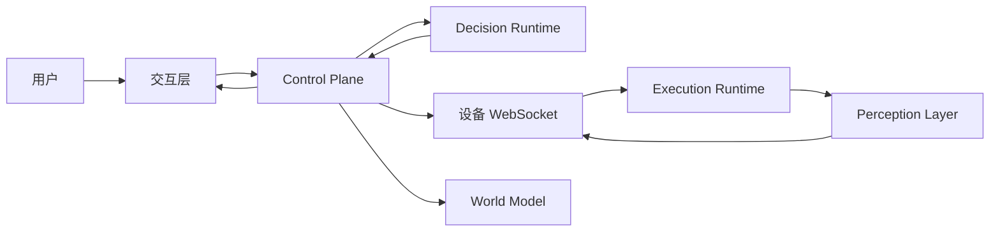
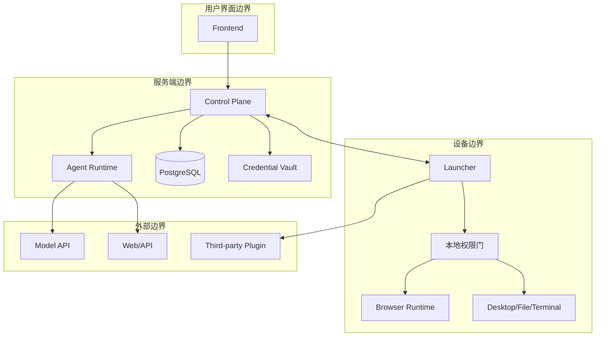
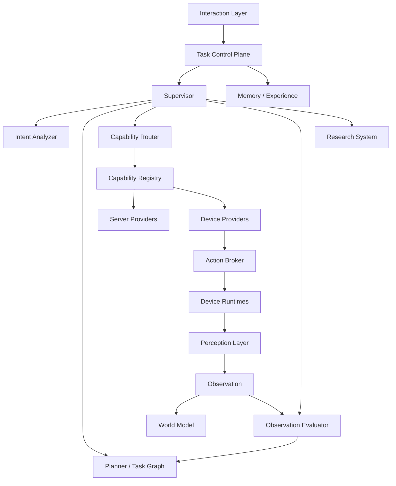

# Athena Agent OS v0.2 架构设计方案

[English](./agent-os-architecture-plan-v0.2.md)

> 实施顺序、版本边界和 Release Gate 以 [Athena Agent OS 分版本落地计划](./athena-agent-os-version-roadmap-v0.2-v1.0.zh-CN.md) 为准。本文只负责解释 `v0.2` 目标架构；与路线图冲突时，路线图优先。

| 项目 | 内容 |
| --- | --- |
| 目标版本 | `v0.2.0` |
| 文档版本 | `0.1-draft` |
| 文档状态 | 待架构评审 |
| 基线版本 | Athena `v0.1.5` |
| 本期范围 | 数字世界 Agent OS |
| 暂不包含 | 机器人运动、智能家居硬件、无限制自我修改 |

## 1. 文档定位

本文档描述 Athena 从“Agent 应用”演进为“数字 Agent Operating System”的目标架构。它重点定义系统边界、模块职责、协议、状态和安全规则，而不是开发排期。

本文需要解决以下问题：

1. 每个仓库、服务和模块分别负责什么。
2. 用户自然语言目标如何转换为可执行、可观察、可验证的任务。
3. Task、Step、Capability、Action、Observation、World Model、Plugin 和 Skill 如何建模。
4. Browser、Desktop、File、Terminal、Research、Memory 与未来 Physical Runtime 如何组合。
5. 系统如何支持中断恢复、幂等、审批、权限、错误定位和完整追踪。
6. 当前 `v0.1.5` 哪些能力保留、适配、替换或废弃。

## 2. 核心架构结论

### 2.1 保留当前五个仓库

- `agent-runtime`：决策与推理平面。
- `agent-runtime-client`：API、身份、持久化、任务控制和设备控制平面。
- `athena-launcher`：桌面设备执行与本地感知平面。
- `frontend/agent-ui`：用户交互与状态展示平面。
- `logx`：跨项目日志、Trace 和结构化错误基础库。

架构文档中把 `agent-runtime-client` 称为 **Athena Control Plane**。`v0.2.0` 不强制修改仓库名称，避免影响现有下载、Release 和用户配置。

### 2.2 建议增加中立的协议仓库

建议增加 `athena-protocol`，只负责：

- Protobuf 协议。
- JSON Schema。
- Go 生成类型。
- TypeScript 生成类型。
- 协议测试夹具。
- 跨语言一致性测试。
- 协议文档和版本规则。

该仓库不包含业务逻辑。这样可以解除 `agent-runtime-client` 对 `agent-runtime` 生成代码的直接依赖，也避免 Action/Observation 在多个仓库重复定义后发生漂移。

### 2.3 明确四个运行平面



- **控制平面**：任务、身份、持久化、审批、设备路由、事件和 World Model。
- **决策平面**：理解、规划、Agent 选择、Capability 选择和 Observation 评估。
- **执行平面**：执行结构化 Action，不决定用户目标。
- **感知平面**：描述真实环境，不决定下一步做什么。

### 2.4 Agent 面向 Capability，而不是 Tool

Agent 只看到稳定能力，例如 `browser.navigate@1`。`agent-browser`、CDP、操作系统命令、HTTP API 或某个 SDK 都只是 Provider 实现。

### 2.5 Task 和 Event 是运行核心

每个用户目标都产生一个持久化 Task。计划、Action、Observation、审批、错误和状态变化都形成 Event。服务重启后通过 Event 与 Projection 恢复任务，而不是要求模型猜测之前发生了什么。

### 2.6 World Model 是“带证据的当前认知”

World Model 不是绝对事实。每条状态必须包含来源、置信度、观察时间、作用域、版本和过期时间。冲突证据进入协调流程，不能直接覆盖。

### 2.7 Kernel 不能插件化

以下模块属于稳定 Kernel：

- 协议校验。
- 用户身份和数据隔离。
- Policy 强制执行。
- Task 状态迁移。
- Event 持久化。
- Capability 权限校验。
- World Model 一致性规则。
- 审计记录。

Capability Provider、Runtime Adapter、Perception Provider、Ontology Pack 和 Skill 可以扩展。

## 3. `v0.2.0` 目标与非目标

### 3.1 目标

- 理解会话、Research、Browser、Desktop、File、Terminal、Planning 和 Scheduled Task 意图。
- 每次只向模型暴露与当前任务相关且允许使用的 Capability。
- 使用有预算的 Plan/Action/Observation/Evaluation 循环完成多步骤任务。
- 前端关闭、服务重启或设备重连后仍能恢复任务。
- 维护用户级和设备级数字 World Model。
- 对高风险操作实施明确审批。
- 完整记录模型、Capability、设备、数据库和 Plugin 的调用耗时与错误链。
- 支持独立安装、禁用、更新和回滚 Capability/Perception Plugin。
- 迁移时保留用户、Agent、模型、聊天、Memory 和 Browser Session。

### 3.2 非目标

- 通用机器人运动规划。
- 面向真实工业设备的安全认证。
- 无人确认的付款、购票、挂号和账户修改。
- 绕过 CAPTCHA、滑块或网站反自动化机制。
- 自动启用 Agent 生成的可执行源码。
- 存储模型隐藏思维链。
- 把所有内部模块都做成 Plugin。
- 为每个网站编写一套特殊执行代码。

## 4. 核心设计原则

1. 模型负责提出决策，确定性代码负责验证和执行边界。
2. 命令发出不代表成功，必须由 Observation 验证。
3. 每个副作用都能关联到用户、Task、Step、Action、设备、Trace 和 PolicyDecision。
4. Capability 是稳定契约，Provider 是可替换实现。
5. 简单任务走 Fast Path，复杂任务才使用多 Agent。
6. Search 和可交互 Browser Control 始终分离。
7. Perception 与 Execution、Decision 解耦。
8. 所有持久化数据默认按用户隔离。
9. 使用至少一次投递加幂等，不宣称无法保证的 Exactly Once。
10. 动态世界状态默认会过期，除非重新观察。
11. Wire Protocol 变化必须协调升级 Runtime、Control Plane、Launcher 和 Frontend。
12. 错误是 Task Event，不只是日志文本。

## 5. 系统上下文与信任边界

### 5.1 系统参与者

- 普通用户。
- 管理员。
- Athena Desktop 设备。
- 远程或本地 Control Plane。
- 模型服务商。
- Search、地图、天气等外部 Provider。
- Plugin 发布者。
- 未来机器人或 IoT 设备。

### 5.2 信任边界



Control Plane 不能假设模型提出的 Action 安全。Launcher 也不能假设服务器下发的 Action 一定具有本地权限。任一层都可以提高风险等级或阻止执行，但不能静默降低风险等级。

## 6. 仓库职责

### 6.1 `agent-runtime`：Decision Plane

负责：

- Intent 分析和 Domain 分类。
- Supervisor Agent。
- Task Plan 生成和计划修订。
- Specialist Agent 选择。
- Capability 选择和参数生成。
- Research 编排。
- Observation 评估。
- 最终回答组织。
- 模型适配与上下文预算。

不负责：

- 用户登录和鉴权。
- 持久化 Task 真相。
- Device WebSocket。
- 设备 Token 和用户密码。
- Browser/OS 的实际执行。
- 用户配置的最终存储。

目标是让 Runtime 可水平扩展并尽量无状态。一次调用接收不可变 DecisionRequest，返回结构化 DecisionEvent。

### 6.2 `agent-runtime-client`：Control Plane

负责：

- 面向前端和调用方的 API。
- User、Role、Agent、Model、Credential、Chat 和 Memory。
- 持久化 Task、Step、Action、Observation 和 Event。
- Device 注册、配对、绑定、在线状态和 Capability Inventory。
- Action 路由和 Observation 关联。
- Approval 工作流。
- World Model 存储、投影和查询。
- Scheduled Task 协调。
- Runtime 调用和流式事件中转。
- Token、费用和调用量统计。

只有 Control Plane 可以修改持久化 Task 状态。

### 6.3 `athena-launcher`：Device Data Plane

负责：

- 设备身份和可撤销设备凭据。
- 主动连接 Control Plane 的 WebSocket。
- 本地 Capability Inventory。
- Browser、Desktop、File、Terminal、Audio、Vision Runtime Adapter。
- 本地权限强制。
- 本地进程启动、停止和健康检查。
- Browser Profile、Session、Window、Tab 和下载状态。
- Perception Provider 和 Artifact Capture。
- 本地 Plugin Host。

不负责：

- 用户目标理解。
- Task 规划。
- Agent 选择。
- 服务端长期 Memory。
- 最终业务审批。

### 6.4 `frontend/agent-ui`：Presentation Plane

负责：

- 登录和账户体验。
- Agent、Model、Key、Device、Plugin 管理。
- Task Plan、Step、Action、Observation 和 Progress 时间线。
- Research Source、错误、调用耗时和 Trace 展示。
- Approval 和 Manual Takeover。
- World Model 查看与诊断。
- 多语言、Voice、Media 和无障碍体验。

前端不能包含 Capability 执行代码，关闭前端也不能导致后台任务停止。

### 6.5 `logx`：可观察性基础库

负责 Context Logger、Trace ID、结构化错误、错误链、Timing Span、HTTP/gRPC/GORM/Model Adapter。它不能依赖 Athena 业务包。

### 6.6 `athena-protocol`：共享契约

```text
athena-protocol/
├── proto/athena/os/v1/
├── schema/json/
├── gen/go/
├── gen/typescript/
├── fixtures/
├── conformance/
└── docs/
```

模块版本与 Wire Protocol 版本分离。例如模块 `v0.2.1` 仍可实现 `athena.agent.v4`。

## 7. 总体逻辑架构



## 8. Agent OS Kernel

### 8.1 Task Controller

Task Controller 位于 Control Plane，负责：

- 从已鉴权请求创建 Task。
- 为 Task 分配单调递增 Revision。
- 校验并应用 Event。
- 强制执行合法状态迁移。
- 触发下一次 Decision Tick。
- 因 Approval、用户输入、设备离线或外部事件暂停。
- 处理 Deadline 和 Cancel。
- 服务重启后恢复 Task。

### 8.2 Supervisor

Supervisor 的输入包括：

- 用户 Goal 和约束。
- 当前 Task Graph。
- 相关 World Slice。
- 最近 Task Event。
- 时间、Token、费用和 Action Budget。
- 当前可用并经过 Policy 过滤的 Capability。
- 用户 Memory 摘要。

Supervisor 只能返回以下结构化 Decision：

- `ANSWER`：产生最终回答。
- `ASK_USER`：补充必要信息。
- `PLAN_CREATE`：创建初始计划。
- `PLAN_PATCH`：增加、替换、跳过或重排 Step。
- `ACTION_PROPOSE`：提出 Capability Action。
- `WAIT`：等待时间或外部事件。
- `DELEGATE`：调用 Specialist Agent。
- `FAIL`：以结构化错误结束。

Supervisor 不能直接写数据库或控制设备。

### 8.3 Intent Analyzer

标准输出示例：

```json
{
  "goal": "打开 YouTube 并播放第二个合适的 AI Agent 教程",
  "domains": ["browser"],
  "mode": "execute",
  "entities": {
    "site": ["YouTube"],
    "topic": ["AI Agent 教程"],
    "ordinal": ["2"]
  },
  "constraints": ["复用当前浏览器 Session"],
  "expected_outcome": ["目标视频处于播放状态"],
  "confidence": 0.94,
  "missing_information": []
}
```

显式命令、安全信号、Session 引用和常见实体优先由确定性规则处理；模糊语义由模型补充。最终结果必须通过 Schema 校验。

### 8.4 Planner 与 Task Graph

Task Graph 是有向无环图。Runtime 可以提出 Patch，但不能产生循环依赖。

```json
{
  "task_id": "task-01",
  "goal": "播放第二个合适的 AI Agent 教程",
  "revision": 3,
  "steps": [
    {
      "step_id": "step-open",
      "goal": "打开或复用 YouTube",
      "depends_on": [],
      "success_conditions": ["active page host is youtube.com"]
    },
    {
      "step_id": "step-search",
      "goal": "搜索 AI Agent 教程",
      "depends_on": ["step-open"],
      "success_conditions": ["page model contains a video result collection"]
    },
    {
      "step_id": "step-play",
      "goal": "播放第二个合适结果",
      "depends_on": ["step-search"],
      "success_conditions": ["media playback state is playing"]
    }
  ]
}
```

每个 Step 包含：

- Goal 和标准化 Intent。
- Dependency。
- 所需 Capability 类型。
- Precondition。
- Success/Failure Condition。
- Retry Policy。
- 时间、Token 和费用预算。
- 风险上限。
- Specialist Agent。
- 当前状态和尝试次数。
- Artifact 输出。

### 8.5 Fast Path

普通会话、一次只读查询、显式网页导航、打开软件和基于现有上下文的直接回答默认只创建一个隐式 Step，不启动多 Agent，降低延迟和 Token 消耗。

### 8.6 Observation Evaluator

Evaluator 比较 Observation 与 Success Condition，输出：

- `SATISFIED`。
- `PARTIALLY_SATISFIED`。
- `NOT_SATISFIED`。
- `INDETERMINATE`。
- `INTERVENTION_REQUIRED`。

URL、状态码、播放状态、文件 Hash 等先走确定性判断；视觉或语义模糊时才调用模型。模型不能把设备返回的失败状态解释为成功。

## 9. Multi-Agent 设计

Specialist Agent 是 Decision Plane 内的逻辑角色，不要求每个 Agent 都是独立进程。

### 9.1 初始 Agent 类型

- Conversation Agent：普通对话和澄清。
- Planning Agent：任务拆解、依赖和约束。
- Research Agent：查询、证据、核验和综合。
- Browser Agent：根据页面语义规划浏览器动作。
- Desktop Agent：规划应用和窗口操作。
- File Agent：规划文件发现、读取、修改和验证。
- Automation Agent：长时间任务、定时任务和事件触发任务。

### 9.2 Context 分配

Supervisor 只向 Specialist 发送当前 Step 所需内容：Goal、相关 World Slice、允许的 Capability、预算、风险、最近 Event 和输出 Schema。Specialist 返回 Proposal，不直接修改全局 Task。

### 9.3 推理隐私

系统保存结构化计划、Decision 类型、Decision Summary、Capability、参数、证据和评估结果，不要求或持久化完整隐藏思维链。

## 10. Capability 架构

### 10.1 CapabilityDescriptor

```json
{
  "id": "browser.navigate",
  "major_version": 1,
  "description": "在浏览器标签中导航到 URL",
  "input_schema": "athena://schema/browser.navigate.input.v1.json",
  "output_schema": "athena://schema/browser.observation.v1.json",
  "execution_location": "device",
  "side_effect": "reversible",
  "default_risk": "MEDIUM",
  "permissions": ["browser.control", "network.outbound"],
  "supports_progress": true,
  "supports_cancel": true,
  "provider_constraints": {
    "platforms": ["darwin", "windows", "linux"]
  }
}
```

### 10.2 标识与版本

- 稳定 ID：`namespace.name`。
- Major Version 表示输入输出兼容边界。
- Provider ID 与 Capability ID 分离。
- 模型函数名只是自动生成 Alias。
- 路由时必须选择兼容 Major Version。

### 10.3 CapabilityInstance

表示某个 Server 或 Device 上真实可用的实现，包含：Instance ID、Capability 版本、Provider、Plugin 版本、Device/Worker、健康状态、权限、容量、并发限制、预估延迟、费用和最近成功时间。

### 10.4 Registry 四层结构

1. Catalog：系统认识的全部 CapabilityDefinition。
2. Provider Registry：已安装实现。
3. Instance Registry：当前在线可调用实例。
4. Task Capability View：经过用户、设备、Policy 和任务上下文过滤后提供给模型的集合。

### 10.5 路由依据

路由考虑用户归属、目标设备、协议版本、健康状态、权限、风险、数据位置、费用、延迟和 Session Affinity，并输出可审计的 RouteDecision。

## 11. Plugin 架构

> 本节定义长期 Provider/Plugin 安全边界。`v0.2` 只落地内置 Provider 的接口和权限边界；通用 Out-of-Process Plugin Host、第三方 SDK 和公共 Registry 延后到 `v0.8`。

### 11.1 Plugin 类型

- Capability Provider Plugin。
- Device Runtime Plugin。
- Perception Provider Plugin。
- Search Provider Plugin。
- Ontology Pack。
- Skill Pack。
- UI Extension 延后，直到有可靠前端 Sandbox。

### 11.2 隔离方式

公共 Plugin 不使用 Go 进程内 `plugin`，因为跨平台能力弱且无法隔离崩溃和权限。

推荐：

- Plugin 作为 Child Process 或 Sidecar。
- Unix 使用 Unix Socket，Windows 使用 Named Pipe。
- 主协议为本地 gRPC。
- 简单 Plugin 可通过受限 JSON-RPC/stdio Adapter。
- Host 提供最小环境变量和工作目录。
- Network、Filesystem、Credential、Device 权限显式授权。
- Host 强制 Timeout、Cancel、CPU、Memory 和并发限制。

### 11.3 PluginManifest

```yaml
schema: athena.plugin.v1
id: com.example.maps
version: 1.2.0
publisher: example
runtime:
  protocol: grpc
  executable:
    darwin-arm64: bin/maps-darwin-arm64
    windows-amd64: bin/maps-windows-amd64.exe
capabilities:
  - maps.route@1
permissions:
  - network.outbound
  - location.approximate
health:
  timeout_ms: 3000
signature:
  algorithm: ed25519
  key_id: example-release-key
```

### 11.4 生命周期

```text
DISCOVERED -> VALIDATED -> INSTALLED -> DISABLED
DISABLED -> STARTING -> HEALTHY -> DEGRADED -> STOPPED
任意非运行状态 -> UNINSTALLED
```

安装必须校验 Hash 和签名，更新形成不可变新版本并支持回滚。

### 11.5 故障语义

- Plugin 崩溃不能终止 Host。
- 当前 Action 返回结构化 Provider Error。
- CapabilityInstance 标记 Unhealthy。
- Router 可选择其他兼容 Provider。
- 连续崩溃触发 Circuit Breaker。

## 12. Action/Observation Protocol v4

### 12.1 通用 Envelope

```json
{
  "protocol": "athena.agent.v4",
  "schema": "athena.action.v1",
  "message_id": "msg-01",
  "correlation_id": "action-01",
  "trace_id": "arc-...",
  "task_id": "task-01",
  "step_id": "step-01",
  "sequence": 4,
  "sent_at": "2026-08-14T10:00:00Z",
  "type": "ACTION",
  "payload": {}
}
```

### 12.2 消息类型

- `HELLO`、`WELCOME`。
- `CAPABILITY_SNAPSHOT`。
- `HEARTBEAT`、`HEARTBEAT_ACK`。
- `ACTION`、`ACTION_ACK`。
- `PROGRESS`。
- `OBSERVATION`。
- `CANCEL`、`CANCEL_ACK`。
- `APPROVAL_REQUEST`、`APPROVAL_DECISION`。
- 独立环境更新使用 `WORLD_PATCH`。
- 协议级失败使用 `ERROR`。

### 12.3 ActionPayload

```json
{
  "action_id": "action-01",
  "capability": "browser.navigate",
  "capability_version": 1,
  "provider_instance_id": "instance-device-browser-01",
  "session_id": "browser-session-01",
  "idempotency_key": "task-01:step-01:attempt-1",
  "deadline": "2026-08-14T10:01:00Z",
  "arguments": {"url": "https://www.youtube.com"},
  "preconditions": [
    {"type": "world_revision", "scope": "browser-session-01", "revision": 18}
  ],
  "expected_observations": [
    {"path": "page.host", "operator": "equals", "value": "www.youtube.com"}
  ],
  "policy": {
    "risk": "MEDIUM",
    "decision": "ALLOW",
    "decision_id": "policy-01"
  }
}
```

### 12.4 ObservationPayload

```json
{
  "action_id": "action-01",
  "status": "SUCCEEDED",
  "started_at": "2026-08-14T10:00:01Z",
  "observed_at": "2026-08-14T10:00:04Z",
  "execution": {
    "provider": "athena.browser.agent-browser",
    "attempt": 1,
    "duration_ms": 2830
  },
  "facts": {
    "page": {
      "url": "https://www.youtube.com/",
      "title": "YouTube",
      "host": "www.youtube.com"
    }
  },
  "world_patch": {"base_revision": 18, "operations": []},
  "artifacts": [],
  "uncertainty": {"confidence": 0.99, "reasons": []}
}
```

### 12.5 投递语义

- 至少一次投递。
- Device 按 IdempotencyKey 在限定时间内保存终态 Observation。
- 重复 Action 直接返回之前结果。
- Sequence 用于发现缺失和乱序，不用于去重。
- `ACTION_ACK` 只代表收到，不代表成功。
- `PROGRESS` 不能作为完成证据。
- 只有终态 Observation 结束一次 Action Attempt。
- Cancel 是尽力而为，设备在线时必须返回终态。

### 12.6 拒绝条件

协议或 Schema 不支持、用户设备绑定错误、Capability 未声明、Major Version 不兼容、Deadline 过期、Schema 校验失败、Policy 不足或 Precondition 不满足时必须拒绝。

## 13. Task 与 Step 状态机

### 13.1 Task 状态

```text
CREATED -> UNDERSTANDING -> PLANNING -> READY
READY -> EXECUTING -> OBSERVING -> EVALUATING
EVALUATING -> EXECUTING | COMPLETED | FAILED
```

等待和终止状态：

- `WAITING_APPROVAL`。
- `WAITING_USER`。
- `WAITING_DEVICE`。
- `WAITING_EVENT`。
- `RETRYING`。
- `FAILED`。
- `CANCELING`。
- `CANCELLED`。

### 13.2 Step 状态

`PENDING`、`BLOCKED`、`READY`、`RUNNING`、`WAITING_APPROVAL`、`WAITING_USER`、`WAITING_DEVICE`、`VERIFYING`、`SUCCEEDED`、`SKIPPED`、`FAILED`、`CANCELLED`。

### 13.3 状态修改权限

- Control Plane 应用所有持久化迁移。
- Runtime 只能提出 Plan 和 Evaluation Transition。
- Device 只能报告 Action Execution Status。
- Frontend 只能提交用户命令和 ApprovalDecision。
- 数据库约束阻止终态被非法恢复。

### 13.4 Retry

每个 Step 声明最大次数、可重试错误、Backoff、是否允许修改参数、是否需要重新观察、是否需要重新审批。Retry 使用新 ActionID，但保持 StepID。高风险 Action 默认不自动重试。

## 14. World Model

### 14.1 定位

World Model 回答：“Athena 当前认为用户的数字环境是什么状态，这个判断来自哪里？”它不是源系统，也不是长期 Memory 的替代品。

### 14.2 核心对象

#### Entity

包含稳定 ID、Type、Ontology Version、Scope、Owner、Label、外部引用、创建时间和最后观察时间。

初始类型：Device、BrowserSession、Window、Tab、Page、Element、Media、Application、File、Directory、Conversation 和 UserLocation。

#### Relation

包含 Subject、Predicate、Object、来源 Observation、Confidence 和有效时间。例如 `session.contains_tab`、`tab.displays_page`。

#### State

包含 Entity、PropertyPath、TypedValue、Revision、Source、Confidence、ObservedAt、ExpiresAt 和 Sensitivity。

#### Event

不可变事实，例如页面导航完成、Tab 关闭、文件修改、软件启动或设备断开。

#### Artifact

保存 Screenshot、File、Source Document、Audio 和 Generated Media 的元数据。敏感二进制数据可仅短暂传输或进入加密 Artifact Store。

### 14.3 Scope

```text
tenant
  -> user
      -> device
          -> workspace
              -> session
                  -> task
```

Task 只能在 Policy 允许时查询上层 Scope，禁止跨用户返回 World Slice。

### 14.4 WorldPatch

```json
{
  "scope": "browser-session-01",
  "base_revision": 18,
  "observed_at": "2026-08-14T10:00:04Z",
  "source": {
    "device_id": "device-01",
    "observation_id": "observation-01",
    "provider": "browser.perception"
  },
  "operations": [
    {
      "op": "upsert_entity",
      "entity": {
        "id": "tab-cdp-target-123",
        "type": "browser.tab",
        "label": "YouTube"
      }
    },
    {
      "op": "set_state",
      "entity_id": "tab-cdp-target-123",
      "path": "page.url",
      "value": "https://www.youtube.com/",
      "confidence": 0.99,
      "ttl_seconds": 30
    }
  ]
}
```

### 14.5 协调规则

- BaseRevision 等于当前 Revision 时正常应用。
- Stale Patch 可保留为 Evidence，但不能直接覆盖更新状态。
- 更高 Confidence 不能自动覆盖时间更新的事实。
- Device 断开后动态状态过期，历史 Event 保留。
- Tab 关闭使用 Tombstone，不能重新编号剩余 Tab 作为身份。
- Browser Tab 使用 CDP Target ID 等稳定 ID，不使用列表位置。

### 14.6 World Slice 查询

Decision Runtime 只能请求有上限的 World Slice，Control Plane 校验 Scope、Freshness、Sensitivity、Entity 数量和总字节数。

## 15. Perception 架构

```text
Perception Layer
├── Perception Orchestrator
│   ├── Domain Classifier
│   ├── Intent Signal Analyzer
│   ├── Confidence Evaluator
│   ├── Capture Policy
│   └── Observation Budget
├── Browser Perception
│   ├── Accessibility / ARIA
│   ├── Focused DOM
│   ├── Visual Capture / OCR
│   └── Spatial Mapping
├── Desktop Perception
├── File Perception
├── Terminal Perception
├── Vision Perception
└── Audio Perception
```

### 15.1 输出

Perception 输出语义事实、Entity/Relation Candidate、Spatial Reference、Artifact、Confidence、Uncertainty、Intervention Signal 和 WorldPatch Proposal，不输出下一步业务动作。

### 15.2 ObservationBudget

预算包括最大元素数、正文字符、Snapshot 字符、Screenshot 数量和尺寸、OCR 字符、执行时间和敏感内容处理规则。

默认先使用 Semantic Evidence；置信度不足时升级到 Visual Evidence；只有语义定位失败时才使用坐标。

### 15.3 Freshness

Observation 必须包含环境 Revision。动态页面 Action 必须作用于同一 Revision，或执行前重新解析 Semantic Target。

## 16. Runtime 架构

### 16.1 公共接口

```text
DescribeCapabilities()
Validate(action)
Prepare(action)
Execute(action, progressSink)
Cancel(actionID)
Observe(actionContext)
Health()
CloseSession(sessionID)
```

即使 Execution 和 Perception 运行在同一进程，也必须保持模块边界。

### 16.2 Browser Runtime

保留当前 Browser Runtime，并适配标准 Capability 与 WorldPatch。

```text
Typed Browser Action
  -> Session Manager
  -> Semantic Target Resolver
  -> agent-browser Provider
  -> Chrome/CDP
```

Direct CDP 用于 Event Subscription、Target Identity 和 Observation Refresh；`agent-browser` 在有充分理由替换前继续作为主要交互 Provider。

Browser Runtime 管理 Profile、Workspace、Session、Window、Stable Tab ID、Navigation、Cookie/Auth Metadata、Download 和 Manual Takeover。

默认复用同一 Browser Session。是否导航当前 Tab 或创建新 Tab 由 Task Policy 明确决定，不能依赖模型随意猜测。Tab Identity 不使用顺序号。

### 16.3 Desktop Runtime

支持 Application Discover/Open/Focus/Close，Window List/Focus/Move/Resize，Clipboard，Screenshot 和 ActiveWindow Observation。Keyboard/Pointer 只是低级 Fallback，不是首选语义能力。

### 16.4 File Runtime

支持 Scoped Search、Metadata、Read、Create、Update、Move、Copy、Delete、Workspace Import 和 Patch。所有路径都要 Normalize、检查授权 Scope、防止 Traversal 和 Symlink Escape。Write 支持 Dry Run 和 Hash Verification。

### 16.5 Terminal Runtime

普通用户默认禁用。启用时必须使用 Executable + Argument List，不接受未经校验的任意 Shell 字符串；Working Directory、Environment、Network、Filesystem 权限显式声明；必须支持 Output Bound、Timeout 和 Cancel。

### 16.6 Physical Runtime

Robot、IoT、Camera 和 Sensor 使用同一 Envelope，但需要独立 Safety Architecture、Simulation、Hardware Interlock 和 Emergency Stop，不进入 `v0.2.0` 默认安装。

## 17. Research 架构

```text
Research Agent
  -> Intent Analyzer
  -> Query Planner
  -> Source Router
  -> Search Providers
  -> Result Aggregator
  -> Fetch / Content Extraction
  -> Evidence Ranker
  -> Claim / Contradiction Verifier
  -> Gap Detector
  -> Follow-up Planner
  -> Knowledge Synthesizer
```

Research 返回结构化 Evidence，包括 URL、Title、Publisher、PublishedAt、RetrievedAt、Excerpt、Claim、Authority、Freshness 和 VerificationStatus。

只有页面需要用户已登录状态、必须交互、用户明确要求打开可见浏览器，或 Search/Fetch Provider 无法读取授权内容时，Research 才请求 Browser Runtime。

预算包含 Query、Page、Byte、Token、ElapsedTime 和 Follow-up Round。

## 18. Memory、Knowledge 与 Skill

### 18.1 Memory 分类

- Conversation Memory：近期上下文。
- User Memory：用户允许长期保存的偏好和事实。
- Task Memory：一个任务的计划、事件、Artifact 和结果。
- Episodic Experience：可复用成功/失败经验。
- Semantic Knowledge：文档、知识库和经过核验的 Research Artifact。
- World State：当前环境，不能与长期 Memory 混为一表。

### 18.2 Skill

Skill 是有版本的 Workflow Template，包含 Input/Output Schema、Precondition、RequiredCapability、TaskGraphTemplate、RiskCeiling、EvaluationSuite、Owner、Visibility、Version 和 ActivationState。

Skill 不能绕过 Capability Policy。

### 18.3 Skill 自动生成

重复成功 Task 可以生成默认禁用的 SkillCandidate，必须经过 Schema、权限静态分析、Fixture Replay、Eval Threshold、人工 Approval 和版本发布。`v0.2.0` 不自动启用生成的可执行代码。

## 19. Ontology 架构

Ontology 从真实数字 Observation 逐步形成，不预先设计完整物理世界分类。

### 19.1 初始类型

- `system.device`。
- `task.task`、`task.step`。
- `browser.profile/session/window/tab/page/element/media`。
- `desktop.application/window`。
- `filesystem.directory/file`。
- `terminal.session/process`。
- `research.source/claim/evidence`。

### 19.2 OntologyPack

包含有版本的 EntityType、PropertySchema、RelationSchema、ValidationRule 和 DisplayMetadata。OntologyPack 本身不能增加执行能力。

## 20. Policy 与 HITL

### 20.1 风险级别

- `LOW`：低隐私影响的只读观察。
- `MEDIUM`：可逆导航或本地状态变化。
- `HIGH`：提交、删除、账号修改、Credential 使用或对外通信。
- `CRITICAL`：付款、提权、安全敏感物理动作或大规模不可逆操作。

### 20.2 Decision

`ALLOW`、`ASK_USER`、`BLOCK`。`WAITING_USER` 是登录、验证码、扫码、2FA 和 Manual Takeover 的状态，不是 PolicyDecision。

### 20.3 Policy 输入

用户和 Role、CapabilityDescriptor、Provider/Device Trust、Argument/Target、SideEffect、World State、Sensitivity、已有 Approval、Task RiskCeiling、Admin Policy 和 Local Device Policy。

### 20.4 ApprovalScope

Approval 包含精确 Capability、标准化 Target、ArgumentDigest、允许次数、Expiry、User、Task、Step 和 Action。参数发生实质变化时 Approval 失效。

### 20.5 Credential

- 使用 Control Plane Vault 或设备系统安全存储。
- 模型永远不接收明文 Password、Token 或 Cookie。
- Provider 执行前通过 CredentialReference 解析。
- Log/Observation 只保存 CredentialID 和结果。
- CAPTCHA、QR 和 2FA 默认转人工接管。

## 21. 数据架构

### 21.1 逻辑表

```text
os_task
os_task_step
os_task_event
os_action
os_observation
os_artifact
os_approval
os_device
os_device_capability
os_capability_definition
os_capability_instance
os_world_entity
os_world_relation
os_world_state
os_world_event
```

现有 `agent_control_*` 通过 Migration 转换或重命名，不能静默废弃。

`os_skill*`、`os_experience*` 和 `os_plugin*` 属于后续版本。`v0.2` 仅兼容读取现有 Skill，并建立内置 Provider 边界，不实现学习型 Skill、Experience Engine 或公共 Plugin Host。

### 21.2 Event 与 Projection

- `os_task_event` Append Only。
- Task、Step、Action 和 World Model 当前表是 Projection。
- Command Transaction 同时写 Event 和 Outbox。
- Projector 幂等更新 Read Model。
- Projection 使用 Revision 防并发覆盖。
- 提供从 Event 重建 Projection 的工具。

### 21.3 ArtifactStore

小型 Metadata 存 PostgreSQL；Screenshot、Document、Audio 和 Media 使用 ArtifactStore。单机模式为加密目录，远程模式为 S3 Compatible Storage；不允许持久化的截图仅内存传输。

### 21.4 Retention

Chat、TaskEvent、Observation、WorldHistory、Audit、Screenshot、ModelPrompt 和 PluginLog 独立设置保留时间。

## 22. 服务通信

### 22.1 Frontend 到 Control Plane

CRUD 和 Command 使用 REST，Task/Chat Event 使用 SSE，重连使用 Last-Event-ID。除非后续确实需要双向低延迟 UI，前端不新增 WebSocket。

### 22.2 Control Plane 到 Agent Runtime

保留 gRPC Streaming，目标 RPC：

- `Decide(DecisionRequest) returns stream DecisionEvent`。
- `Evaluate(EvaluationRequest) returns EvaluationResult`。
- `Research(ResearchRequest) returns stream ResearchEvent`。
- `Health`、`Capabilities`。

请求携带 TaskRevision 和 TraceID，旧 Revision 的 Decision 不能应用。

### 22.3 Control Plane 到 Launcher

继续使用 Launcher 主动建立的 Device WebSocket。目标架构使用设备级可撤销 Token，废弃部署级共享 `device_token`。

### 22.4 Pairing

1. Launcher 创建设备 KeyPair 和短时 PairingCode。
2. 已登录用户确认 PairingCode。
3. Control Plane 绑定 User/Organization。
4. 签发可撤销 DeviceCredential。
5. Launcher 存入 OS Secure Storage。
6. Device 重新连接并上报签名 Capability Inventory。

## 23. Error 与 Observability

### 23.1 StructuredError

```json
{
  "code": "BROWSER_TARGET_STALE",
  "category": "precondition",
  "operation": "BrowserRuntime.ResolveTarget",
  "message": "选中的页面元素已经不存在",
  "retryable": true,
  "origin": {
    "service": "athena-launcher",
    "component": "browser-runtime",
    "file": "target_resolver.go",
    "line": 142,
    "function": "Resolve"
  },
  "cause": {},
  "metadata": {
    "target_ref": "@e12",
    "page_revision": 18
  }
}
```

错误展示必须区分包装 Operation 和 Root Cause。内部日志保留 SourceLocation，用户只看到安全消息和 TraceID。

### 23.2 必须记录的 Span

HTTP/gRPC、DecisionTick、Model、SpecialistAgent、CapabilityRoute、Policy、ActionQueue、DeviceDispatch、Execution、Perception、Evaluation、DBTransaction 和 PluginInvocation。

每个 Span 包含 Start、End、Duration、Status、TaskID、StepID、ActionID、ErrorCode 和 TraceID。

### 23.3 Metrics

- Task Success/Failure/Cancel/Intervention。
- TimeToFirstResponse 和 TaskDuration。
- Model Latency、Token、Cost，按 Model/User/Agent/Task 统计。
- Capability Latency 和 Provider SuccessRate。
- Device Online/Reconnect/Heartbeat。
- Retry、Deduplication 和 WorldPatchConflict。
- ObservationFreshness。
- ApprovalWaitTime。
- PluginCrash 和 CircuitBreaker。

## 24. 安全架构

### 24.1 威胁模型

- 网页和文档 Prompt Injection。
- 恶意 Plugin。
- 跨用户 Device 路由。
- Credential 泄露到 Model/Log。
- Action Replay。
- Path Traversal 和 Symlink Escape。
- Browser Session 劫持。
- 未授权 Terminal。
- 伪造 Observation。
- Screenshot/Document 过度持久化。

### 24.2 强制控制

- 每个对象校验 Tenant/User。
- Device Credential 可撤销。
- Plugin 签名和 Hash。
- Capability Allowlist 和 SchemaValidation。
- Deadline、Nonce、Idempotency 和 Sequence。
- Launcher 本地 PermissionGate。
- 外部内容标记为 Untrusted。
- 内容指令与系统 Policy 分离。
- Secret 进入 Model/Log 前 Redact。
- Credential/Artifact 加密。
- 高风险操作写不可变 AuditEvent。
- Rate、Concurrency、Token 和 Storage Limit。

## 25. 部署架构

### 25.1 Local Mode

Launcher 管理 Embedded PostgreSQL、Agent Runtime、Control Plane 和 Frontend。即使全部在本机，也使用相同的设备协议，避免形成无法测试的 Local Shortcut。

### 25.2 Remote Mode

Launcher 连接 Remote Control Plane，不安装、不启动、不关闭本地后端服务。Remote Endpoint 和 DeviceCredential 跨重启保存。

### 25.3 Multi-Device

一个用户可以绑定多个设备。存在多个兼容在线设备时，除非用户设置 DefaultDevice，否则要求明确选择。

### 25.4 High Availability

- Control Plane 共享 PostgreSQL 和分布式 Event Notification。
- WebSocket Owner 使用 Lease 注册。
- ActionBroker 路由到持有 Device Connection 的实例。
- Runtime Worker 无状态水平扩展。
- Timer 和 ScheduledJob 使用 DB Lease。

## 26. 故障与恢复

### 26.1 Runtime 故障

Control Plane 保留 Task，可把同一 Revision 的 DecisionRequest 发给另一 Runtime。Stale Decision 不允许写入。

### 26.2 Control Plane 重启

通过 Event 重建 Task。PendingAction 与 Device/DedupRecord 对账。高风险 Action 结果未知时进入 `WAITING_USER`，不能自动重试。

### 26.3 Launcher 断线

Lease 到期后 Device Offline，运行 Step 进入 `WAITING_DEVICE`。重连后先同步 Capability 和 PendingAction，再接受新 Action。

### 26.4 Browser Target 变化

StableTargetID 和 PageRevision 检测关闭或跳转，重新根据新 Observation 解析语义目标，不能因为位置相同就点击新页面相同序号。

### 26.5 Model Timeout

DecisionTick 返回 RetryableModelError，Control Plane 根据 Fallback Policy 重试或暂停，已执行的 DeviceAction 不能丢失。

### 26.6 并行动作部分失败

只有声明互不冲突 Effect 的 Action 才允许并行。每个 Action 独立 Observation，Planner 根据全部结果决定补偿、继续或终止。

## 27. 性能与资源预算

初始目标：

- 无模型 CapabilityRoute：p95 小于 50ms。
- Control Plane Dispatch Overhead：p95 小于 100ms，不含网络和执行。
- ActiveSession WorldSlice：p95 小于 100ms。
- Device Heartbeat：默认 15 秒并带 Jitter。
- 页面稳定后的 Browser SemanticObservation：p95 小于 2 秒。
- Read/Reversible Action 默认最多 3 次尝试。
- Consequential Action 默认最多 1 次尝试。
- Observation 和 ModelContext 必须有 Byte/Token 上限。

这些目标需要根据实际测量更新。

## 28. 测试架构

### 28.1 ContractTest

- 跨仓库共享 Protocol Fixture。
- Go/TypeScript RoundTrip。
- UnknownField 和 Version 行为。
- StateTransition Conformance。
- Capability Input/Output Schema。

### 28.2 UnitTest

Intent、RoutePolicy、TaskGraph、Policy、WorldPatch、Idempotency、Retry、PluginLifecycle 和 ErrorChain 必须有确定性测试。

### 28.3 RuntimeSimulator

提供 FakeDeviceRuntime 和 FakeModelRuntime，可脚本化 Observation、Disconnect、Duplicate、StaleRevision、Timeout 和 Cancel。

### 28.4 BrowserEval

- 多网站共用一个 BrowserSession。
- 打开 YouTube、搜索、选择第二个匹配视频并验证播放。
- 关闭 Tab 后继续使用剩余 StableTabID。
- 语义点击 Shorts 等 Filter，不依赖坐标。
- Login/CAPTCHA/QR/ManualTakeover。
- 避免错误打开 Profile、Playlist 和 Sidebar。
- StaleElement 自动重新观察。
- 使用授权 Profile，但不复制 Credential。

CI 使用可控本地页面保证确定性；真实网站放入定时 Live Evaluation，检测页面漂移。

### 28.5 SecurityTest

覆盖 CrossUser、PromptInjection、SecretLeak、MaliciousPlugin、PathEscape、Replay、ExpiredAction、ForgedObservation 和 InvalidAttachment。

### 28.6 E2E ReleaseGate

1. Conversation FastPath。
2. 多源 Research 和 Citation。
3. Browser 闭环。
4. File Read 和审批后 Write。
5. Device Disconnect/Resume。
6. Frontend 关闭后 Task 继续。
7. Approval、Cancel、Timeout。
8. Service Restart 和 Task Reconstruction。
9. Plugin Crash Isolation。
10. User/Tenant Isolation。

## 29. 从 `v0.1.5` 迁移

### 29.1 Branch

- `main` 保持 `v0.1.x` 稳定线。
- 四个业务仓库从 `v0.1.5` 创建 `architecture/agent-os-v0.2`。
- 功能分支合并到 Integration Branch。
- 跨仓库 Conformance 通过后才发布 Alpha Tag。

### 29.2 Protocol

架构分支允许 `athena.agent.v4` 与 v3 不兼容，但 Runtime、Control Plane、Launcher 必须协调升级。最终切换前，`main` 继续维护 v3。

### 29.3 Data

- 保留 User、Agent、Model、Key、Chat、Memory 和 Schedule。
- 新增 Task、Event、WorldModel 和 Capability Migration。
- 安全映射已有 `agent_control_*`。
- 迁移前备份并写 MigrationAudit。
- Package 更新永远不能清空 Embedded PostgreSQL Data。

### 29.4 保留

- IntentParser 和 RoutePlan 思路。
- CapabilityRegistry 基础。
- ResearchAgent v3。
- Device WebSocket、幂等和持久化经验。
- BrowserRuntime Manager。
- Perception v6。
- 现有 User/Model/Agent/Chat Service。
- Trace 和 `logx`。

### 29.5 替换或重构

- 重复 Protocol Struct。
- Model Text Action Parsing。
- 仅内存 Task Coordination。
- 部署级共享 DeviceToken。
- 没有 VersionedSchema 的 Capability。
- 依赖页面顺序而非 StableID 的 Browser State。
- 未经统一 Provider 边界执行的内置扩展；通用 Plugin Host 延后处理。

## 30. Release 架构

- `v0.2.0-alpha.1`：Protocol、TaskAggregate、Conformance。
- `v0.2.0-alpha.2`：Supervisor、TaskGraph、CapabilityRegistry v2。
- `v0.2.0-alpha.3`：WorldModel 和 WorldPatch。
- `v0.2.0-beta.1`：Browser/Desktop/File/Terminal。
- `v0.2.0-beta.2`：Policy、Pairing、Approval、PermissionGate。
- `v0.2.0-rc.1`：Migration、Recovery、Security、Performance。
- `v0.2.0`：Digital Agent OS 正式版。

Launcher Manifest 固定兼容的 Protocol、Runtime、Control Plane、Frontend、BrowserProvider 和 Database Package 版本。

## 31. 必须评审的 ADR

1. `ADR-001`：是否新建独立 `athena-protocol`。
2. `ADR-002`：Control Plane 持久化 Task，Runtime 只负责 Decision。
3. `ADR-003`：Task/WorldModel 使用 EventLog + Projection。
4. `ADR-004`：内置 Provider 隔离边界；通用 Out-of-Process Plugin Host 延后到 `v0.8`。
5. `ADR-005`：WorldModel Scope、TTL 和 ConflictRule。
6. `ADR-006`：DevicePairing 和 CredentialStorage。
7. `ADR-007`：Artifact 持久化与 Screenshot 默认隐私规则。
8. `ADR-008`：CapabilityVersion Negotiation 和 ProviderSelection。
9. `ADR-009`：RiskLevel 和 ApprovalScope。
10. `ADR-010`：`agent-browser` 与 DirectCDP 的 Provider 边界。

## 32. 需要你确认的问题

1. 是否接受新增 `athena-protocol` 仓库？
2. `agent-runtime-client` 是否在未来重命名为 Control Plane？
3. Task 和 WorldModel 是否接受 EventSourcing，还是首版采用普通事务表？
4. 哪些 Observation 和 Screenshot 默认允许持久化？
5. `v0.8` 的 Plugin 支持系统级、用户级，还是两者都支持？
6. `v0.8` 是否接受 gRPC + UnixSocket/NamedPipe 作为 Plugin 主通信方式？
7. 普通用户默认开放哪些 Terminal/File Write Capability？
8. TaskEvent 和 WorldHistory 默认保存多久？
9. `v0.2.0` 是否需要 Organization Shared World Scope？
10. 哪些真实网站进入官方 Browser LiveEval？
11. 是否确认 `v0.2.0` 只做数字世界，Physical Runtime 延后？
12. `v0.1.5` 哪些用户可见行为必须原样保留？

## 33. 最终验收形态

完成后，Athena 应具备以下行为：

- 用户表达 Goal，不需要选择 Tool。
- 系统创建有边界、可查看的 TaskGraph。
- Agent 只看到相关且有权限的 Capability。
- Control Plane 把 TypedAction 路由到正确 Server 或 Device Runtime。
- Runtime 只执行，不代替 Agent 做业务规划。
- Perception 返回真实环境证据。
- WorldModel 记录 Athena 当前相信什么以及证据来源。
- Supervisor 根据 Observation 继续、重规划、询问、等待或完成。
- 每个操作都可恢复、可观察、经过权限检查并能追踪到责任主体。

该架构保留现有 Browser、Research、Memory、Capability 和 Device Control 投资，同时为 Desktop、File、Terminal、Plugin 以及未来 Physical Device 建立稳定边界。

## 34. 架构评审检查表

评审时建议逐项标记 `接受`、`修改` 或 `拒绝`：

- [ ] 四个运行平面的职责边界合理。
- [ ] Control Plane 是 Task 和 WorldModel 的唯一持久化所有者。
- [ ] Runtime 可以保持无状态并水平扩展。
- [ ] Launcher 只负责设备执行和本地感知。
- [ ] Frontend 不参与 Action 执行。
- [ ] `athena-protocol` 的独立仓库方案可接受。
- [ ] CapabilityDescriptor 字段满足扩展需求。
- [ ] Action/Observation v4 字段和投递语义合理。
- [ ] Task/Step 状态机足够表达暂停、恢复和取消。
- [ ] WorldPatch、Revision、TTL 和冲突规则合理。
- [ ] `v0.2` 的内置 Provider 隔离边界合理，公共 Plugin 生态已明确延后。
- [ ] Browser 保留 `agent-browser + CDP` 的边界合理。
- [ ] Research 与 Browser 完全分离。
- [ ] Memory、WorldState、Knowledge 和 Skill 分类合理。
- [ ] Risk、Approval 和 Credential 边界合理。
- [ ] EventLog + Projection 的复杂度可以接受。
- [ ] Local/Remote/MultiDevice 部署规则合理。
- [ ] 故障恢复和高风险未知结果处理合理。
- [ ] 测试与 ReleaseGate 足够覆盖真实风险。
- [ ] `v0.2.0` 范围没有包含 Physical Runtime 和自动启用生成代码。
