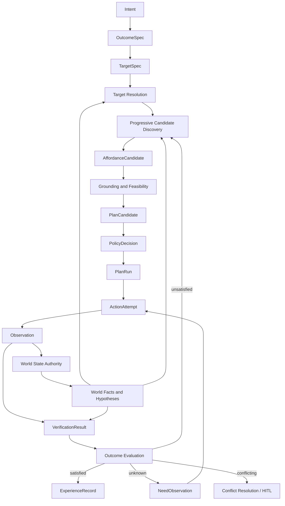

# Athena Agent OS v0.3 Architecture Plan

[Simplified Chinese](./agent-os-architecture-plan-v0.3.zh-CN.md)

> This document freezes the architecture semantics for `v0.3`, not object fields, database storage, or RPC/event contracts. Release scope and gates remain governed by the [versioned delivery plan](./athena-agent-os-version-roadmap-v0.2-v1.0.md). Repository responsibilities, trust boundaries, and Protocol v4 continue to inherit from the [v0.2 architecture plan](./agent-os-architecture-plan-v0.2.md).

| Item | Status |
| --- | --- |
| Target release | `v0.3.0` |
| Current delivery status | Engineering implementation/review for `V3-W1` through `V3-W5` is complete; external `V3-W0` gates and production coverage sampling remain open, so `v0.3.0` has not passed its release gate |
| Architecture semantic baseline | **FROZEN** |
| Object model | `draft/v0alpha` |
| Storage model | Unspecified |
| Wire protocol | Existing Protocol v4 remains stable; transport for new conceptual objects is unspecified |
| First validation target | Browser vertical slice |
| Golden path | Play the second video on the current page |
| Evolution level | `E1-E2`: recording, retrieval, and offline evaluation |

The Browser Vertical Slice in this document is an architecture-validation slice and supplies engineering evidence for roadmap `V3-W1`; it does not mean that `v0.3.0` is complete. Release order, blockers, and acceptance status are governed exclusively by roadmap `V3-W0` through `V3-W5`. In this document, `R0-R3` refers only to behavior risk levels.

See the [v0.3 Evidence Review](./v0.3-evidence-review.md) and [ADR-0001](./adr/0001-v0.3-semantics-carriage.md) for implementation evidence and the protocol decision.

## 1. Purpose

`v0.2` established the Task, Action, Observation, World Model, Capability, and device-control loop. `v0.3` asks a stricter question:

> How does Athena prove that the user's intended result happened instead of merely proving that an action ran?

This plan advances Athena from an action-centric runtime to an effect-centric runtime and validates the object boundaries with a real browser task. It:

1. Freezes architecture invariants that must survive schema changes.
2. Defines the semantic boundaries between outcomes, grounding, affordances, plans, execution, verification, and experience.
3. Maps those concepts to the current repositories and implementation.
4. Defines the browser golden path, failure paths, tests, and exit gates.
5. Avoids prematurely freezing storage and wire contracts.

## 2. Architecture baseline

Athena `v0.3` is defined as:

> **Effect-Centric Runtime + Evidence-Grounded World Model + Progressive Affordance Discovery + Governed Execution + Governed Learning**

Its five design principles are:

1. Goals describe verifiable outcomes rather than implementation actions.
2. World state carries evidence, provenance, freshness, and versions.
3. An affordance is a temporary action opportunity inferred from context, not a permanent object-use label.
4. Capabilities constrain what an actor can execute on a specific device.
5. Learning produces candidates; governance decides what may become production behavior.

## 3. Athena Core Invariants

These invariants extend the `v0.2` invariants. Fields, table names, and encodings may change; these semantics may not.

1. A Goal describes desired effects, not implementation actions.
2. An OutcomeSpec is immutable after a version is created.
3. Target grounding is dynamic, evidence-bound, and tied to an observation snapshot.
4. Only the World State Authority may commit a WorldFact.
5. A Hypothesis is not a WorldFact.
6. A Hypothesis alone cannot authorize strong side effects.
7. An Affordance describes an opportunity; a Plan describes execution.
8. A PlanCandidate is immutable after creation.
9. Execution occurs only through PlanRun and ActionAttempt.
10. Governed execution requires a non-expired, context-bound PolicyDecision.
11. Goal success is decided by effect verification, not action completion.
12. Learning produces candidates; candidates never directly alter production behavior.

Additional constraints:

- An Observation may report environment state but may not write a WorldFact directly.
- A forbidden-effect violation takes precedence over satisfying an ordinary desired effect.
- Closing the frontend does not alter the semantics of a submitted Task.
- Credentials remain references and never enter outcomes, experiences, logs, or model context.

## 4. Four object layers

The following fields define semantics only. They are not frozen JSON schemas.

### 4.1 Goal Layer

#### OutcomeSpec

An OutcomeSpec is a normalized, verifiable description of the user's intended result. It does not bind a concrete device or implementation.

```text
OutcomeSpec
|-- outcome_id
|-- version
|-- goal_ref
|-- target_specs[]
|-- desired_effects[]
|-- must_preserve[]
|-- forbidden_effects[]
|-- constraints[]
|-- actor_constraints[]
|-- verification_requirements[]
|-- deadline
|-- priority
`-- provenance
```

Each effect clause needs a stable identity, typed and versioned predicate, operator, value schema, unit or tolerance, and verification requirements. Free-form strings are not authoritative predicates.

An OutcomeSpec may create a new version but may not be mutated in place. User clarification, changed constraints, or changed authorization scope creates a new version.

#### TargetSpec

A TargetSpec stores the user's stable reference to a target, not the page-dependent resolution.

```text
TargetSpec
|-- target_spec_id
|-- domain
|-- collection_hint
|-- selector
|   |-- type
|   `-- value
|-- semantic_constraints[]
`-- resolution_requirements[]
```

In "play the second video," `second` is an ordinal TargetSpec selector, not a desired effect.

#### TargetResolution

A TargetResolution is a temporary grounding of a TargetSpec against a specific world snapshot.

```text
TargetResolution
|-- resolution_id
|-- target_spec_ref
|-- source_snapshot_ref
|-- resolved_entity_refs[]
|-- evidence_refs[]
|-- confidence
|-- world_read_set[]
|-- decision: execute | reobserve | ask_user | block
`-- valid_until
```

The resolution expires when the page refreshes, the target disappears, a read-set dependency changes, or its TTL expires. The OutcomeSpec remains unchanged.

### 4.2 World and Decision Layer

#### WorldFact

A WorldFact is current state accepted and committed by the World State Authority.

```text
WorldFact
|-- fact_id
|-- subject_ref
|-- predicate
|-- value
|-- fact_type: observed | derived
|-- evidence_refs[]
|-- derivation_ref
|-- confidence
|-- observed_at
|-- valid_until
|-- entity_version
|-- property_version
`-- status
```

A derived fact retains its deterministic rule, input facts, and versions. An opaque model judgment cannot masquerade as a derived fact.

#### Hypothesis

A Hypothesis is a proposition that does not meet the WorldFact commit standard.

```text
Hypothesis
|-- hypothesis_id
|-- proposition
|-- supporting_evidence_refs[]
|-- contradicting_evidence_refs[]
|-- confidence
|-- required_verifications[]
|-- risk_limit
`-- valid_until
```

A hypothesis may trigger low-risk observation or exploration but cannot authorize R2/R3 behavior alone.

#### AffordanceCandidate

An AffordanceCandidate describes an action opportunity inferred from the current Goal, World, Actor, and Capability constraints.

```text
AffordanceCandidate
|-- candidate_id
|-- outcome_ref
|-- target_resolution_refs[]
|-- actor_binding
|-- action_schema_ref
|-- capability_instance_refs[]
|-- generation_mode: direct | compositional | exploratory
|-- contributed_effect_clause_refs[]
|-- preconditions[]
|-- predicted_effects[]
|-- fact_refs[]
|-- hypothesis_refs[]
|-- assumption_refs[]
|-- world_read_set[]
|-- feasibility
|-- success_probability
|-- utility
|-- risk
|-- cost
|-- uncertainty
|-- reversibility
|-- observation_contract
`-- valid_until
```

It is not a Plan, cannot execute directly, and is not permanent world knowledge.

#### PlanCandidate

A PlanCandidate is an immutable execution definition produced from one or more affordance candidates.

```text
PlanCandidate
|-- plan_id
|-- outcome_ref
|-- affordance_refs[]
|-- steps[]
|   |-- action_definition
|   |-- preconditions[]
|   |-- expected_effects[]
|   |-- timeout
|   |-- retry_constraints
|   `-- compensation_definition
|-- dependencies[]
|-- estimates
|-- world_read_set[]
`-- created_at
```

Approval and execution status do not belong to PlanCandidate. Multiple PlanRuns may use the same candidate.

### 4.3 Execution and Governance Layer

#### ExecutionContext

ExecutionContext pins the environment used by a PlanRun. It is required and may be implemented as a value object or a separate record.

```text
ExecutionContext
|-- world_snapshot_ref
|-- capability_snapshot_ref
|-- policy_version
|-- budget_ref
|-- actor_bindings[]
|-- environment_fingerprint
|-- model_build_ref
|-- planner_build_ref
`-- runtime_build_refs[]
```

#### PolicyDecision

A PolicyDecision is a time-bound authorization proof for a subject in a specific context.

```text
PolicyDecision
|-- decision_id
|-- subject_type: plan | action | capability | promotion | plugin | skill
|-- subject_ref
|-- principal_ref
|-- context_hash
|-- world_read_set_hash
|-- policy_version
|-- decision: allow | deny | require_confirmation
|-- reasons[]
|-- approval_ref
|-- decided_at
`-- expires_at
```

A changed dependency, target, actor, capability, policy, or approval scope invalidates reuse.

#### PlanRun

A PlanRun is one real execution of a PlanCandidate.

```text
PlanRun
|-- run_id
|-- plan_ref
|-- execution_context
|-- policy_decision_refs[]
|-- status
|-- active_step_ref
|-- started_at
|-- finished_at
`-- terminal_reason
```

Durable PlanRun state advances through persisted events rather than unaudited in-memory mutation.

#### ActionAttempt

An ActionAttempt is one concrete attempt to run a Plan step.

```text
ActionAttempt
|-- attempt_id
|-- run_ref
|-- step_ref
|-- action_ref
|-- capability_instance_ref
|-- target_resolution_refs[]
|-- idempotency_key
|-- lease_or_fencing_token
|-- policy_decision_ref
|-- started_at
|-- deadline
|-- status
|-- retry_of
`-- compensation_ref
```

A non-idempotent action may not be retried automatically after a network timeout. Retry obeys side-effect, policy, and idempotency constraints.

#### Observation

Observation retains the `v0.2` execution-feedback semantics and gains correlation to PlanRun, ActionAttempt, and Outcome.

```text
Observation
|-- observation_id
|-- provider_ref
|-- device_ref
|-- attempt_ref
|-- run_ref
|-- outcome_ref
|-- schema_version
|-- observed_values[]
|-- evidence_refs[]
|-- provider_sequence
|-- observed_at
|-- received_at
|-- quality
|-- privacy_classification
`-- status
```

Providers are authenticated. Device wall time is not the sole ordering source; the Control Plane also uses sequence, receive time, and fencing tokens.

#### VerificationResult

A VerificationResult records the verdict for one Outcome clause.

```text
VerificationResult
|-- verification_id
|-- outcome_ref
|-- plan_run_ref
|-- effect_clause_ref
|-- status: satisfied | unsatisfied | unknown | conflicting
|-- expected_value
|-- observed_value
|-- evidence_refs[]
|-- confidence
|-- verified_at
`-- verifier_version
```

`unknown` is not failure. It creates an information need, such as asking the File Runtime to confirm a downloaded file.

#### OutcomeVerificationSummary

```text
if any forbidden effect is satisfied:
    failure
else if all desired effects are satisfied and all invariants hold:
    success
else if some desired effects are satisfied:
    partial_success
else if evidence is insufficient or conflicting:
    indeterminate
else:
    failure
```

Terminal statuses also include `cancelled` and `expired`. Nonterminal results continue as follows:

- `unsatisfied`: retry, compensate, or replan.
- `unknown`: request more observations.
- `conflicting`: reconcile evidence or require human intervention.

### 4.4 Learning Layer

#### ExperienceRecord

Every terminal Task produces a sanitized, immutable ExperienceRecord or an explicit skip reason.

```text
ExperienceRecord
|-- experience_id
|-- owner_id
|-- task_ref
|-- outcome_ref
|-- plan_run_ref
|-- execution_context_ref
|-- action_attempt_refs[]
|-- observation_refs[]
|-- verification_refs[]
|-- outcome_summary
|-- failure_classification
|-- cost_and_latency
|-- human_intervention
|-- sensitivity
|-- retention_policy
`-- provenance
```

It is not a chat dump, raw DOM, raw screenshot, or hidden model reasoning.

#### LearningCandidate

A LearningCandidate is derived from multiple ExperienceRecords after aggregation, offline evaluation, and governance.

```text
ExperienceRecord[]
  -> Pattern Aggregation
  -> Offline Evaluation
  -> LearningCandidate
  -> Replay
  -> Review
  -> Shadow
  -> Low-risk Canary
  -> Promotion or Rejection
```

`v0.3` implements ExperienceRecord, retrieval, and offline fixtures. It does not automatically create or activate LearningCandidates.

## 5. Progressive Affordance Discovery

Discovery escalates according to cost and uncertainty.

### 5.1 Level 1: Direct Retrieval

Use registered capabilities, semantic pages, accessibility, ARIA, stable element references, and known action schemas. This is the default low-latency, high-confidence path.

### 5.2 Level 2: Compositional Retrieval

When no direct candidate reaches the success threshold, combine existing capabilities and consult sanitized experiences, similar tasks, and validated strategies.

### 5.3 Level 3: Exploratory Discovery

Run only when the first two levels are insufficient, the user explicitly asks for exploration, or policy and budget allow it. A model may propose an affordance hypothesis, but it must:

- Mark assumptions and uncertainty.
- Bind supporting and contradicting evidence.
- Pass feasibility, policy, and risk gates.
- Gather more observation, simulation, or confirmation before strong side effects.

The `v0.3` browser slice requires Level 1 and permits narrowly bounded Level 2. Level 3 remains trace-only and cannot drive production execution.

## 6. Main runtime loop



The World State Authority is the logical single writer within the Control Plane's governance boundary; it need not be one physical process. It validates evidence, resolves conflicts, commits WorldPatches, and advances property versions.

## 7. Browser vertical slice

### 7.1 Golden path

User request:

```text
Play the second video on the current page.
```

The system produces and correlates:

1. OutcomeSpec: the selected video is playing while the browser session is preserved.
2. TargetSpec: the second item in the current page's video collection.
3. TargetResolution: a stable entity bound to a specific page snapshot.
4. AffordanceCandidate: the resolved video card can be clicked or navigated.
5. PlanCandidate: interact with the target and observe media state.
6. PolicyDecision: the reversible R1 browser interaction is allowed in context.
7. PlanRun with its ExecutionContext.
8. ActionAttempt in the real Browser Runtime.
9. Observation containing URL, title, media presence, `paused`, and `currentTime`.
10. VerificationResult proving media state and, when budget permits, increasing `currentTime` across two samples.
11. OutcomeVerificationSummary with `success`.
12. ExperienceRecord containing sanitized references, result, latency, cost, and implementation versions.

A successful click, changed URL, or a `<video>` element alone does not prove playback.

### 7.2 Snapshot drift

If the page refreshes or a tab closes after target resolution:

- The relevant resolution expires through its read set or target liveness.
- Athena observes again and creates a new TargetResolution.
- It never reuses stale coordinates, ordinals, or CDP targets.

### 7.3 Login-required path

If the second video requires login while the OutcomeSpec preserves the login-state baseline:

- Observation reports `login_required`.
- Verification is `unsatisfied` or `unknown`, never fabricated success.
- The Planner may look for an equivalent no-login path but may not log in silently.
- If no compliant path exists, the outcome becomes failure, partial success, or indeterminate.

### 7.4 Forbidden-effect path

If an action closes an existing window, changes login state, or navigates to the wrong target:

- A forbidden or must-preserve violation overrides ordinary playback success.
- Athena attempts safe compensation and otherwise records an explicit terminal reason and error chain.

## 8. Current implementation mapping

| Semantic concept | Browser-slice implementation | Status |
| --- | --- | --- |
| Intent, OutcomeSpec, and immutable PlanCandidate | `agent-runtime/internal/effectspec`, `internal/tools/browser_public.go`, and the direct browser dispatcher | `V3-W1` draft slice implemented |
| TargetSpec and TargetResolution | Stable selectors originate in Runtime; Launcher resolves them against an exact snapshot in `browser-runtime/effect_semantics.go` | `V3-W1` draft slice implemented |
| Browser affordance | Launcher derives a bounded AffordanceCandidate from the resolved entity and current browser state | `V3-W1` Level 1 draft implemented |
| Action/Observation | `athena-protocol/protocol/v4` and device WebSocket carry `draft/v0alpha` semantic metadata without changing the stable v4 envelope | `V3-W1` internal representation implemented |
| Policy, PlanRun, and ActionAttempt | Runtime Client binds the device, capability instance, world read-set hash, policy expiry, run, and attempt before dispatch | `V3-W1` draft slice implemented |
| Effect verification | Launcher emits clause-level `satisfied`, `unsatisfied`, `unknown`, or `conflicting` results and an aggregate outcome | `V3-W1` golden path and `V3-W2` failure matrix implemented |
| Experience | Runtime Client retains the sanitized final trace and only marks Experience verified when the effect summary succeeded | `V3-W3` privacy and retention lifecycle implemented; production coverage remains a release gate |
| User-visible evidence | Frontend timeline renders outcome, selector, grounded entity, policy, run, expected/observed clause values, evidence references, and aggregate state | `V3-W1` evidence view implemented |

The Browser Vertical Slice extends the existing target resolver and automation verifier rather than creating parallel engines. Semantic Trace is currently persisted inside existing Task and Observation JSON metadata. This is deliberate: the slice validates object ownership and lifecycle before any production table or public protocol is frozen.

### 8.1 Landing status

Phases A-E now provide executable representations for the golden path, failure matrix, Experience lifecycle, and offline evaluation across Runtime, Runtime Client, Launcher, Protocol, and Frontend. Phase F has completed its engineering evidence review, while the overall release remains blocked by the explicitly listed `V3-W0` external gates:

- `athena-protocol/draft/v0alpha` is strict and rejects invalid references, incomplete effect coverage, stale plan hashes, invalid attempt lifecycles, and run/verification disagreement.
- The real browser golden path binds the second visible item, keeps one browser session, opens the exact resolved URL, starts real media, verifies playback progress, and then opens another tab without losing session identity.
- The login-required fixture preserves authentication state and cannot silently log in; snapshot drift, missing target, unknown evidence, forbidden effects, cancellation, and retry exhaustion are covered by the `V3-W2` matrix.
- `unknown` pauses the run and requests more observation; transport success alone cannot become goal success.
- Deterministic replay produces the same target and effect summary for the same fixture.
- Observation sanitization retains effect and evidence correlation while removing credential material.

Object fields remain `draft/v0alpha`; storage and any future public wire representation remain explicitly unfrozen until Phase F evidence review.

The executable acceptance test is `ATHENA_BROWSER_E2E=1 ATHENA_AGENT_BROWSER_BIN=<path> go test ./internal/runtime-system/browser-runtime -run TestE2EBrowserV3KeepsSessionAndSelectsSecondResult -count=1 -v` in `athena-launcher`. It supplies real execution evidence for `V3-W1`; the failure matrix, privacy lifecycle, evaluation, and field review provide the remaining `V3-W2` through `V3-W5` engineering evidence. None of these tests implicitly freeze the draft schema or override the open release gates.

## 9. Repository delivery boundaries

### 9.1 `agent-runtime`

- Produce OutcomeSpec and TargetSpec from intent.
- Consume World Slice and TargetResolution.
- Produce AffordanceCandidate and PlanCandidate.
- React to VerificationResult with completion, observation, retry, compensation, or replanning.
- Never persist runtime truth or execute browser actions directly.

### 9.2 `agent-runtime-client`

- Persist authoritative Task, PlanRun, ActionAttempt, Observation, Verification, and Experience correlations.
- Produce ExecutionContext snapshot references.
- Enforce policy, approval, routing, revision, and idempotency.
- Govern the World State Authority.
- Enforce ownership, redaction, and retention.

### 9.3 `athena-launcher`

- Observe the active browser session and resolve targets.
- Bind real CapabilityInstances and stable browser targets.
- Execute ActionAttempts and return real observations and evidence.
- Enforce local permissions, raising but never lowering risk.
- Never decide whether the user's Goal is complete.

### 9.4 `athena-protocol`

- Continue using Protocol v4 Action/Observation at the start of `v0.3`.
- `Protocol v4` names the Action/Observation schema family; `Athena Protocol v1.0` names the current stable release set. `v0.3` neither rewrites nor unfreezes an existing stable contract.
- Validate conceptual objects as internal `draft/v0alpha` types, event metadata, or fixtures.
- Do not change frozen protocol hashes for fields not proven by the vertical slice.
- Propose a protocol ADR only after browser and conformance tests pass.

### 9.5 `frontend/agent-ui`

- Show Outcome, Target Resolution, Policy, Attempt, and Verification in the Task timeline.
- Distinguish action completion from verified goal success.
- Provide recoverable UI for Ask User, Manual Takeover, Unknown, and Conflict.
- Never expose hidden model reasoning or sensitive raw evidence.

## 10. Implementation phases

Phases A-F are a technical decomposition of the browser architecture slice, not an alternative release route. Their mapping to the authoritative release workstreams is: the golden-path baseline of Phases A-D belongs to `V3-W1`, while their negative and recovery scenarios belong to `V3-W2`; production lifecycle work in Phase E is accepted by `V3-W3` and `V3-W4`; Phase F corresponds to `V3-W5`. Every phase remains constrained by the `V3-W0` prerequisite gate.

### Phase A: Semantic trace

- Add internal `draft/v0alpha` conceptual types and fixtures.
- Emit complete correlation IDs for the golden path.
- Add no production database migration and change no public wire protocol.

### Phase B: Target grounding

- Generate a stable TargetSpec from intent.
- Extend the current resolver with snapshot, evidence, and property read set.
- Test refresh, tab closure, ordinal drift, and low confidence.

### Phase C: Plan and execution separation

- Separate PlanCandidate, PlanRun, and ActionAttempt.
- Add idempotency, deadline, retry, and policy correlation.
- Ensure duplicate delivery creates no duplicate side effect.

### Phase D: Effect verification loop

- Implement clause-level four-state VerificationResult.
- Implement OutcomeVerificationSummary precedence.
- Let `unknown` request observation and `unsatisfied` enter bounded retry or replan.

### Phase E: Experience and replay

- Generate a sanitized ExperienceRecord asynchronously for terminal Tasks.
- Pin ExecutionContext, attempts, observations, and verifications to fixtures.
- Replay deterministic mock browser snapshots without production accounts.

### Phase F: Protocol review

- Measure the fields, states, and compatibility issues used by the slice.
- Remove fields not justified by real execution.
- Add strict decoding, round-trip, golden fixture, and cross-language tests.
- Review whether new objects belong in internal metadata, a compatible extension, or a new protocol version. Do not freeze a new contract in this phase.

## 11. Test plan

### 11.1 Unit tests

- Outcome-clause precedence.
- Target selector and snapshot binding.
- Precise read-set invalidation.
- Hypothesis versus Fact authorization.
- Policy context hashing and expiry.
- Non-idempotent retry blocking.
- Four-state verification transitions.

### 11.2 Contract tests

- Existing Protocol v4 Action/Observation tests remain green.
- `draft/v0alpha` fixture strict decoding and round trip.
- Correlation IDs survive from Outcome through Experience.
- Provider sequence, attempt, and evidence correlation remain consistent.

### 11.3 Replay tests

- The same snapshot, PlanCandidate, and ExecutionContext produce the same result.
- Runtime, Capability, or Policy version differences are explicit rather than hidden as environment noise.
- Replay never connects to production browser profiles, accounts, or write APIs.

### 11.4 End-to-end tests

- Golden path: play the second video and prove actual playback.
- Drift path: refresh or close a tab and ground the target again.
- Login path: do not silently log in when preserving login state.
- Unknown path: use File Runtime when browser observation cannot prove a download.
- Forbidden path: a side-effect violation overrides ordinary success.
- Cancel path: cancellation reaches the active attempt and produces an explicit terminal state.

## 12. Observability

Every golden-path run exposes one timeline:

```text
Intent normalized
OutcomeSpec created
Target resolution started/completed
Affordance candidates generated/ranked
PlanCandidate created
Policy decided
PlanRun started
ActionAttempt started/completed
Observation received/validated
WorldPatch accepted/rejected
Effect verified
Outcome summarized
Experience recorded/skipped
```

Every span carries `trace_id`, `task_id`, `outcome_id`, `plan_id`, `run_id`, `attempt_id`, component, build version, start, finish, duration, and structured error chain. Logs exclude credentials, cookies, tokens, password fields, and unredacted page bodies.

## 13. Security and privacy

- R2/R3 behavior still requires explicit authorization and cannot use automatic canary.
- A hypothesis or model score cannot lower the Capability risk floor.
- Browser content is untrusted input and cannot override system, policy, or explicit user constraints.
- Raw DOM, screenshots, and page bodies are short-lived artifacts by default and do not enter Experience payloads.
- TargetResolution references snapshots only inside the user's device scope.
- ExecutionContext stores credential references or irreversible fingerprints, never plaintext secrets.
- Users may disable experience recording and delete deletable payloads.

## 14. Architecture-slice exit gate

This section determines only whether the browser architecture slice supplies sufficient evidence. It is not the `v0.3.0` release gate, which separately requires every roadmap condition from `V3-W0` through `V3-W5`.

The `v0.3` browser vertical slice passes only when:

1. The golden path produces a complete Outcome-to-Experience trace.
2. The second video binds to a stable entity in a named snapshot rather than reinterpreting the ordinal at execution time.
3. Refresh or target removal precisely invalidates the resolution without global recomputation for irrelevant changes.
4. A successful action with no playback never produces a successful outcome.
5. `unknown` triggers budgeted information gathering rather than immediate failure.
6. A forbidden-effect violation overrides ordinary success.
7. The login-required path never changes login state silently.
8. Replaying the same fixture is repeatable and records implementation-version differences.
9. At least 95% of terminal Tasks create a sanitized ExperienceRecord; the remainder record a skip reason.
10. Secret and PII corpus leakage is zero.
11. No LearningCandidate alters production planning automatically.
12. Existing Protocol v4 contract tests remain green.

## 15. Explicit non-goals

`v0.3` does not implement:

- General robot motion or physical-property reasoning.
- Complex or self-learning ontology.
- Production execution of exploratory affordances by default.
- Automatic generation, compilation, installation, or activation of plugin code.
- Automatic Skill or Strategy promotion.
- Online production canary.
- Self-rewriting core runtime.
- A separate business workflow for every website.
- Premature freezing of object fields, database tables, or a new wire protocol.

## 16. Freeze and change rules

Current status:

```text
Architecture Semantic Baseline: FROZEN
Object Schemas: draft/v0alpha
Storage Model: Unspecified
Wire Protocol: Existing Protocol v4 remains stable; new object transport is unspecified
Validation Target: Browser Vertical Slice
```

Changing the twelve Core Invariants, four-layer responsibilities, or World State Authority ownership is an architecture-breaking change and requires an ADR and review. Internal fields and fixtures may change based on browser-slice evidence. Any public wire change requires compatibility, strict-decoding, cross-language fixture, and rollback review.

The next phase does not add more abstractions or reopen completed `V3-W1` through `V3-W5` engineering work. It is restricted to closing the remaining `V3-W0` evidence gates: signed platform installers, the complete packaged 500-journey soak, one complete ten-span acceptance Trace, and 95% production-like terminal-task Experience coverage. Work on `v0.4` remains prohibited until the aggregate release gate passes.

Object fields, database models, and new wire contracts may be frozen only when supported by this execution evidence and an ADR. Merged implementation code, one passing golden path, or the existence of internal tables does not change contract maturity by itself. The existing Athena Protocol v1.0 stable set remains unchanged.
