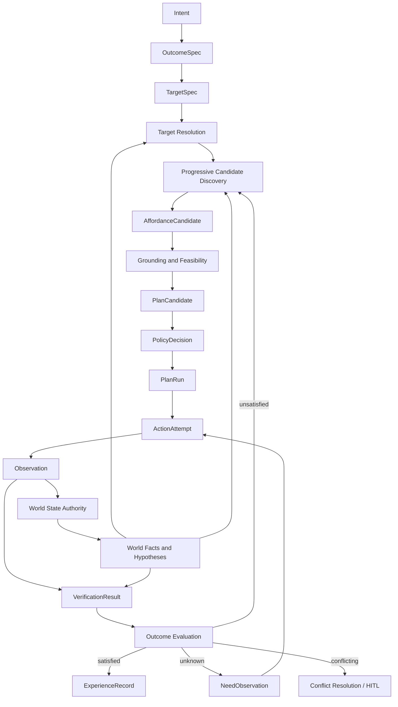

# Athena Agent OS v0.3 架构设计方案

[English](./agent-os-architecture-plan-v0.3.md)

> 本文冻结 `v0.3` 的架构语义，不冻结对象字段、数据库模型或 RPC/事件协议。发布范围和 Release Gate 仍以 [Athena Agent OS 分版本落地计划](./athena-agent-os-version-roadmap-v0.2-v1.0.zh-CN.md) 为准；仓库职责、信任边界与 Protocol v4 继续继承 [v0.2 架构设计方案](./agent-os-architecture-plan-v0.2.zh-CN.md)。

| 项目 | 状态 |
| --- | --- |
| 目标版本 | `v0.3.0` |
| 当前交付状态 | `V3-W1` 至 `V3-W5` 工程实现/评审完成；`V3-W0` 外部门禁与生产覆盖率采样未关闭，`v0.3.0` 尚未达到 Release Gate |
| 架构语义基线 | **FROZEN** |
| 对象模型 | `draft/v0alpha` |
| 存储模型 | 未指定 |
| Wire Protocol | 现有 Protocol v4 保持稳定；新增概念对象的传输方式未指定 |
| 首个验证目标 | Browser 垂直链路 |
| Golden Path | 播放当前页面中的第二个视频 |
| 本期演进级别 | `E1-E2`：记录、检索与离线评测 |

本文中的 Browser Vertical Slice 是架构验证切片，对应总路线图的 `V3-W1` 工程证据，不等于 `v0.3.0` 已完成。发布顺序、阻塞条件和验收状态统一以总路线图的 `V3-W0` 至 `V3-W5` 为准。本文中的 `R0-R3` 只表示行为风险等级。

实现证据与协议决策见 [v0.3 Evidence Review](./v0.3-evidence-review.zh-CN.md) 和 [ADR-0001](./adr/0001-v0.3-semantics-carriage.zh-CN.md)。

## 1. 文档目的

`v0.2` 建立了 Task、Action、Observation、World Model、Capability 和设备控制闭环。`v0.3` 在此基础上回答一个更严格的问题：

> Athena 如何证明用户想要的结果真的发生了，而不只是证明某个动作已经执行？

本方案把 Athena 从 Action-centric Runtime 推进为 Effect-centric Runtime，并以真实 Browser 任务反向验证对象边界。本文负责：

1. 冻结不会随字段变化而变化的架构不变量。
2. 定义 Outcome、Grounding、Affordance、Plan、Execution、Verification 和 Experience 的语义边界。
3. 说明这些概念如何映射到现有仓库和实现。
4. 定义 Browser Golden Path、失败路径、测试和退出门槛。
5. 明确本版本不提前冻结存储和线协议。

## 2. 核心结论

Athena `v0.3` 的架构基线定义为：

> **Effect-Centric Runtime + Evidence-Grounded World Model + Progressive Affordance Discovery + Governed Execution + Governed Learning**

对应的五条设计哲学是：

1. 目标描述可验证结果，而不是实现动作。
2. 世界状态必须具有证据、来源、时效和版本。
3. Affordance 是动态推导出的临时行动机会，不是对象的永久用途标签。
4. Capability 约束 Actor 在当前设备上实际能够执行什么。
5. 学习只产生 Candidate，治理系统决定什么可以成为生产行为。

## 3. Athena Core Invariants

以下不变量继承并补充 `v0.2` 不变量。字段、表名和传输格式可以变化，但这些语义不能被破坏。

1. Goal 描述期望效果，不描述实现动作。
2. OutcomeSpec 创建版本后不可原地修改。
3. Target Grounding 必须动态、证据化并绑定观察快照。
4. WorldFact 只能由 World State Authority 提交。
5. Hypothesis 不是 WorldFact。
6. Hypothesis 不能单独授权强副作用行为。
7. Affordance 描述行动机会，Plan 描述执行方法。
8. PlanCandidate 创建后不可原地修改。
9. 实际执行只能通过 PlanRun 和 ActionAttempt 发生。
10. 受治理的执行必须具有绑定上下文且未过期的 PolicyDecision。
11. Goal 是否成功由 Effect Verification 决定，而不是由 Action 完成决定。
12. 学习只能产生 Candidate，Candidate 不能直接改变生产行为。

附加约束：

- Observation 可以报告环境状态，但不能直接写入 WorldFact。
- Forbidden Effect 的违反优先于普通 Desired Effect 的满足。
- Frontend 关闭不能改变已提交 Task 的执行语义。
- 凭据始终以 Reference 形式传递，不进入 Outcome、Experience、日志或模型上下文。

## 4. 四层对象模型

对象按职责分成四层。以下字段仅用于明确语义，不是冻结后的 JSON Schema。

### 4.1 Goal Layer

#### OutcomeSpec

OutcomeSpec 是用户意图规范化后的、可验证的结果描述。它不绑定具体执行设备或实现方法。

```text
OutcomeSpec
├── outcome_id
├── version
├── goal_ref
├── target_specs[]
├── desired_effects[]
├── must_preserve[]
├── forbidden_effects[]
├── constraints[]
├── actor_constraints[]
├── verification_requirements[]
├── deadline
├── priority
└── provenance
```

每条 Effect Clause 至少需要稳定标识、类型化 Predicate、Operator、Value Schema、单位或容差，以及验证要求。Predicate 必须来自带版本的命名空间，不能依赖自由文本。

OutcomeSpec 可以创建新版本，但不能原地改写。用户澄清目标、目标约束变化或权限范围变化时必须产生新版本。

#### TargetSpec

TargetSpec 保存用户稳定的目标指代，不保存随页面变化而变化的解析结果。

```text
TargetSpec
├── target_spec_id
├── domain
├── collection_hint
├── selector
│   ├── type
│   └── value
├── semantic_constraints[]
└── resolution_requirements[]
```

例如“播放第二个视频”中的 `第二个` 是 TargetSpec 的 Ordinal Selector，不是 Desired Effect。

#### TargetResolution

TargetResolution 是 TargetSpec 在特定世界快照下的临时 Grounding 结果。

```text
TargetResolution
├── resolution_id
├── target_spec_ref
├── source_snapshot_ref
├── resolved_entity_refs[]
├── evidence_refs[]
├── confidence
├── world_read_set[]
├── decision
│   ├── execute
│   ├── reobserve
│   ├── ask_user
│   └── block
└── valid_until
```

页面刷新、目标实体消失、依赖属性版本变化或 TTL 到期时，TargetResolution 失效；OutcomeSpec 保持不变。

### 4.2 World and Decision Layer

#### WorldFact

WorldFact 是由 World State Authority 接受并提交的当前状态投影。

```text
WorldFact
├── fact_id
├── subject_ref
├── predicate
├── value
├── fact_type: observed | derived
├── evidence_refs[]
├── derivation_ref
├── confidence
├── observed_at
├── valid_until
├── entity_version
├── property_version
└── status
```

Derived Fact 必须保留确定性推导规则、输入 Fact 和版本。不可解释的模型判断不能伪装成 Derived Fact。

#### Hypothesis

Hypothesis 是尚未达到 WorldFact 提交标准的推测。

```text
Hypothesis
├── hypothesis_id
├── proposition
├── supporting_evidence_refs[]
├── contradicting_evidence_refs[]
├── confidence
├── required_verifications[]
├── risk_limit
└── valid_until
```

Hypothesis 可以触发低风险观察或探索，但不能单独授权 R2/R3 行为。

#### AffordanceCandidate

AffordanceCandidate 描述：在当前 Goal、World、Actor 和 Capability 约束下，某个目标可能提供什么行动机会。

```text
AffordanceCandidate
├── candidate_id
├── outcome_ref
├── target_resolution_refs[]
├── actor_binding
├── action_schema_ref
├── capability_instance_refs[]
├── generation_mode: direct | compositional | exploratory
├── contributed_effect_clause_refs[]
├── preconditions[]
├── predicted_effects[]
├── fact_refs[]
├── hypothesis_refs[]
├── assumption_refs[]
├── world_read_set[]
├── feasibility
├── success_probability
├── utility
├── risk
├── cost
├── uncertainty
├── reversibility
├── observation_contract
└── valid_until
```

AffordanceCandidate 不是 Plan，不能直接执行，也不能作为永久 WorldFact 保存。

#### PlanCandidate

PlanCandidate 是 Planner 使用一个或多个 AffordanceCandidate 生成的不可变执行定义。

```text
PlanCandidate
├── plan_id
├── outcome_ref
├── affordance_refs[]
├── steps[]
│   ├── action_definition
│   ├── preconditions[]
│   ├── expected_effects[]
│   ├── timeout
│   ├── retry_constraints
│   └── compensation_definition
├── dependencies[]
├── estimates
├── world_read_set[]
└── created_at
```

Approval 和执行状态不写入 PlanCandidate。相同 PlanCandidate 可以被多个 PlanRun 使用。

### 4.3 Execution and Governance Layer

#### ExecutionContext

ExecutionContext 固定一次 PlanRun 使用的运行环境。它是 PlanRun 的必需结构，可以作为值对象或独立记录实现。

```text
ExecutionContext
├── world_snapshot_ref
├── capability_snapshot_ref
├── policy_version
├── budget_ref
├── actor_bindings[]
├── environment_fingerprint
├── model_build_ref
├── planner_build_ref
└── runtime_build_refs[]
```

#### PolicyDecision

PolicyDecision 是 Policy Engine 针对特定 Subject 和 Context 产生的时效性授权证明。

```text
PolicyDecision
├── decision_id
├── subject_type: plan | action | capability | promotion | plugin | skill
├── subject_ref
├── principal_ref
├── context_hash
├── world_read_set_hash
├── policy_version
├── decision: allow | deny | require_confirmation
├── reasons[]
├── approval_ref
├── decided_at
└── expires_at
```

世界依赖、目标、Actor、Capability、策略或批准范围变化时，旧 Decision 不能复用。

#### PlanRun

PlanRun 表示一次 PlanCandidate 的真实执行实例。

```text
PlanRun
├── run_id
├── plan_ref
├── execution_context
├── policy_decision_refs[]
├── status
├── active_step_ref
├── started_at
├── finished_at
└── terminal_reason
```

PlanRun 状态通过持久化 Event 推进，不能通过未审计的内存赋值成为持久化真相。

#### ActionAttempt

ActionAttempt 表示某个 Plan Step 的一次具体尝试。

```text
ActionAttempt
├── attempt_id
├── run_ref
├── step_ref
├── action_ref
├── capability_instance_ref
├── target_resolution_refs[]
├── idempotency_key
├── lease_or_fencing_token
├── policy_decision_ref
├── started_at
├── deadline
├── status
├── retry_of
└── compensation_ref
```

非幂等 Action 不得因为网络超时被自动重试。重试必须遵守 Side Effect、Policy 和 Idempotency 约束。

#### Observation

Observation 继续使用 `v0.2` 的真实执行反馈语义，并增加与 PlanRun、ActionAttempt 和 Outcome 的关联。

```text
Observation
├── observation_id
├── provider_ref
├── device_ref
├── attempt_ref
├── run_ref
├── outcome_ref
├── schema_version
├── observed_values[]
├── evidence_refs[]
├── provider_sequence
├── observed_at
├── received_at
├── quality
├── privacy_classification
└── status
```

Provider 必须经过认证。设备时间不能作为唯一排序依据，Control Plane 需要结合序列、接收时间和 Fencing Token 处理乱序结果。

#### VerificationResult

VerificationResult 针对单个 Outcome Clause 记录验证结论。

```text
VerificationResult
├── verification_id
├── outcome_ref
├── plan_run_ref
├── effect_clause_ref
├── status: satisfied | unsatisfied | unknown | conflicting
├── expected_value
├── observed_value
├── evidence_refs[]
├── confidence
├── verified_at
└── verifier_version
```

`unknown` 不等于失败。它会产生新的信息需求，例如要求 File Runtime 验证下载文件是否落盘。

#### OutcomeVerificationSummary

OutcomeVerificationSummary 聚合所有 Clause 的结果：

```text
if any forbidden_effect is satisfied:
    failure
else if all desired_effects are satisfied and all invariants hold:
    success
else if some desired_effects are satisfied:
    partial_success
else if evidence is insufficient or conflicting:
    indeterminate
else:
    failure
```

终态还包括 `cancelled` 和 `expired`。当结果不是终态时：

- `unsatisfied`：重试、补偿或重新规划。
- `unknown`：请求更多 Observation。
- `conflicting`：冲突消解或 Human-in-the-Loop。

### 4.4 Learning Layer

#### ExperienceRecord

每个终态 Task 都应产生脱敏、不可变的 ExperienceRecord，或记录无法产生的明确原因。

```text
ExperienceRecord
├── experience_id
├── owner_id
├── task_ref
├── outcome_ref
├── plan_run_ref
├── execution_context_ref
├── action_attempt_refs[]
├── observation_refs[]
├── verification_refs[]
├── outcome_summary
├── failure_classification
├── cost_and_latency
├── human_intervention
├── sensitivity
├── retention_policy
└── provenance
```

ExperienceRecord 不是聊天转储、原始 DOM、原始截图或模型隐藏思维链。

#### LearningCandidate

LearningCandidate 由多个 ExperienceRecord 经过聚合、离线评测和治理后生成。

```text
ExperienceRecord[]
  -> Pattern Aggregation
  -> Offline Evaluation
  -> LearningCandidate
  -> Replay
  -> Review
  -> Shadow
  -> Low-risk Canary
  -> Promotion or Rejection
```

`v0.3` 只实现 ExperienceRecord、检索和离线 Fixture，不自动生成或激活 LearningCandidate。

## 5. Progressive Affordance Discovery

候选发现按成本和不确定性逐级升级。

### 5.1 Level 1: Direct Retrieval

使用已注册 Capability、语义页面、Accessibility、ARIA、稳定元素引用和已知 Action Schema。它是默认路径，要求低延迟和高确定性。

### 5.2 Level 2: Compositional Retrieval

当 Direct Candidate 不存在或低于成功阈值时，组合多个已有 Capability，并参考脱敏 Experience、相似任务和已验证策略。

### 5.3 Level 3: Exploratory Discovery

只有在前两级不足、用户明确要求探索，或 Policy 与预算允许时启动。模型可以提出新的 Affordance Hypothesis，但必须：

- 明确标记假设和不确定性。
- 绑定支持证据和反证。
- 通过 Feasibility、Policy 和风险门。
- 在强副作用前补充 Observation、Simulation 或人工确认。

`v0.3` 的 Browser Vertical Slice 只要求 Level 1，并允许非常有限的 Level 2。Level 3 只保留概念和 Trace，不进入生产执行。

## 6. 主运行闭环



World State Authority 是 Control Plane 治理范围内的逻辑单写者，不要求由一个物理进程承担全部计算。它负责验证 Evidence、处理冲突、提交 WorldPatch 和推进属性版本。

## 7. Browser Vertical Slice

### 7.1 Golden Path

用户输入：

```text
播放当前页面中的第二个视频。
```

系统必须产生并关联以下可观测对象：

1. OutcomeSpec：目标视频进入播放状态，同时保持 Browser Session。
2. TargetSpec：当前页面视频集合中的第二项。
3. TargetResolution：绑定特定页面 Snapshot 与稳定实体引用。
4. AffordanceCandidate：目标 Video Card 在当前状态下可点击或可导航。
5. PlanCandidate：执行目标交互并观察媒体状态。
6. PolicyDecision：R1 可逆 Browser 行为在当前上下文下允许执行。
7. PlanRun 与 ExecutionContext。
8. ActionAttempt：真实 Browser Runtime 交互尝试。
9. Observation：URL、标题、媒体存在、`paused` 与 `currentTime`。
10. VerificationResult：媒体状态满足，且 `currentTime` 在两个采样点之间增加。
11. OutcomeVerificationSummary：`success`。
12. ExperienceRecord：保存脱敏引用、结果、耗时、成本和实现版本。

点击返回成功、URL 变化或页面出现 `<video>` 都不能单独证明播放成功。验证至少需要 `paused == false`，并在有预算时确认 `currentTime` 增加。

### 7.2 Snapshot Drift

在 TargetResolution 后刷新页面或关闭前一个 Tab：

- 原 Resolution 必须因 Read Set 或 Target 存活性变化而失效。
- 系统必须重新观察并生成新的 TargetResolution。
- 不得继续使用旧坐标、旧 Ordinal 或旧 CDP Target。

### 7.3 Login-required Failure Path

第二个视频要求登录，而 OutcomeSpec 要求 `login_state` 保持基线：

- Observation 报告 `login_required`。
- VerificationResult 为 `unsatisfied` 或 `unknown`，不能伪造 Success。
- Planner 可以寻找不需要登录的等价路径，但不能静默登录。
- 如果没有满足约束的路径，Outcome 为 `failure`、`partial_success` 或 `indeterminate`。

### 7.4 Forbidden-effect Path

如果 Action 意外关闭现有窗口、改变登录态或跳转到错误目标：

- Forbidden/Must-preserve Clause 的失败覆盖普通播放成功。
- 系统尝试安全补偿；无法补偿时记录明确终态与错误链。

## 8. 当前实现映射

| 语义对象或能力 | Browser Slice 实现 | 状态 |
| --- | --- | --- |
| Intent、OutcomeSpec 与不可变 PlanCandidate | `agent-runtime/internal/effectspec`、`internal/tools/browser_public.go` 与 Direct Browser Dispatcher | `V3-W1` Draft Slice 已实现 |
| TargetSpec 与 TargetResolution | Runtime 生成稳定 Selector；Launcher 在 `browser-runtime/effect_semantics.go` 中针对精确 Snapshot 完成 Grounding | `V3-W1` Draft Slice 已实现 |
| Browser Affordance | Launcher 从已解析实体和当前 Browser State 生成受限 AffordanceCandidate | `V3-W1` Level 1 Draft 已实现 |
| Action/Observation | `athena-protocol/protocol/v4` 与设备 WebSocket 在不修改稳定 v4 Envelope 的前提下传递 `draft/v0alpha` Metadata | `V3-W1` 内部表达已实现 |
| Policy、PlanRun 与 ActionAttempt | Runtime Client 在 Dispatch 前绑定 Device、Capability Instance、World Read-set Hash、Policy Expiry、Run 与 Attempt | `V3-W1` Draft Slice 已实现 |
| Effect Verification | Launcher 输出 Clause 级 `satisfied`、`unsatisfied`、`unknown`、`conflicting` 和聚合结果 | `V3-W1` Golden Path 与 `V3-W2` Failure Matrix 已实现 |
| Experience | Runtime Client 保留脱敏后的最终 Trace；只有 Effect Summary 成功时才标记 Experience 已验证 | `V3-W3` 隐私与保留生命周期已实现；生产覆盖率仍是 Release Gate |
| 用户可见证据 | Frontend Timeline 展示 Outcome、Selector、已定位实体、Policy、Run、Clause 预期/观测值、Evidence Ref 与聚合状态 | `V3-W1` 证据视图已实现 |

Browser Vertical Slice 继续扩展现有 Target Resolver 和 Automation Verifier，没有新建并行引擎。Semantic Trace 当前保存在现有 Task/Observation JSON Metadata 中。这是刻意选择：先用真实 Slice 验证对象所有权和生命周期，再冻结生产表或公共协议。

### 8.1 落地状态

当前 Phases A-E 已经为 Golden Path、Failure Matrix、Experience 生命周期与离线评测提供跨 Runtime、Runtime Client、Launcher、Protocol 和 Frontend 的可执行表示。Phase F 已完成工程证据评审，但整体 Release 仍受明确列出的 `V3-W0` 外部门禁阻塞：

- `athena-protocol/draft/v0alpha` 使用严格校验，拒绝错误引用、不完整 Effect 覆盖、过期 Plan Hash、非法 Attempt 生命周期以及 Run/Verification 不一致。
- 真实 Browser Golden Path 会绑定第二个可见项目、保持同一个 Browser Session、打开精确解析 URL、启动真实媒体、验证播放进度，并继续在不丢失 Session Identity 的情况下打开另一标签页。
- Login-required Fixture 保持 Authentication State，不允许静默登录；Snapshot Drift、Target Missing、Unknown、Forbidden Effect、Cancel 和 Retry Exhaustion 已由 `V3-W2` 矩阵覆盖。
- `unknown` 会暂停 Run 并请求更多 Observation；Transport Success 不能直接变成 Goal Success。
- 相同 Fixture 的确定性 Replay 会得到相同 Target 与 Effect Summary。
- Observation 脱敏持久化会保留 Effect/Evidence 关联，同时删除凭据材料。

对象字段继续保持 `draft/v0alpha`；Storage 和未来 Public Wire 表达在 Phase F 证据评审前明确不冻结。

可执行验收命令为：在 `athena-launcher` 中运行 `ATHENA_BROWSER_E2E=1 ATHENA_AGENT_BROWSER_BIN=<path> go test ./internal/runtime-system/browser-runtime -run TestE2EBrowserV3KeepsSessionAndSelectsSecondResult -count=1 -v`。该测试为 `V3-W1` 提供真实执行证据；Failure Matrix、隐私生命周期、Evaluation 与字段评审提供 `V3-W2` 至 `V3-W5` 的其余工程证据。这些测试都不会自动冻结 Draft Schema，也不会覆盖仍开放的 Release Gate。

## 9. 仓库交付边界

### 9.1 `agent-runtime`

- 从 Intent 生成 OutcomeSpec 与 TargetSpec。
- 消费 World Slice 和 TargetResolution。
- 生成 AffordanceCandidate 与 PlanCandidate。
- 根据 VerificationResult 选择完成、补充观察、重试、补偿或重新规划。
- 不持久化运行真相，不直接执行 Browser Action。

### 9.2 `agent-runtime-client`

- 持久化 Task、PlanRun、ActionAttempt、Observation、Verification 和 Experience 的关联真相。
- 生成 ExecutionContext 快照引用。
- 执行 Policy、Approval、设备路由、Revision 和 Idempotency 校验。
- 作为 World State Authority 的治理边界。
- 保证用户隔离、脱敏和保留策略。

### 9.3 `athena-launcher`

- 在当前 Browser Session 中观察页面并解析 Target。
- 绑定真实 CapabilityInstance 和稳定 Browser Target。
- 执行 ActionAttempt，返回真实 Observation 与 Evidence。
- 执行本地权限门；允许提高风险，禁止降低风险。
- 不判断用户 Goal 是否最终完成。

### 9.4 `athena-protocol`

- `v0.3` 开始时继续使用现有 Protocol v4 Action/Observation。
- `Protocol v4` 表示 Action/Observation Schema 家族；`Athena Protocol v1.0` 表示当前稳定发布集合。`v0.3` 不重写或解冻任何已有稳定契约。
- 概念对象先以 `draft/v0alpha` 内部类型、Event Metadata 或测试 Fixture 验证。
- 不修改已冻结的稳定协议 Hash 来迎合尚未验证的字段设计。
- Browser Slice 和 Conformance Test 通过后，再提出正式协议 ADR。

### 9.5 `frontend/agent-ui`

- 在 Task Timeline 展示 Outcome、Target Resolution、Policy、Attempt 和 Verification。
- 明确区分“动作执行完成”和“目标验证成功”。
- 对 Ask User、Manual Takeover、Unknown 和 Conflict 提供可恢复交互。
- 不展示模型隐藏思维链或敏感原始 Evidence。

## 10. 实施阶段

本节的 Phase A-F 是 Browser 架构切片的技术分解，不是另一套版本路线。它们与权威 Release Workstream 的映射为：Phase A-D 的 Golden Path 基线属于 `V3-W1`，其负向与恢复场景属于 `V3-W2`；Phase E 的生产生命周期分别由 `V3-W3` 和 `V3-W4` 验收；Phase F 对应 `V3-W5`。所有工作仍受 `V3-W0` 前置门禁约束。

### Phase A: Semantic Trace

- 增加内部 `draft/v0alpha` 概念类型和序列化 Fixture。
- 为 Golden Path 输出完整 Correlation ID。
- 不增加生产数据库迁移，不修改公共 Wire Protocol。

### Phase B: Target Grounding

- 从 Intent 生成稳定 TargetSpec。
- 扩展现有 Resolver，绑定 Snapshot、Evidence 和 Property Read Set。
- 增加刷新、Tab 关闭、Ordinal 漂移和低置信度测试。

### Phase C: Plan and Execution Separation

- 明确 PlanCandidate、PlanRun 和 ActionAttempt。
- 为 Attempt 增加 Idempotency、Deadline、Retry 和 Policy 关联。
- 确保重复投递不会重复产生副作用。

### Phase D: Effect Verification Loop

- 实现 Clause 级四态 VerificationResult。
- 实现 OutcomeVerificationSummary 优先级。
- `unknown` 产生 NeedObservation，`unsatisfied` 进入受限重试或 Replan。

### Phase E: Experience and Replay

- 终态 Task 异步生成脱敏 ExperienceRecord。
- 把 ExecutionContext、Attempt、Observation 和 Verification 固定到 Fixture。
- 使用 Mock Browser Snapshot 做确定性 Replay，不访问真实账号。

### Phase F: Protocol Review

- 统计 Slice 中出现的字段、状态和兼容问题。
- 删除未被真实链路证明需要的字段。
- 补充严格解码、Round Trip、Golden Fixture 和跨语言测试。
- 单独评审新增对象应采用内部 Metadata、现有协议的兼容扩展，还是新的协议版本；本阶段不默认冻结新契约。

## 11. 测试计划

### 11.1 Unit

- Outcome Clause 聚合优先级。
- Target Selector 与 Snapshot 绑定。
- Read Set 精确失效。
- Hypothesis 与 Fact 权限差异。
- PolicyDecision Context Hash 与过期。
- 非幂等 Action Retry 阻止。
- Verification 四态转换。

### 11.2 Contract

- Protocol v4 Action/Observation 继续通过现有测试。
- `draft/v0alpha` Fixture 严格解码和 Round Trip。
- Correlation ID 从 Outcome 到 Experience 不丢失。
- Provider Sequence、Attempt 和 Evidence 关联一致。

### 11.3 Replay

- 相同 Snapshot、PlanCandidate 和 ExecutionContext 得到一致结果。
- Runtime、Capability 或 Policy 版本变化会被明确识别，而不是混入环境噪声。
- Replay 不连接生产 Browser Profile、账号或外部写接口。

### 11.4 E2E

- Golden Path：播放第二个视频并验证真实播放。
- Drift Path：刷新/关闭 Tab 后重新 Grounding。
- Login Path：保持登录状态约束时禁止静默登录。
- Unknown Path：Browser 点击成功但需 File Runtime 补充下载验证。
- Forbidden Path：副作用违反时覆盖普通成功。
- Cancel Path：取消传递到活动 ActionAttempt 并形成明确终态。

## 12. 可观察性

每个 Golden Path 必须提供统一 Timeline：

```text
Intent normalized
OutcomeSpec created
Target resolution started/completed
Affordance candidates generated/ranked
PlanCandidate created
Policy decided
PlanRun started
ActionAttempt started/completed
Observation received/validated
WorldPatch accepted/rejected
Effect verified
Outcome summarized
Experience recorded/skipped
```

每个 Span 至少记录 `trace_id`、`task_id`、`outcome_id`、`plan_id`、`run_id`、`attempt_id`、组件、版本、开始时间、结束时间、耗时和结构化错误链。日志不得包含 Credential、Cookie、Token、密码字段或未经脱敏的页面正文。

## 13. 安全与隐私

- R2/R3 行为继续要求显式授权，禁止自动 Canary。
- Hypothesis 或模型评分不能降低 Capability Risk Floor。
- Browser 内容属于不可信输入，不能覆盖 System、Policy 或用户明确约束。
- 原始 DOM、截图和页面正文默认是短期 Artifact，不进入 Experience Payload。
- TargetResolution 只能引用用户与设备作用域内的 Snapshot。
- ExecutionContext 不保存明文凭据，只保存 Credential Reference 或不可逆 Fingerprint。
- 用户可以关闭 Experience 记录并删除可删除 Payload。

## 14. Architecture Slice Exit Gate

本节只判断 Browser 架构切片是否提供足够证据，不是 `v0.3.0` Release Gate。正式发布必须另外满足总路线图 `V3-W0` 至 `V3-W5` 的全部条件。

`v0.3` Browser Vertical Slice 只有满足以下条件才算通过：

1. Golden Path 能生成完整的 Outcome-to-Experience Trace。
2. 第二个视频绑定到指定 Snapshot 的稳定实体，而不是执行时重新解释 Ordinal。
3. 页面刷新或目标消失会精确失效相关 Resolution，不因无关页面变化全量重算。
4. Action 返回成功但媒体未播放时，Outcome 不得为 Success。
5. `unknown` 能触发有预算的信息收集，不被直接当作 Failure。
6. Forbidden Effect 违反会覆盖普通成功。
7. Login-required Path 不会静默改变登录状态。
8. 相同 Fixture Replay 结果可重复，并记录实现版本差异。
9. 95% 以上终态 Task 形成脱敏 ExperienceRecord，其余记录跳过原因。
10. Secret/PII 测试语料泄漏为 0。
11. 没有 LearningCandidate 自动影响生产规划。
12. 现有 Protocol v4 Contract Test 全部继续通过。

## 15. Explicit Non-goals

`v0.3` 明确不实现：

- 通用机器人运动与物理属性推理。
- 复杂或自学习 Ontology。
- 默认启用 Exploratory Affordance 执行。
- 自动生成、编译、安装或激活 Plugin 代码。
- 自动创建或晋升 Skill/Strategy。
- 在线生产 Canary。
- 核心 Runtime 自我改写。
- 为每个网站编写独立业务流程。
- 提前冻结对象字段、数据库表或新 Wire Protocol。

## 16. 冻结与后续变更规则

当前状态：

```text
Architecture Semantic Baseline: FROZEN
Object Schemas: draft/v0alpha
Storage Model: Unspecified
Wire Protocol: Existing Protocol v4 remains stable; new object transport is unspecified
Validation Target: Browser Vertical Slice
```

修改 12 条 Core Invariants、四层职责或 World State Authority 所有权属于架构破坏性变更，必须提交 ADR 并重新评审。对象字段和内部 Fixture 可以根据 Browser Slice 证据调整；任何公共 Wire Protocol 变化必须经过兼容性、严格解码、跨语言 Fixture 和回滚评审。

下一阶段不再继续增加抽象概念，也不重新打开已完成的 `V3-W1` 至 `V3-W5` 工程工作。范围只允许关闭剩余 `V3-W0` 证据门禁：三平台签名安装器、完整打包 500 Journey Soak、一条完整十 Span 验收 Trace，以及生产近似终态 Task 的 Experience 95% 覆盖率。在聚合 Release Gate 通过前仍禁止进入 `v0.4`。

对象字段、数据库模型和新增 Wire Contract 只能由上述运行证据与 ADR 推动冻结；实现代码已经合并、单个 Golden Path 通过或内部表已经存在，都不能单独改变其成熟度。现有 Athena Protocol v1.0 稳定集合不受影响。
