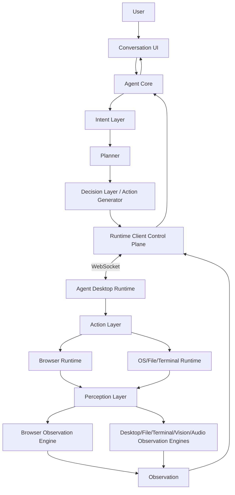
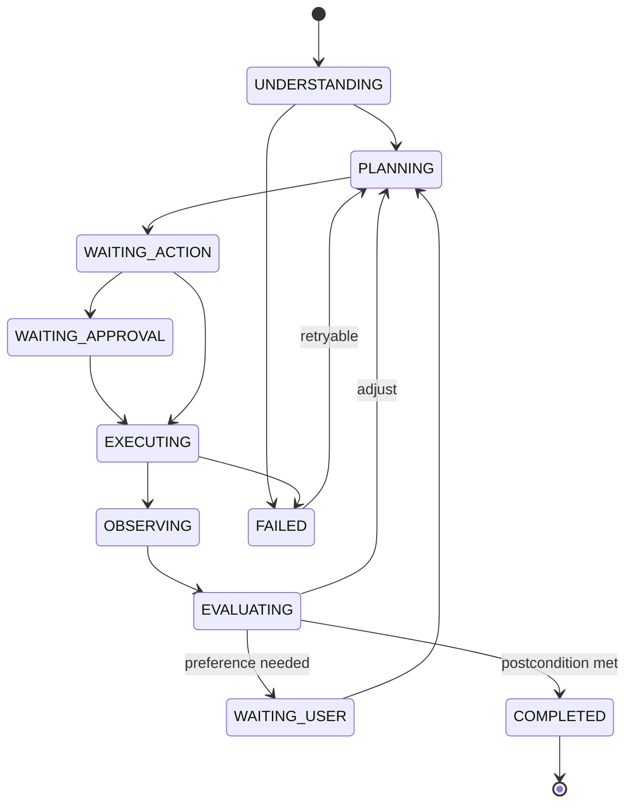

# Athena Agent Architecture v2

> Historical baseline: the current wire protocol is `athena.agent.v3`. Version 3 keeps these layer boundaries and adds transient, bounded Observation attachments for native multimodal evidence.

Athena separates reasoning from device execution. The LLM may propose an abstract action, but it never calls operating-system APIs, browser automation binaries, or local applications directly.



## Service Boundaries

| Component | Responsibility | Must not do |
| --- | --- | --- |
| `agent-runtime` | Intent, planning, reasoning, action generation, observation evaluation | Access the user's OS or browser directly |
| `agent-runtime-client` | Authentication, task routing, device registry, WebSocket control plane, task/session correlation | Execute host commands |
| `athena-launcher` | Device Action Layer, Perception Layer, permissions, local session state | Make product or planning decisions |
| `agent-ui` | Conversation, plans, approvals, progress, observations | Parse model text into executable actions |

## Core Modules

1. **Intent Layer** converts a user utterance into a goal, environment, constraints, expected result, and execution mode.
2. **Planner** creates and revises a dependency-aware plan. Command mode may use one step; goal mode uses a bounded loop.
3. **Action System** emits typed, capability-level actions. It never emits shell syntax, UI coordinates, process IDs, or secrets unless a narrowly scoped capability explicitly requires them.
4. **Perception Layer** reports verified state after every action through Browser, Desktop, File, Terminal, Vision, and Audio observation engines. An action is not successful until an observation confirms its postcondition.
5. **Task Session** keeps active browser, application, file authorization, plan, action history, and latest observations across conversation turns.
6. **Autonomous Mode** repeats plan, act, observe, evaluate, and adjust within explicit budgets and policy limits.

## Control Protocol

In the historical v2 baseline, all envelopes used protocol `athena.agent.v2` and included correlation, ordering, expiry, and retry safety.

### Action

```json
{
  "protocol": "athena.agent.v2",
  "type": "ACTION",
  "task_id": "task_01...",
  "action_id": "act_01...",
  "session_id": "session_01...",
  "sequence": 4,
  "idempotency_key": "task_01...:4",
  "deadline": "2026-08-03T12:00:30Z",
  "capability": "browser.navigate",
  "arguments": { "url": "https://example.com" },
  "policy": { "risk": "LOW", "decision": "ALLOW" }
}
```

### Observation

```json
{
  "protocol": "athena.agent.v2",
  "type": "OBSERVATION",
  "task_id": "task_01...",
  "action_id": "act_01...",
  "session_id": "session_01...",
  "sequence": 4,
  "status": "SUCCEEDED",
  "observed_at": "2026-08-03T12:00:04Z",
  "state": {
    "active_window": "Browser",
    "url": "https://example.com",
    "title": "Example",
    "elements": []
  }
}
```

Observations are untrusted environment data. They may update task state but may never override system policy or become instructions.

## Action Families

- `app.open`, `app.activate`, `app.observe`, `app.close`
- `browser.open`, `browser.navigate`, `browser.observe`, `browser.click`, `browser.type`, `browser.press`, `browser.scroll`, `browser.close`
- `file.search`, `file.read`, `file.open`, `file.write`
- `screen.capture`
- `keyboard.input`, `keyboard.press`
- `pointer.click`, `pointer.scroll`
- `terminal.execute`

Semantic browser or accessibility elements are mandatory when available. Coordinate actions are a fallback, require a fresh screenshot, and expire when the screen changes. File writes, terminal execution, credentials, messages, purchases, appointments, and destructive actions use dedicated high-risk capabilities rather than generic keyboard or pointer actions.

## Task State Machine



Every loop has limits for actions, elapsed time, model calls, retries, and spend. Cancellation is propagated from UI to Core, control plane, and device executor.

Risk and policy values are closed enums: `LOW`, `MEDIUM`, `HIGH` and `ALLOW`, `ASK_USER`, `BLOCK`. Read-only observation defaults to `LOW/ALLOW`; reversible state changes default to `MEDIUM/ASK_USER`; purchases, bookings, messages, account changes, credentials, and destructive operations require a purpose-specific capability and explicit approval. Generic input capabilities must block those consequential operations.

## Transport

The desktop runtime establishes an authenticated outbound WebSocket to `agent-runtime-client`; this works for local and remote deployments without exposing a device port. The control plane routes actions only to devices bound to the authenticated user and persists devices, tasks, actions, and observations when the database is enabled. HTTP/SSE presentation connections do not own task lifetime, so closing the UI does not cancel device execution or the Observation feedback loop. SSE remains presentation-only for conversation and task progress.

WebSocket message types are `HELLO`, `WELCOME`, `HEARTBEAT`, `HEARTBEAT_ACK`, `ACTION`, `PROGRESS`, `OBSERVATION`, `CANCEL`, and `ERROR`. Capabilities are advertised by `HELLO`; approval is represented by an Observation with status `WAITING_APPROVAL`. Task state is owned by Runtime Client and exposed through its authenticated control API rather than duplicated over the device socket.

## Architecture Freeze

Version 2 does not parse executable JSON from assistant text. Typed Action and Observation events are connected end to end through the Runtime Client control plane. The UI never executes an action based on model-rendered content.

The `athena.agent.v2` envelope was frozen and is now superseded by `athena.agent.v3`; see `action-observation-v3.md`. The closed service boundaries and prohibition on special JSON markers, assistant-text parsers, and frontend execution relays still apply.
