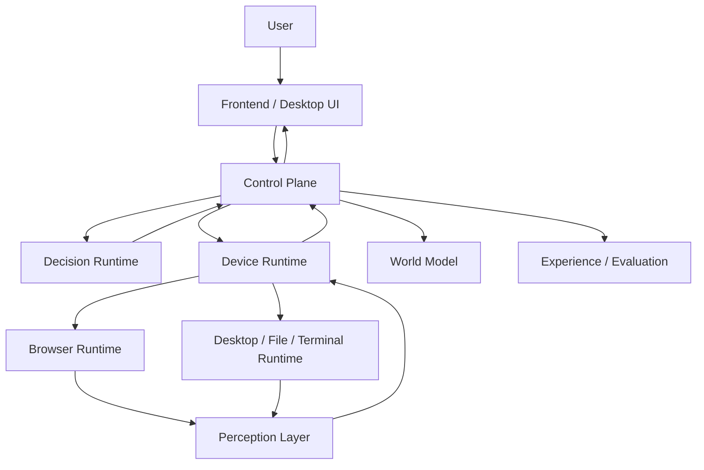

# Athena Agent OS Versioned Delivery Plan

[Simplified Chinese](./athena-agent-os-version-roadmap-v0.2-v1.0.zh-CN.md)

| Field | Value |
| --- | --- |
| Document version | `1.1-rebased` |
| Current code baseline | `v0.1.7` maintenance line plus the `architecture/agent-os-roadmap-v1.0` architecture-integration branch |
| Planned releases | `v0.2.0` through `v1.0.0` |
| Repositories | `agent-runtime`, `agent-runtime-client`, `athena-launcher`, `frontend/agent-ui`, `logx`, and the planned `athena-protocol` |
| Primary objective | Evolve Athena from an LLM plus tools into a durable, verifiable, learning, and governable Personal Agent OS |
| Document role | Normative cross-repository roadmap. Release implementation plans must follow the ownership boundaries and gates defined here. |
| Current route status | `v0.2` internal implementation, the local seven-scenario packaged run, and locally executable gates are substantially closed; signed installation, the 500-journey packaged soak, the complete ten-span trace, and production-coverage gates remain open; `v0.3` W1-W5 have engineering evidence but the release is incomplete |
| Architecture semantics | `v0.3` Core Invariants and four-layer ownership are **FROZEN** |
| Contract maturity | Object schemas are `draft/v0alpha`; storage and new wire contracts are not frozen |

---

## 1. Executive Decision

Athena already contains foundations such as Intent, RoutePlan, Capability Registry, Research, device WebSocket control, Browser Runtime, Perception, and frontend execution panels. These capabilities are distributed across repositories, however, and still suffer from duplicated protocols, unclear state ownership, and incomplete execution feedback loops.

Athena must therefore not jump directly into self-evolution. The rebased dependency sequence is:

```text
Current state
    |-- v0.2 internal implementation and local tests complete
    `-- v0.3 Browser Semantic Slice has validation evidence
    |
    v
V3-W0: close the v0.2 external release gates
    |
    v
V3-W1: semantic baseline and browser golden path
    |
    v
V3-W2: browser failure matrix
    |
    v
V3-W3: experience, privacy, and retention
    |
    v
V3-W4: evaluation, replay, and retrieval
    |
    v
V3-W5: evidence review and release gate
    |
    v
v0.4 skill and strategy candidate learning
    |
    v
v0.5 controlled promotion and rollback
    |
    v
v0.6 evidence-backed knowledge and controlled ontology
    |
    v
v0.7 persistent goals and multi-agent coordination
    |
    v
v0.8 capability and plugin ecosystem
    |
    v
v0.9 production hardening
    |
    v
v1.0 Personal Agent OS GA
```

This plan makes the following architectural decisions:

1. `agent-runtime-client` acts as the **Control Plane**. The repository name may remain unchanged for now.
2. The Control Plane is the sole durable owner of Tasks, Actions, Observations, World Model, Experiences, Evaluations, and Promotions.
3. `agent-runtime` is the Decision Runtime. It owns understanding, planning, routing, model invocation, candidate generation, and offline evaluation, but not durable task state.
4. `athena-launcher` is the Device Runtime. It owns local execution, perception, permissions, browser, desktop, file, terminal, and process deployment.
5. The Frontend is responsible only for presentation, input, approval, and administration. It is neither an execution proxy nor a requirement for task continuity.
6. A Capability is a policy-protected executable operation. A Skill may compose existing Capabilities, but cannot create permissions or executors.
7. An Action is not truth. Only an Observation produced after execution may update the World Model.
8. Raw model chain of thought is never stored. Athena stores structured Intent, Plan, Decision Summary, Actions, Observations, and outcome evidence.
9. The first implementation does not use pure event sourcing. It uses transactional tables, append-only events, a transactional outbox, and projections.
10. Learning produces Candidates first. No Candidate may bypass validation, evaluation, policy, approval, or rollback controls.

---

## 2. Current Baseline and Technical Debt

### 2.1 Reusable foundations

| Repository | Existing capabilities | Direction |
| --- | --- | --- |
| `agent-runtime` | Intent Parser, Router, Capability Registry, Action Protocol, Research Agent, tools, sub-agents, model streaming | Converge into a stateless Decision Runtime |
| `agent-runtime-client` | Users, models, agents, chat, memory, device WebSocket, `agent_control_*` data | Evolve into the authoritative Control Plane |
| `athena-launcher` | Wails desktop shell, service deployment, Browser Runtime, CDP, Perception, page understanding, device control | Converge into the Device Runtime |
| `frontend/agent-ui` | Chat, task display, browser execution, research sources, models, agents, settings | Converge into presentation and approval UI |
| `logx` | Trace, error chain, and structured logging foundations | Become the common observability library for every repository |

### 2.2 Problems that must be solved first

1. Action, Observation, and DeviceMessage are independently defined in several repositories and can drift.
2. Runtime tools, sub-agents, and the Control Plane contain different Task definitions.
3. `agent_control_*` represents only the device loop and cannot express Goal, Plan, Step, Approval, Artifact, or complete World State.
4. Direct tool execution in the Runtime coexists with the unified Capability/Action path.
5. Browser Perception is already rich, but Observation budgets, attachment persistence, World Patches, and task correlation are not unified.
6. Experience, Evaluation, Candidate, and Promotion have no authoritative data model or governance boundary.
7. Error chains are traceable, but model, tool, and device operations do not yet produce one complete invocation timeline.
8. The Frontend still uses different display contracts for Tasks, Actions, Research, Browser execution, and ordinary messages.

### 2.3 Migration principles

1. Do not maintain protocol v3 and v4 indefinitely. A one-time migration and short-lived development adapter are acceptable.
2. Preserve existing user data and provide reversible database migrations.
3. Do not rewrite the execution kernel and introduce learning in the same release.
4. Every new feature must use the unified protocol. Do not add special JSON, tool markup, or frontend forwarding paths.
5. A release must pass its exit gate before work begins on the next architectural layer.

### 2.4 Authority boundaries and anti-drift rules

Athena no longer uses one document to freeze architecture, fields, and release status at the same time. Four decision classes are controlled by different evidence:

| Decision layer | Authority | Current state | Change mechanism |
| --- | --- | --- | --- |
| Architecture semantics | The 12 Core Invariants, four-layer ownership, and World State Authority in the `v0.3 Architecture Plan` | **FROZEN** | Architecture ADR and renewed review only |
| Release scope and gates | This roadmap | Normative `v0.2-v1.0` delivery spine | Version-boundary changes update both language editions and dependency gates |
| Internal objects and implementation | `draft/v0alpha`, internal fixtures, and reversible migrations | Draft | May change from real-slice evidence without compatibility promises |
| Stable wire and storage contracts | Released protocols, schema hashes, and formal migration contracts | New objects are not frozen | Compatibility, cross-language fixtures, upgrade/rollback evidence, and ADR review required |

There is no implicit "newest document wins" rule. Architecture documents define **what the semantics mean**, this roadmap defines **which release delivers them**, and released protocols define **production compatibility**. An unclassified conflict stops work until an ADR resolves it.

The following rules constrain every later release:

1. Passing the Browser Vertical Slice does not complete the `v0.3` release.
2. Until the `v0.2` external gates close, `v0.3` prototype evidence may remain, but `v0.3` cannot ship and `v0.4` Candidate Learning cannot begin.
3. Every new concept maps to a Core Invariant, current-release objective, owning repository, and executable test. Otherwise it stays in the backlog.
4. One Browser Slice cannot freeze database tables, public RPCs, or event fields.
5. `v0.3` records, retrieves, and evaluates offline only. Automatic Candidate generation, Promotion, Canary, or production behavior changes are version violations.
6. Every release maintains explicit Done, Next, Non-goal, and Exit-evidence columns. A code merge is not gate evidence.
7. A release consumes only artifacts that passed the previous release gate, never planned but unverified objects.

### 2.5 Version dependency spine

| Release | Consumes only these verified artifacts | One new layer introduced | Must not be pulled forward |
| --- | --- | --- | --- |
| `v0.2` | Existing users, agents, models, and device capabilities | Unified Task/Action/Observation, World, and device execution kernel | Experience Mining, Candidate, Promotion |
| `v0.3` | Verified execution kernel and real Observations | Effect Verification, Experience, Evaluation, and Retrieval | Automatic Skills, online Canary, Ontology self-learning |
| `v0.4` | Sanitized Experience and stable offline suites | Declarative Skill/Strategy Candidates and human review | Automatic activation, production experiments, code execution |
| `v0.5` | Reviewed Candidates and repeatable benchmarks | AgentBuild, RunManifest, Shadow, low-risk Canary, and Rollback | Automatic R2/R3 Canary and kernel self-modification |
| `v0.6` | Traceable Experience, Evaluation, and Builds | Evidence Knowledge, conflict, freshness, and controlled Ontology | Evidence-free promotion and Ontology self-learning |
| `v0.7` | Stable Task, World, Knowledge, and Build layers | Persistent Goals, multi-agent work, checkpoints, and cross-device recovery | Unbudgeted autonomy and policy-bypassing delegation |
| `v0.8` | Frozen Capability contracts and stable governance kernel | SDK, signed Plugins, Sandbox, and Registry | Unsigned executors and Plugin changes to Kernel/Auth |
| `v0.9` | Functionally frozen complete system | Security, backup, update, signing, HA, load tests, and SLOs | New major architecture concepts |
| `v1.0` | Production-gated `v0.9` | Protocol freeze, core user journeys, and GA support commitment | Breaking changes outside a new-version process |

---

## 3. Target System Ownership



### 3.1 Control Plane

Responsibilities:

- Identity, users, agents, models, and authorization.
- Authoritative state machines for Task, Step, Action, and Observation.
- Device registration, Capability Instances, online status, and routing.
- Approval, cancellation, timeout, retry, and idempotency.
- Current World Model state and evidence indexes.
- Experience, Evaluation, Candidate, Promotion, and Agent Build records.
- HTTP, WebSocket, SSE/gRPC boundaries and frontend APIs.
- Transactions, outbox delivery, audit, and database migrations.

Non-responsibilities:

- Direct control of a local browser or desktop.
- Long-running model inference inside an HTTP handler.
- Storage of plaintext passwords or delivery of credentials to a model.

### 3.2 Decision Runtime

Responsibilities:

- Intent parsing and response-language resolution.
- Capability RoutePlan generation.
- Planner, Supervisor, and specialist agents.
- Research, knowledge synthesis, and model invocation.
- Typed Action Proposals based on bounded World Slices.
- Continued reasoning after receiving Observations.
- Skill/Strategy Candidate generation and offline evaluation execution.

Non-responsibilities:

- Durable Task state transitions.
- Arbitrary device selection that bypasses the Control Plane.
- Treating Action success as environmental truth.
- Automatic Candidate promotion or permission grants.

### 3.3 Device Runtime

Responsibilities:

- Long-lived connection, device identity, Capability reporting, and heartbeat.
- Browser, desktop, file, terminal, audio, and vision execution.
- Local permission gates and high-risk secondary confirmation.
- Perception of screenshots, DOM, accessibility, files, and processes.
- Action deduplication, timeout, cancellation, execution logs, and Observation delivery.
- Service installation, update, health checks, and log aggregation in Local Mode.

Non-responsibilities:

- Deciding the user's final goal.
- Expanding server permissions by itself.
- Owning authoritative server-side Task or Experience state.

### 3.4 Frontend

Responsibilities:

- Chat, Task Timeline, Action, Observation, and Research Evidence display.
- Approval, takeover, cancellation, retry, and Candidate review.
- Agent, model, device, memory, experience, and settings management.
- Localization, voice, accessibility, and theming.

Non-responsibilities:

- Executing actions on behalf of the Launcher.
- Keeping critical runtime state only in the page.
- Exposing API keys, website passwords, or cookies to the Agent.

### 3.5 athena-protocol

A planned independent repository responsible for:

- The normative Protobuf, JSON Schema, and TypeScript contract source.
- Task, Capability, Action, Observation, World Patch, Approval, Artifact, and Event Envelope schemas.
- Go and TypeScript generation and protocol conformance tests.
- Protocol versions, compatibility matrices, and golden fixtures.

It must contain no business logic, database implementation, model invocation, or device executor.

---

## 4. Cross-Release Invariants

The following invariants apply beginning with `v0.2.0-alpha.1`:

1. Every request has a `trace_id`; every task has a `task_id`.
2. An Action contains `action_id`, `task_id`, `step_id`, `revision`, `idempotency_key`, `risk`, `timeout`, and target scope.
3. An Observation references its Action and contains execution status, timing, evidence summary, error chain, and an optional World Patch.
4. The Control Plane accepts Decisions only for the current Task Revision. Stale revisions are rejected.
5. The same Idempotency Key on the same device cannot produce the same irreversible side effect twice.
6. The Device Runtime may raise risk but may never lower the server-provided risk level.
7. Action completion is not Goal completion. A Verifier evaluates the resulting Observation.
8. Every durable record contains an `owner_id` or an explicit public scope.
9. Credentials appear only as `credential_ref`; plaintext never enters model prompts, logs, Experience, or frontend responses.
10. Raw screenshots, DOM, and file contents do not enter long-term Experience by default.
11. Raw chain of thought is not persisted; only structured decision summaries are retained.
12. Candidate, Agent Build, and Promotion records are immutable after publication. Changes create new versions.
13. Every database change includes forward migration, rollback guidance, and upgrade tests.
14. Closing the Frontend cannot terminate a submitted Task. The Task either continues or enters an explicit paused state.
15. Remote Mode must not install, start, stop, or overwrite local backend services.

---

## 5. Unified Core Model

### 5.1 Task

```text
Task
|-- task_id
|-- owner_id
|-- agent_id
|-- goal
|-- intent
|-- status
|-- revision
|-- budget
|-- active_device_id
|-- active_step_id
|-- created_at
|-- updated_at
`-- terminal_reason
```

Recommended state machine:

```text
CREATED
  -> PLANNING
  -> RUNNING
  -> WAITING_OBSERVATION
  -> WAITING_APPROVAL
  -> WAITING_USER
  -> VERIFYING
  -> COMPLETED

Any active state
  -> CANCELLING
  -> CANCELLED

Recoverable error
  -> RETRY_WAIT
  -> RUNNING

Unrecoverable error
  -> FAILED
```

### 5.2 Action

```json
{
  "protocol_version": "4",
  "action_id": "act_...",
  "task_id": "task_...",
  "step_id": "step_...",
  "revision": 7,
  "capability": "browser.interact",
  "operation": "click",
  "target": {},
  "arguments": {},
  "risk": "R1",
  "idempotency_key": "...",
  "timeout_ms": 30000,
  "expected_observation": {},
  "issued_at": "..."
}
```

### 5.3 Observation

```json
{
  "protocol_version": "4",
  "observation_id": "obs_...",
  "action_id": "act_...",
  "task_id": "task_...",
  "device_id": "device_...",
  "status": "SUCCEEDED",
  "started_at": "...",
  "finished_at": "...",
  "summary": "Clicked the Shorts filter",
  "evidence": [],
  "world_patch": {},
  "error": null
}
```

### 5.4 Minimum World Model

`v0.2` implements only:

```text
Entity
Relation
State
Evidence Reference
Scope
Revision
Confidence
Observed At
Expires At
```

Belief, Prediction, and dynamic Ontology must not become authoritative durable models before `v0.6`.

### 5.5 Risk levels

| Level | Meaning | Examples | Default approval |
| --- | --- | --- | --- |
| `R0` | Read-only, no external side effect | Read page, search file, screenshot | Not required |
| `R1` | Reversible local interaction | Open page, play, pause, switch tab | May be pre-approved by user policy |
| `R2` | External write or possible user-data impact | Send message, upload file, modify cloud content | Explicit authorization required |
| `R3` | High-value or security-sensitive | Payment, purchase, deletion, medical booking, credentials | Per-action approval; automatic canary prohibited |

Composite Task risk is determined by the combined effect, not merely the maximum risk of individual Actions.

---

## 6. Release Matrix

| Release | Theme | Learning level | Main deliverable | Rough solo full-time effort |
| --- | --- | --- | --- | --- |
| `v0.2` | Execution Kernel | `E0` | Task, Protocol v4, World Model, unified execution loop | 10-14 weeks |
| `v0.3` | Experience and Evaluation | `E1-E2` | Sanitized Experience, retrieval, failure taxonomy, offline evaluation | 7-10 weeks |
| `v0.4` | Candidate Learning | `E3-E4` | Skill/Strategy Candidates, DSL, benchmark comparison | 9-12 weeks |
| `v0.5` | Controlled Promotion | Controlled E4 | Shadow, low-risk canary, Agent Build, rollback | 7-10 weeks |
| `v0.6` | Knowledge and Ontology | Experimental E5 | Evidence knowledge, contradiction handling, Ontology Packs | 9-13 weeks |
| `v0.7` | Persistent Personal Agent | Composed capabilities | Long-lived Goals, multi-agent work, scheduling, cross-device recovery | 10-14 weeks |
| `v0.8` | Capability Ecosystem | Ecosystem | SDK, signed plugins, sandbox, Provider Registry | 10-14 weeks |
| `v0.9` | Production Hardening | Stabilization | Security, HA, upgrade, backup, load testing, installer signing | 10-14 weeks |
| `v1.0` | GA | Stable loop | Protocol freeze, user journeys, SLOs, complete documentation | 5-8 weeks |

These estimates constrain scope; they are not release-date commitments. A solo maintainer should prioritize `v0.2-v0.5` and avoid parallel work on `v0.6+`.

---

## 7. v0.2.0: Unified Execution Kernel

### 7.1 Objective

Establish one recoverable and observable execution loop:

```text
Intent
-> RoutePlan
-> Task Graph
-> Action Proposal
-> Policy
-> Device Execution
-> Observation
-> Verification
-> World Model
-> Continue / Complete
```

### 7.2 Entry criteria

- Every `v0.1.5` repository builds and tests independently.
- The current database has a recoverable backup.
- Legacy protocol feature development is frozen except for defect fixes.
- The `architecture/agent-os-v0.2` branch and cross-repository compatibility matrix exist.

### 7.3 Delivery scope

#### Protocol

- Create `athena-protocol`.
- Define Envelope, Task, Step, DecisionRequest, DecisionResponse, Action, Observation, WorldPatch, Approval, and Artifact.
- Generate Go and TypeScript types.
- Define behavior for unknown fields, incompatible versions, and message-size limits.
- Publish golden JSON/Protobuf fixtures.

#### Control Plane

- Add the Task Controller and state machine.
- Add Revision/CAS validation and reject stale Decisions and Observations.
- Add a transactional outbox.
- Add Action deduplication, timeout, cancellation, and retry policy.
- Route devices by `owner_id + device_id + capability_instance`.
- Implement the minimum World Model and bounded World Slices.
- Publish Task Events to the Frontend through SSE or WebSocket.

#### Decision Runtime

- Produce a stable structured Intent from the Intent Parser.
- Let the Router choose a Primary Route and Capability requirements, not execute device operations.
- Produce a bounded Task Graph from the Planner.
- Convert all model tool calls into Action Proposals.
- Continue the model loop after Observation until a visible result or explicit waiting state is reached.
- Separate server-side Research Capabilities from device-side Browser Capabilities.

#### Device Runtime

- Make the Launcher connect to the Control Plane proactively.
- Report device, platform, version, and Capability Instances.
- Implement idempotent execution, cancellation, timeout, and reconnect.
- Use stable CDP Target IDs rather than tab indexes.
- Produce budget-constrained Observations from Perception.
- Re-resolve Targets after a user closes or moves a tab; never reuse stale indexes.
- Return a structured Observation for local permission denial.

#### Frontend

- Render Task, Step, Action, Observation, Approval, and errors through one contract.
- Stop rendering tool markup as ordinary chat text.
- Make Stop invoke Task Cancel and display cancellation confirmation.
- Show actual URL, title, target, evidence, and failure cause in browser execution cards.
- Restore running Task timelines when the Frontend is reopened.

### 7.4 Data model

```text
os_task
os_task_step
os_task_event
os_action
os_observation
os_artifact
os_approval
os_device
os_device_capability
os_capability_definition
os_capability_instance
os_world_entity
os_world_relation
os_world_state
os_world_evidence_ref
os_outbox
```

Every table contains at least:

```text
id
owner_id / scope
created_at
updated_at
revision
trace_id
```

### 7.5 Existing code migration

| Current location | Migration |
| --- | --- |
| `agent-runtime/internal/actionprotocol` | Convert into an `athena-protocol` adapter, then delete duplicate types |
| `agent-runtime-client/domain/entity/control/protocol.go` | Use generated types and retain only domain adaptation |
| `athena-launcher/internal/control/protocol.go` | Use generated types and retain only device execution interfaces |
| `agent_control_*` | One-time migration to `os_*` with a migration audit |
| Multiple Task types in Runtime | Retain only read-only Planner views; remove persistence ownership |
| Frontend structured messages | Use generated TypeScript event types |

### 7.6 Observability

Every log entry is correlatable by:

```text
trace_id
task_id
step_id
action_id
observation_id
device_id
model_invocation_id
```

Required spans:

```text
intent.parse
route.plan
world.query
model.invoke
action.policy
action.dispatch
device.execute
perception.observe
world.apply
task.verify
```

Log a complete error chain once at a boundary. Internal layers wrap operations without repeatedly printing the same failure.

### 7.7 Test plan

- Protocol golden and compatibility tests.
- Table-driven Task state machine tests.
- Action idempotency and duplicate Observation tests.
- Control Plane restart recovery tests.
- Launcher disconnect and reconnect tests.
- Browser tab close, reorder, and duplicate-open tests.
- Task continuation while the Frontend is closed.
- Database migration and rollback tests.
- macOS, Windows, and Linux end-to-end tests.

### 7.8 Acceptance scenarios

1. Open YouTube, search for specified content, click the second result, and verify playback.
2. Open two sites in one Browser Session without creating unnecessary browser instances.
3. Close one tab and continue operating the correct remaining tab through Target ID.
4. Close the Frontend while a task runs, then reopen it and restore the complete Timeline.
5. Restart the Control Plane and recover unfinished tasks without repeating side effects.
6. Send the same Action twice without producing a second click, message, or submission.
7. Return every failure with its root cause, operation chain, Trace, and timing.

### 7.9 Release stages

```text
alpha.1  Protocol and generated types
alpha.2  Task Controller and database migration
alpha.3  World Model and World Slice
alpha.4  Launcher device execution migration
beta.1   Frontend unified Task Timeline
beta.2   Fault injection and cross-platform end-to-end tests
rc.1     Upgrade rehearsal and release manifest
```

### 7.10 Exit gate

- Every new device action uses Protocol v4.
- The Control Plane is the only durable owner of Task and World Model state.
- Core end-to-end scenarios run 500 times with at least 98% non-environmental success.
- Duplicate irreversible side effects equal zero.
- Required span coverage is 100%.
- No plaintext credential enters logs, Task Events, or Observations.

### 7.11 Explicit non-goals

- Experience mining.
- Automatic Skill generation.
- Dynamic Ontology.
- Automatic Promotion.
- Arbitrary generated code execution.

---

## 8. v0.3.0: Experience and Evaluation Foundation

> See the [Athena Agent OS v0.3 Architecture Plan](./agent-os-architecture-plan-v0.3.md) for the effect-centric semantic baseline, conceptual objects, and browser validation slice. This section remains authoritative for release scope and gates.

### 8.1 Objective

Allow Athena to answer safely:

```text
What happened?
Why did it succeed or fail?
Has a similar task happened before?
Is a new implementation better than the old one?
```

This release reaches only `E1-E2`: recording and retrieval. It does not modify production behavior automatically.

It also validates the frozen architecture semantics through a browser vertical slice. Conceptual objects remain `draft/v0alpha`; storage and a new wire protocol are not frozen at the start of this release.

### 8.2 Entry criteria

- Every `v0.2` exit gate has passed.
- Task, Action, Observation, and World Revision contracts are stable.
- The data-redaction specification has passed security review.

### 8.3 Release workstreams and current status

These workstreams define the internal `v0.3` delivery order; they are not new public version numbers. `v0.3.0` is complete only after every gate passes:

| Workstream | Purpose and deliverables | Current status | Exit evidence |
| --- | --- | --- | --- |
| `V3-W0` prerequisite reconciliation | Complete the `v0.2` database rollback, three-platform packages, seven E2E scenarios, 500-run soak, span audit, and credential audit | **PARTIAL / BLOCKING**: database rollback, unsigned cross-platform structure, Browser 10/10, component 500/500, the local packaged seven-journey run, and release-corpus credential scan pass; signed platform installs, the complete packaged 500-run soak, one complete ten-span Trace, and 95% production coverage remain external | The [final evidence aggregation](./v0.3-evidence-review.md) remains `release_ready=false` until every remaining gate in `v0.2-release-readiness` has an auditable record |
| `V3-W1` semantic baseline and golden path | Freeze Core Invariants; implement `draft/v0alpha`; correlate Outcome through Experience; really play the second video | **Engineering implementation complete** | Strict validation, full regression, real media playback, and same-session E2E pass |
| `V3-W2` browser failure matrix | Snapshot drift, target removal, login-required, unknown, forbidden effects, cancellation, and retry boundaries | **Engineering implementation complete** | Every scenario has Observation, Verification, terminal state, Trace, and Replay Fixture evidence |
| `V3-W3` experience and privacy | Internal draft persistence, async generation, redaction, retention/deletion, owner isolation, and user controls | **Engineering implementation complete; production coverage awaits V3-W0 sampling** | 95% terminal coverage, zero secret leakage, deletion, and cross-user isolation tests pass |
| `V3-W4` evaluation, replay, and retrieval | Fixtures, suites, runs, baseline comparison, retrieval budgets, and poisoning defenses | **Engineering implementation complete** | Replay is repeatable; historical retrieval never overrides current Observation; offline metrics are comparable |
| `V3-W5` evidence review and release | Measure used fields, remove unjustified fields, and decide between internal metadata and a new protocol ADR | **Engineering review complete; release blocked by V3-W0** | [Evidence review](./v0.3-evidence-review.md) and [ADR-0001](./adr/0001-v0.3-semantics-carriage.md); no new protocol is frozen |

The `V3-W1 -> V3-W5` engineering implementation and evidence may be retained and corrected, but the remaining `V3-W0` external gates still prevent a `v0.3` release and entry into `v0.4`. `os_experience*` tables remain reversible internal implementation details; their fields, table names, and public APIs are not frozen contracts.

Completing `V3-W1` proves that the object boundaries support one real task. It does not prove that the Experience product, privacy lifecycle, evaluation system, or the complete `v0.3` release is ready. `V3-W*` identifies version-delivery workstreams; `R0-R3` remains reserved for behavior risk levels.

### 8.4 Experience definition

Experience is not a complete chat transcript or raw reasoning trace. It is a sanitized, structured summary of task execution:

```text
Experience
|-- experience_id
|-- owner_id
|-- task_id
|-- agent_build_id
|-- run_manifest_id
|-- goal_summary
|-- intent
|-- environment_fingerprint
|-- plan_summary
|-- action_refs
|-- observation_refs
|-- outcome
|-- verification
|-- failure_classification
|-- cost
|-- duration
|-- human_intervention
|-- sensitivity
|-- retention_policy
`-- provenance
```

### 8.5 Privacy and retention

- Redaction runs before Experience is written, not afterward.
- Plaintext credentials, cookies, tokens, password fields, identity documents, and payment data are never retained.
- Screenshots and DOM are stored by summary, hash, and temporary Artifact Reference by default.
- Users can disable learning, inspect Experiences, and delete Experiences.
- Append-only audit data is separated from deletable payload data.
- Deletion uses payload removal or key destruction plus a tombstone without breaking audit consistency.
- Experiences from different users or organizations cannot be retrieved together. Public data requires explicit publication.

### 8.6 Delivery scope

#### Browser semantic baseline validation

- Use "play the second video on the current page" to validate complete correlation across OutcomeSpec, TargetSpec, TargetResolution, PlanCandidate, PlanRun, ActionAttempt, Observation, VerificationResult, and ExperienceRecord.
- Bind target resolution to a page snapshot, evidence, and a precise read set. Re-ground after page change and never reuse stale ordinals, coordinates, or CDP targets.
- Action success does not imply Outcome success. Clause-level effect verification must prove media playback.
- Let `unknown` request budgeted observation, `unsatisfied` enter bounded retry, compensation, or replanning, and `conflicting` enter evidence reconciliation or human intervention.
- Continue using Protocol v4 Action/Observation. Validate conceptual fields through internal fixtures and event correlation first.

#### Experience Engine

- Generate Experience asynchronously after Task completion or failure.
- Add Redaction, Sensitivity, and Retention pipelines.
- Record outcome, cost, latency, model usage, and Capability usage.
- Search by task type, domain, environment, failure, and skill.

#### Failure classification

Use one taxonomy:

```text
INTENT_FAILURE
ROUTING_FAILURE
PLANNING_FAILURE
MODEL_FAILURE
CAPABILITY_SELECTION_FAILURE
ARGUMENT_FAILURE
POLICY_FAILURE
DEVICE_OFFLINE
RUNTIME_FAILURE
PERCEPTION_FAILURE
VERIFICATION_FAILURE
ENVIRONMENT_DRIFT
USER_INTERRUPTION
```

Rules take precedence; an LLM may supplement classification. Every classification retains supporting evidence.

#### Evaluation Engine v1

- Generate Replay Fixture Candidates from sanitized Experience.
- Bind a Fixture to environment version, page snapshot, protocol version, and Expected Outcome.
- Use mocks or simulation for browser and desktop replay by default; never use production accounts.
- Compare correctness, success, latency, cost, and safety.
- Run all evaluation offline without affecting production traffic.

#### Retrieval

- Combine keyword search, structured filters, and vector similarity.
- Apply result-count, token, time, and sensitivity budgets before retrieval reaches the Planner.
- Label retrieved content as historical reference and never let it override current Observation.

### 8.7 Data model

```text
os_experience
os_experience_event_ref
os_experience_payload
os_experience_redaction
os_failure_classification
os_evaluation_fixture
os_evaluation_suite
os_evaluation_run
os_evaluation_result
```

### 8.8 Frontend delivery

- Let users inspect how a Task formed an Experience.
- Let users disable learning, delete personal Experiences, and configure retention.
- Let administrators inspect failure classes, model/Capability cost, and evaluation results.
- Never expose raw chain of thought; show explainable decision summaries and evidence.

### 8.9 Test plan

- Secret and PII redaction corpus.
- Cross-user isolation tests.
- Retention and deletion tests.
- Experience-generation idempotency tests.
- Fixture repeatability tests.
- Mock browser/device replay tests.
- Retrieval poisoning and prompt-injection tests.
- Browser golden-path, snapshot-drift, login-required, forbidden-effect, unknown, and cancellation tests.
- Outcome-to-Experience correlation completeness tests.
- Precise target read-set invalidation and four-state effect-clause verification tests.

### 8.10 Exit gate

- At least 95% of terminal Tasks produce structured Experience; every skipped Task records a reason.
- Secret-corpus leakage is zero.
- Deleted Experience cannot be read through APIs, retrieval, or live backup indexes.
- Repeated runs of the same Fixture are deterministic.
- Historical retrieval never overwrites current World State.
- No Candidate changes production planning.
- The browser golden path produces a complete Outcome-to-Experience trace and proves actual media playback rather than only a successful click.
- Page refresh, target removal, or tab closure never executes a stale TargetResolution.
- A forbidden-effect violation overrides ordinary desired-effect success.
- Existing Protocol v4 contract tests remain green.

### 8.11 Explicit non-goals

- Automatic Skill creation or activation.
- Online canary.
- Dynamic Planner prompt modification.
- Ontology self-learning.
- Freezing new object fields, database tables, or wire protocol.
- General robot physics and production exploratory-affordance execution.

---

## 9. v0.4.0: Skill and Strategy Candidate Learning

### 9.1 Objective

Reach controlled `E3-E4`: generate readable, verifiable, non-escalating Candidates from repeated experience while leaving activation under human control.

### 9.2 Entry criteria

- `v0.3` privacy, retrieval, and evaluation gates have passed.
- Stable Browser, Research, and File simulation suites exist.
- Capability schemas and the risk model are frozen.

### 9.3 Skill DSL

Skills use a declarative DSL. The system may not generate executable Go, JavaScript, shell, or Python directly:

```text
SkillVersion
|-- id
|-- version
|-- description
|-- input_schema
|-- output_schema
|-- preconditions
|-- required_capabilities
|-- task_graph_template
|-- recovery_paths
|-- verification_rules
|-- risk_ceiling
|-- evaluation_suite
|-- owner
|-- visibility
`-- lifecycle_state
```

A Skill may reference only registered Capabilities. It cannot create a new permission, Credential Scope, or Runtime Executor.

### 9.4 Strategy definition

A Strategy contains only controlled Planner-selection metadata:

```text
condition
preferred_skill
fallback_order
observation_policy
retry_budget
verification_policy
```

This release does not allow Strategy to modify the Kernel, Policy, Auth, or Sandbox.

### 9.5 Candidate pipeline

```text
Experience Cluster
  -> Pattern Evidence
  -> Candidate Proposal
  -> Schema Validation
  -> Capability and Permission Analysis
  -> Static Risk Analysis
  -> Replay
  -> Benchmark Comparison
  -> Human Review
  -> APPROVED_FOR_USE / REJECTED
```

### 9.6 Candidate-generation requirements

- A Candidate must derive from several independent Experiences, never a single execution.
- It includes successful evidence and failure counterexamples.
- It declares applicable environments, site families, preconditions, and invalidation conditions.
- It includes a baseline comparison.
- Core execution logic may not hard-code individual websites. Site knowledge is semantic guidance or Plugin Knowledge only.

### 9.7 Human demonstration

- Recording begins only after the user explicitly enables demonstration mode.
- Recording pauses automatically before sensitive input.
- Athena records semantic Actions, not raw keystrokes or credentials.
- The user previews, edits, and confirms the demonstration summary before Candidate generation.
- Demonstrations are user-owned by default and are not automatically published as public Skills.

### 9.8 Data model

```text
os_learning_candidate
os_candidate_evidence
os_candidate_evaluation
os_skill
os_skill_version
os_strategy
os_strategy_version
os_demonstration
```

Lifecycle:

```text
DRAFT
-> VALIDATING
-> EVALUATING
-> REVIEW_REQUIRED
-> APPROVED_FOR_USE
-> REJECTED
-> DEPRECATED
-> RETIRED
```

`APPROVED_FOR_USE` means that a user or Agent configuration may select the Candidate. It does not replace a production default automatically.

### 9.9 Frontend delivery

- Candidate Inbox.
- Skill/Strategy diff viewer.
- Evidence, evaluation suite, success rate, cost, and risk display.
- Approve, Reject, Edit, and Re-evaluate controls.
- User, organization, and public visibility controls.

### 9.10 Test plan

- DSL parser and validator tests.
- Capability escalation tests.
- Composite-risk escalation tests.
- Candidate generalization and counterexample tests.
- Prompt-injection isolation for Candidate generation.
- Sensitive-input tests for demonstrations.

### 9.11 Exit gate

- A Candidate cannot reference an unregistered Capability.
- A Candidate cannot widen Credential Scope or lower Risk.
- Every Candidate has Evidence, Evaluation, and a readable diff.
- Benchmark improvement uses minimum sample sizes and confidence intervals, not one-off success rates.
- Candidates do not change existing Agent behavior by default.
- No arbitrary generated code enters a production path.

---

## 10. v0.5.0: Controlled Promotion, Shadow, and Rollback

### 10.1 Objective

Create the complete governance path from usable Candidate to production behavior:

```text
Candidate
-> Approved
-> Shadow
-> Low-risk Canary
-> Active
-> Monitor
-> Rollback / Retire
```

### 10.2 AgentBuild and RunManifest

#### AgentBuild

Immutable and publishable:

```text
kernel_version
planner_version
policy_version
protocol_version
skill_versions
strategy_versions
ontology_version
prompt_template_versions
evaluation_suite_version
```

#### RunManifest

Generated for every run:

```text
agent_build_id
model_config_version
capability_instances
device_id
user_scope
world_revision
knowledge_snapshot
budget
feature_flags
exposure_id
```

Capability availability, user knowledge, and device state never belong in immutable AgentBuild.

### 10.3 Promotion state machine

```text
PROPOSED
-> REVIEWED
-> SHADOW
-> CANARY
-> ACTIVE
-> PAUSED
-> ROLLED_BACK
-> RETIRED
```

### 10.4 Shadow

- A Candidate receives the same input but executes no real Action.
- Compare RoutePlan, Task Graph, Action Proposal, cost, and risk.
- Shadow output cannot write to the production World Model.
- Shadow failure cannot affect the user Task.

### 10.5 Canary

- Only verifiable and recoverable `R0/R1` behavior may enter automatic canary.
- Assign exposure stably by `owner_id + agent_id`; do not randomly vary behavior for one user.
- Users may opt out of experiments.
- `R2/R3` behavior cannot enter automatic canary; users must explicitly select the new version.
- Define stop thresholds for success, latency, cost, safety, and human intervention.

### 10.6 Rollback

- Record the Previous Build before activation.
- Rollback switches a version pointer; it never edits historical versions in place.
- New Tasks use the previous version after rollback. Already executed external effects are not falsely treated as undone.
- Irreversible operations require compensation workflows, not status-only rollback.

### 10.7 Data model

```text
os_agent_build
os_run_manifest
os_promotion
os_exposure
os_shadow_result
os_canary_metric
os_rollback
os_compensation
```

### 10.8 Frontend delivery

- Agent Build version page.
- Promotion approval, Shadow comparison, and Canary monitoring.
- One-click pause and rollback.
- User-level experiment controls and version pinning.

### 10.9 Exit gate

- Every Active Skill/Strategy traces to Evidence, Evaluation, Approval, and an Agent Build.
- Canary can stop and return to the previous Build within one minute.
- Automatic `R2/R3` canary count is zero.
- Shadow produces no real device or network write.
- Build rollback does not break Task, World Model, or Experience reads.

### 10.10 Explicit non-goals

- Automatic source-code modification.
- Automatic publication of a new Capability Executor.
- Automatic modification of Auth, Policy, Sandbox, or Credential System.
- Public Skill publication without human review.

---

## 11. v0.6.0: Evidence-Backed Knowledge and Controlled Ontology

### 11.1 Objective

Upgrade remembering content into knowing where a claim came from, whether it is stale, and whether contradictory evidence exists.

### 11.2 Knowledge model

```text
Knowledge Claim
|-- claim_id
|-- subject
|-- predicate
|-- object/value
|-- scope
|-- evidence_refs
|-- confidence
|-- valid_from
|-- valid_until
|-- contradicted_by
|-- owner
`-- provenance
```

A single Observation cannot directly become Knowledge. Evidence processing and scope validation are mandatory.

### 11.3 Evidence and contradiction

- Research sources, official documentation, page Observations, and user confirmations use different trust levels.
- Time-sensitive information requires a freshness policy.
- Contradictions create explicit Contradiction Records rather than silently overwriting state.
- Final answers can return the important Claims and sources used.
- Personal preferences cannot be promoted into public knowledge accidentally.

### 11.4 Ontology Pack

The first release supports:

```text
Core Ontology
Domain Ontology Pack
Version
Compatibility
Migration Plan
Validation Rules
Display Metadata
```

Ontology Candidates are generated and evaluated offline. Production schema migrations require human approval and a migration tool.

### 11.5 Belief and Prediction

- Belief is a derived read model over World State, not a separate truth source.
- Prediction compares expected and actual Observations.
- Prediction Error may become Experience but cannot modify Policy automatically.
- Initial experiments are limited to Browser and Research simulations.

### 11.6 Hybrid retrieval

```text
Structured Filter
+ Keyword Search
+ Vector Search
+ Relation Traversal
+ Temporal Filter
+ Evidence Rank
```

Every request has Scope, Sensitivity, Token, Result Count, and Time budgets.

### 11.7 Data model

```text
os_knowledge_claim
os_evidence
os_contradiction
os_knowledge_snapshot
os_ontology_pack
os_ontology_version
os_ontology_candidate
os_ontology_migration
```

### 11.8 Exit gate

- Every externally cited Claim has at least one accessible Evidence source.
- Expired time-sensitive Claims are not returned as certain facts.
- Contradictory evidence is visible to the UI and Agent context.
- An Ontology Candidate cannot migrate production data automatically.
- Knowledge retrieval cannot cross user or organization boundaries.

---

## 12. v0.7.0: Persistent Goals and Multi-Agent Coordination

### 12.1 Objective

Support tasks that span hours, days, and devices, while allowing a Supervisor to coordinate bounded specialists rather than creating an unbounded agent swarm.

### 12.2 Persistent Goal

```text
Goal
|-- owner
|-- objective
|-- constraints
|-- success_criteria
|-- budget
|-- deadline
|-- approval_policy
|-- active_task_ids
|-- checkpoint
`-- status
```

### 12.3 Supervisor

Responsibilities:

- Produce bounded Task Graphs.
- Select Research, Browser, Desktop, File, and other specialists.
- Allocate token, time, query, and device budgets.
- Merge results, detect conflicts, and decide when user clarification is required.
- Resume from Checkpoint after pause, disconnect, or restart.

Non-responsibilities:

- Bypassing Policy to execute Actions.
- Spawning unlimited sub-agents.
- Writing specialist guesses directly into the World Model.

### 12.4 Scheduler

- Move current Cron/Scheduled Task ownership into the Control Plane.
- Every trigger creates a standard Task and uses no special execution path.
- Support timezone, missed-run policy, retry, maximum concurrency, and user notification.
- Scheduled `R2/R3` operations require execution-time approval or a narrowly scoped pre-authorization.

### 12.5 Cross-device behavior

- Task is device-independent; only an Action binds to a concrete Device.
- When a Device is offline, the Task may wait, reroute, or ask the user.
- World Model state retains device scope. A tab on macOS cannot be assumed to exist on Windows.

### 12.6 Acceptance scenarios

1. Build a five-day travel plan by researching weather, transport, lodging, and interests, asking about gaps, and returning a sourced itinerary.
2. Close the Frontend and Launcher, reconnect later, and resume from an explicit Checkpoint.
3. Let Research and Browser specialists share filtered World Slices without sharing all context.
4. Enter `WAITING_USER` when the budget is exhausted rather than searching forever.

### 12.7 Exit gate

- Supervisor concurrency, depth, token, time, and Action counts have hard limits.
- Every specialist result retains Provenance.
- Restart recovery does not repeat confirmed external side effects.
- Scheduled and interactive Tasks use the same protocol and audit path.

---

## 13. v0.8.0: Capability and Plugin Ecosystem

### 13.1 Objective

Allow controlled third-party extension without compiling every new tool directly into the Agent Runtime.

### 13.2 Capability Provider SDK

A Provider declares:

```text
provider_id
version
capabilities
input/output schemas
platforms
permissions
credential scopes
risk floor
resource limits
health check
observation contract
signature
```

### 13.3 Plugin package

```text
plugin.json
schemas/
knowledge/
skills/
runtime/
tests/
SIGNATURE
SBOM
```

Plugin Knowledge may add site semantics, but the core Browser Runtime continues to operate through UI Trees and patterns. Athena must not return to one hard-coded controller per website.

### 13.4 Sandbox

Isolate:

- Filesystem.
- Network domains.
- Credential Scope.
- Device Capability.
- CPU, memory, and execution time.
- World Model writes.
- External side effects.

### 13.5 Registry

- Start with a Private Registry.
- Public release requires signatures, scanning, evaluation, and human review.
- Support withdrawal, disablement, and minimum compatible versions.
- The Agent may select only installed and authorized Providers.

### 13.6 Exit gate

- A third-party sample Provider registers a read-only Capability without modifying the core Runtime.
- An unauthorized Plugin cannot access network, credentials, or devices.
- Plugin failure cannot crash the Control Plane or Launcher.
- Every Capability call traces to Provider, version, permissions, and Observation.

---

## 14. v0.9.0: Production Hardening

### 14.1 Objective

Raise the functionally complete system to a quality suitable for long-term public distribution, upgrades, and operations.

### 14.2 Security

- Threat model and data-flow review.
- User, organization, and administrator permission matrix.
- Penetration tests for API, WebSocket, Device Token, and Credential Vault.
- Prompt injection, indirect injection, and tool-output poisoning defenses.
- SBOM, checksum, and signature for every release.
- macOS notarization, Windows code signing, and Linux package signatures.

### 14.3 Data reliability

- Automated PostgreSQL backup, restore drills, and version upgrades.
- Embedded PostgreSQL updates never overwrite its Data Directory.
- If the state file is lost, safely recover identity from the existing database or perform secure rebinding.
- Data export, deletion, and retention policies.
- Migration tests for N-1 to N and rollback after failure.

### 14.4 Availability and performance

- Multi-instance Control Plane uses a shared database and event notification.
- Device connections use a single-owner or lease mechanism.
- Backpressure, queue limits, and circuit breakers.
- Independent timeout and budget for model, Search, Browser, and Device operations.
- Long-running Tasks never occupy an HTTP request lifecycle.

### 14.5 SLOs

Suggested targets:

| Metric | Target |
| --- | --- |
| Control Plane API availability | 99.9% |
| Device online-state convergence | Within 10 seconds |
| Action Dispatch p95 | Within 200 ms, excluding execution |
| Lost Task Events | 0 |
| Duplicate irreversible side effects | 0 |
| Crash-free Desktop Sessions | Above 99.5% |
| Upgrade success | Above 99% |

### 14.6 Tests

- 24-hour and 72-hour soak tests.
- Fault injection for network instability, database restart, process crash, and low disk space.
- Multi-device and multi-user load testing.
- Install, upgrade, downgrade, uninstall, and preserve-data tests.
- macOS, Windows, and major Linux distribution matrix.

### 14.7 Exit gate

- No known P0/P1 security issue.
- Disaster recovery drill passes.
- Installer signing and automatic update path pass.
- SLO observation meets release thresholds.
- Users can locate Launcher, Runtime, Control Plane, and Frontend logs.

---

## 15. v1.0.0: Personal Agent OS GA

### 15.1 Objective

Release the first stable Personal Agent OS:

```text
Goal
-> Plan
-> Typed Action
-> Real Execution
-> Observation
-> Verification
-> World Model
-> Experience
-> Evaluation
-> Controlled Improvement
```

### 15.2 Stable user journeys

1. One-click installation with Local or Remote Mode selection.
2. Create a user, bind a model, and create an Agent.
3. Chat with an Agent and inspect task execution, sources, timing, and errors.
4. Complete multi-step browser operations with human takeover at any time.
5. Search local files, open applications, and perform authorized desktop operations.
6. Complete research tasks with ranked evidence and citations.
7. Create a persistent Goal, pause it, resume it, and continue on another device.
8. Inspect and delete Memory/Experience and control personalized learning.
9. Manage Skills, Agent Builds, approvals, and rollback.
10. Upgrade safely without losing the database, configuration, or user content.

### 15.3 Protocol and compatibility

- Freeze Protocol v1 and adopt semantic versioning.
- Publish a Runtime, Control Plane, Launcher, Frontend, and Protocol compatibility matrix.
- Pin all component versions and SHA-256 values in the Release Manifest.
- Support an in-place upgrade from at least the final `v0.9` release.

### 15.4 Documentation

- Chinese and English architecture, installation, upgrade, backup, and troubleshooting guides.
- API and SDK documentation.
- Capability and Plugin development guides.
- Security, privacy, and data-retention documentation.
- Administrator, end-user, and developer manuals.

### 15.5 GA gate

- Every `v0.2-v0.9` invariant still holds.
- The core Golden Task Suite meets defined success and regression thresholds.
- Public installers pass signing, automatic update, and rollback tests.
- Security review, privacy review, and data-recovery drills are complete.
- Background Tasks do not require the Frontend to remain open.
- Every production behavior traces to Agent Build, RunManifest, Capability, Action, and Observation.

### 15.6 v1.0 non-goals

- Unrestricted source-code self-modification.
- Autonomous modification of authentication, authorization, policy, or sandboxing.
- Autonomous storage or use of plaintext user credentials.
- CAPTCHA, 2FA, or security-control bypass.
- Unapproved financial transactions, medical bookings, purchasing, or irreversible actions.
- General-purpose physical robot control.

---

## 16. Cross-Release Database Strategy

### 16.1 Required columns

Every business table includes:

```text
primary_id
owner_id / organization_id
created_at
updated_at
revision
deleted_at or explicit append-only semantics
trace_id
```

### 16.2 Transaction boundaries

- Task transition, Task Event, and Outbox commit in one transaction.
- Observation persistence and Action transition commit in one transaction.
- World Patch applies only after Observation validation.
- Promotion pointer switch and audit record commit atomically.
- Large Artifacts remain outside the database; the database stores an encrypted object reference, hash, type, and retention period.

### 16.3 Idempotency

Recommended unique keys:

```text
(owner_id, idempotency_key)
(task_id, revision, decision_id)
(action_id, observation_sequence)
(candidate_id, evaluation_suite_id, evaluator_build_id)
```

### 16.4 Why pure event sourcing is deferred

- Current team size and code maturity do not justify a complete event-sourcing platform in one step.
- Relational projections fit Task queries, user management, and administration.
- Append-only events retain audit and recovery value.
- Event replay can be strengthened later without changing the wire protocol.

---

## 17. Cross-Release Evaluation System

### 17.1 Golden Task Suite

Minimum coverage:

```text
conversation
research
browser navigation
browser semantic interaction
browser media playback
file search/read
desktop app control
approval
cancel/timeout
device offline/reconnect
multi-step recovery
```

### 17.2 Success rate is not enough

Every release evaluates:

```text
Correctness
Task Success
Verification Accuracy
Safety Violations
Human Intervention
Average Attempts
Latency
Token Cost
Capability Cost
Regression
User Override
```

### 17.3 Stratified comparison

Results are split by:

```text
task_type
domain/site family
model/provider
platform
device capability
risk level
user locale
agent build
```

Do not rely on a global average alone.

### 17.4 Promotion guardrails

- Minimum sample size.
- Confidence interval.
- Safety veto.
- Cost and latency non-inferiority constraints.
- `R2/R3` behavior cannot be promoted from aggregate success rate alone.

---

## 18. Cross-Release Security and Privacy Plan

### 18.1 Data classification

```text
PUBLIC
INTERNAL
PERSONAL
SENSITIVE
CREDENTIAL
```

### 18.2 Credentials

- The Control Plane stores Credential Metadata and authorization relationships only.
- Plaintext secrets remain in Auth Vault or the system Keychain.
- The Agent receives only Session/Credential References.
- The Device Runtime injects credentials through protected APIs or standard input boundaries.
- Logs, prompts, Observations, Experiences, and screenshots are redacted.

### 18.3 Browser

- `isolated`, `profile`, and `auto_connect` modes have explicit permission explanations.
- Profile data is never uploaded to the Control Plane.
- After human takeover, Athena observes the page again instead of assuming it is unchanged.
- CAPTCHA, QR login, and 2FA use human takeover by default.
- Athena does not bypass site security controls automatically.

### 18.4 User controls

- Memory and Experience switches.
- Data inspection, export, deletion, and retention settings.
- Permission management for each Device and Plugin.
- Approval history for every high-risk operation.
- Ability to disable personalized learning and canary exposure.

---

## 19. Cross-Release Observability Plan

### 19.1 Unified invocation timeline

Users and administrators can inspect:

```text
Request received
Intent parsed
Route selected
World Slice loaded
Model call started/finished
Capability selected
Action dispatched
Device execution started/finished
Observation received
Verification completed
Final response streamed
```

### 19.2 Model usage

Aggregate by:

```text
owner_id
agent_id
model_id
provider
task_id
purpose
prompt_tokens
completion_tokens
cached_tokens
latency
success/failure
cost
```

`purpose` distinguishes at least main conversation, Planner, Memory Extractor, Research, Evaluation, and Candidate Generation.

### 19.3 Error chain

Preferred presentation:

```text
operation A
  caused by operation B
    caused by original error
```

Do not concatenate every layer with an ambiguous colon. A logging boundary emits the complete chain once. APIs return a stable error code, safe user message, Trace ID, and sanitized root-cause summary.

---

## 20. Branches, Tags, and Cross-Repository Releases

### 20.1 Current architecture-integration phase

- Keep `main` as the stable `v0.1.7` maintenance line.
- `architecture/agent-os-roadmap-v1.0` is the only long-lived architecture-integration branch. It carries the synchronized `v0.1.7` fixes, the internal `v0.2` implementation, and `v0.3` validation work.
- Sync critical `main` fixes into the architecture branch only after review. Do not create parallel long-lived `agent-os-v0.2` or `agent-os-v0.3` branches.
- Do not mark the internal implementation as a formal `v0.2` release before `V3-W0` closes, and do not tag `v0.3.0` before `V3-W5` closes.
- Tag Protocol first, then upgrade Runtime, Control Plane, Launcher, and Frontend according to the compatibility matrix.

### 20.2 After the v0.3 release

- Return to trunk-based development.
- Use short-lived feature branches and pull requests.
- Use `release/v0.x` only for release stabilization.
- Do not maintain a permanent architecture branch for every version.

### 20.3 Tag order

```text
logx
-> athena-protocol
-> agent-runtime
-> agent-runtime-client
-> frontend/agent-ui
-> athena-launcher
-> release-manifest
```

The Launcher may announce a release only when every asset, SHA, and version referenced by the Release Manifest exists.

---

## 21. Required Release Artifacts

Every release delivers:

1. Architecture Delta describing changes from the previous release.
2. ADRs for irreversible decisions.
3. Protocol and API schemas.
4. Database migration and rollback procedures.
5. Updated threat model.
6. Test plan and actual results.
7. Benchmark and evaluation report.
8. Upgrade, backup, and recovery guide.
9. Chinese and English README and user documentation.
10. Release Manifest, checksums, SBOM, and signing status.

---

## 22. Risk Register

| Risk | Impact | Control |
| --- | --- | --- |
| Rewrite all repositories at once | No releasable version for a long time | Migrate in Protocol -> Control Plane -> Runtime -> Launcher -> Frontend order |
| Over-designed World Model | Data and reasoning complexity become unmanageable | Restrict v0.2 to Entity, Relation, State, and Evidence |
| Experience leaks private data | Severe security and trust failure | Pre-write redaction, scope, retention, deletion, and encryption |
| Prompt injection poisons a Candidate | Learned error or permission escalation | Source isolation, evidence requirements, static validation, offline evaluation, human review |
| Replay causes real side effects | User data or financial loss | Mocks, simulation, test accounts, and no production credentials |
| Canary affects high-risk operations | Irreversible damage | Permit only R0/R1; require explicit choice for R2/R3 |
| Multi-device state confusion | Operation targets the wrong device or page | Device scope, stable Target ID, Revision, and re-observation |
| Model cost is uncontrolled | System becomes economically unsustainable | Layered budgets, caching, retrieval limits, and cost metrics |
| Protocol versions drift | Cross-repository build or runtime failure | `athena-protocol`, compatibility matrix, and golden tests |
| Solo-development scope is too large | Every release remains incomplete | Strict exit gates, prioritize v0.2-v0.5, defer ecosystem and Ontology |

---

## 23. Recommended Immediate Sequence

Only the following queue may run now:

```text
1. V3-W0: collect the remaining v0.2 external-gate evidence without redesigning the completed internal backbone.
2. Retain the V3-W1 golden path and draft/v0alpha evidence; do not reopen architecture semantics unless failing evidence requires an ADR.
3. V3-W2: complete the browser failure matrix, terminal states, traces, and replay fixtures.
4. V3-W3: only after V3-W0/V3-W2 pass, complete the experience privacy and data lifecycle.
5. V3-W4: complete deterministic replay, offline evaluation, historical retrieval, and poisoning defenses.
6. V3-W5: review real field usage, remove unsupported fields, and decide whether a protocol ADR is justified.
7. Release v0.3.0 after V3-W5 passes; only then may v0.4 candidate learning begin.
```

Stop rule: when a workstream fails, fix that workstream or its dependencies instead of bypassing it with another abstraction. Merged code, an existing table, one passing E2E test, or a successful demo never substitutes for a release gate.

The following remain prohibited before `V3-W5`:

```text
Freezing a new object schema, storage model, or wire contract
Ontology Learning
Skill or Strategy Candidate Promotion
Generated Capability Code
Online Canary
Public Plugin Marketplace
Physical Agent Runtime
```

Athena does not need more disconnected features. It needs one reliable backbone:

```text
Goal
-> Typed Task
-> Verified Action
-> Real Observation
-> Durable State
-> Safe Experience
-> Measured Improvement
```

Only after this backbone is stable does self-evolution become an engineering capability rather than another source of uncertainty.
