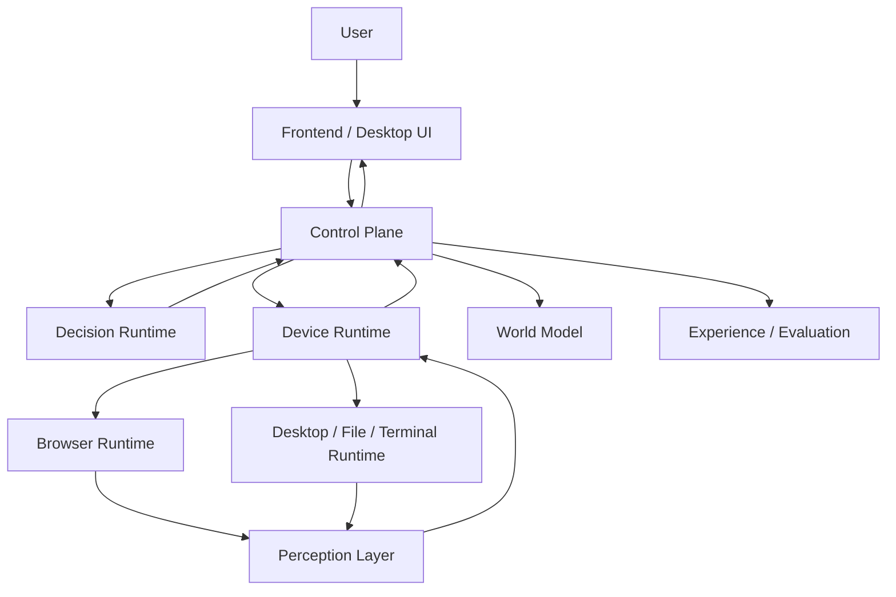

# Athena Agent OS 分版本落地计划

[English](./athena-agent-os-version-roadmap-v0.2-v1.0.md)

| 字段 | 内容 |
| --- | --- |
| 文档版本 | `1.1-rebased` |
| 当前代码基线 | `v0.1.7` 修复线 + `architecture/agent-os-roadmap-v1.0` 架构集成分支 |
| 规划范围 | `v0.2.0` 至 `v1.0.0` |
| 适用仓库 | `agent-runtime`、`agent-runtime-client`、`athena-launcher`、`frontend/agent-ui`、`logx`、规划中的 `athena-protocol` |
| 核心目标 | 把 Athena 从“LLM + 工具集合”演进为可持续运行、可验证、可学习、可治理的 Personal Agent OS |
| 文档性质 | 跨仓库规范性路线图；各版本实施文档必须服从本计划的职责边界和发布门槛 |
| 当前路线状态 | `v0.2` 内部实现、本地 7 场景打包跨进程运行和本地可执行门禁已大幅收口，但签名安装、完整打包 500 Journey、完整十 Span Trace 与生产覆盖率门禁仍未关闭；`v0.3` W1-W5 已形成工程证据，Release 尚未完成 |
| 架构语义 | `v0.3` Core Invariants 与四层职责 **FROZEN** |
| 契约成熟度 | Object Schema 为 `draft/v0alpha`；Storage 与新增 Wire Contract 未冻结 |

---

## 1. 结论与关键决策

Athena 当前已经拥有 Intent、RoutePlan、Capability Registry、Research、设备 WebSocket、Browser Runtime、Perception 和前端执行面板等基础能力，但这些能力仍分散在不同仓库，并存在协议重复、状态所有权不清和执行结果闭环不完整的问题。

因此，后续版本不能直接进入“自我进化”。重整后的依赖顺序是：

```text
当前状态
    ├── v0.2 内部实现与本地测试已完成
    └── v0.3 Browser Semantic Slice 已形成验证证据
    ↓
V3-W0：关闭 v0.2 外部门禁
    ↓
V3-W1：语义基线与 Browser Golden Path
    ↓
V3-W2：Browser Failure Matrix
    ↓
V3-W3：Experience、隐私与保留
    ↓
V3-W4：Evaluation、Replay 与 Retrieval
    ↓
V3-W5：Evidence Review 与 Release Gate
    ↓
v0.4 Skill / Strategy 候选学习
    ↓
v0.5 受控发布与回滚
    ↓
v0.6 证据知识与受控本体
    ↓
v0.7 长期目标与多 Agent 协作
    ↓
v0.8 Capability / Plugin 生态
    ↓
v0.9 生产级加固
    ↓
v1.0 Personal Agent OS GA
```

本计划作出以下不可逆架构决策：

1. `agent-runtime-client` 在架构中承担 **Control Plane** 职责，名称可暂时不改。
2. Control Plane 是 Task、Action、Observation、World Model、Experience、Evaluation 和 Promotion 的唯一持久化所有者。
3. `agent-runtime` 是 Decision Runtime，负责理解、规划、路由、模型调用、候选生成和离线评测，不直接拥有持久化任务状态。
4. `athena-launcher` 是 Device Runtime，负责本地执行、感知、权限、浏览器、桌面、文件、终端和进程部署。
5. Frontend 只负责展示、输入、审批和管理，不承担设备执行转发，也不成为任务继续运行的必要条件。
6. Capability 是受策略保护的可执行能力；Skill 只能编排已有 Capability，不能凭空增加权限或执行器。
7. Action 不是事实。只有执行后的 Observation 才能更新 World Model。
8. 不保存模型原始思维链。只保存结构化 Intent、Plan、Decision Summary、Action、Observation 和结果证据。
9. 第一版不采用纯 Event Sourcing。采用“事务表 + Append-only Event + Transactional Outbox + Projection”的混合模式。
10. 自我学习首先产生 Candidate；任何 Candidate 都不能绕过验证、评测、策略、审批和回滚直接进入生产。

---

## 2. 当前基线与主要技术债

### 2.1 已有可复用能力

| 仓库 | 当前已有能力 | 后续处理 |
| --- | --- | --- |
| `agent-runtime` | Intent Parser、Router、Capability Registry、Action Protocol、Research Agent、Tools、Sub-Agent、模型流式处理 | 收敛为无状态 Decision Runtime |
| `agent-runtime-client` | 用户、模型、Agent、聊天、Memory、设备 WebSocket、`agent_control_*` 数据 | 升级为权威 Control Plane |
| `athena-launcher` | Wails 桌面壳、服务部署、Browser Runtime、CDP、Perception、页面理解、设备控制 | 收敛为 Device Runtime |
| `frontend/agent-ui` | Chat、Task 展示、Browser Execution、Research Sources、Model、Agent、Settings | 收敛为 Presentation 与 Approval UI |
| `logx` | Trace、错误链、结构化日志基础 | 成为所有仓库唯一公共可观测性库 |

### 2.2 必须先处理的问题

1. Action、Observation、DeviceMessage 在多个仓库各自定义，字段和语义可能漂移。
2. Task 在 Runtime Tool、Sub-Agent 和 Control Plane 中存在不同定义。
3. `agent_control_*` 只覆盖设备闭环，无法表达完整 Goal、Plan、Step、Approval、Artifact 和 World State。
4. Runtime 仍有直接 Tool 执行路径，与统一 Capability/Action 路径并存。
5. Browser Perception 已较丰富，但 Observation Budget、附件持久化、World Patch 和任务关联尚未统一。
6. Experience、Evaluation、Candidate、Promotion 尚没有正式数据模型和治理边界。
7. 日志能够追踪错误链，但跨模型、工具、设备动作的统一调用时间线仍不完整。
8. Frontend 对 Task、Action、Research、Browser 和普通消息仍存在不同展示协议。

### 2.3 迁移原则

1. 不长期维护 v3/v4 双协议；允许一次性迁移和短期开发环境适配器。
2. 不删除现有用户数据；提供可回滚数据库迁移。
3. 不在同一版本同时重写执行内核和引入学习系统。
4. 新功能必须走统一协议，不再增加特殊 JSON、特殊 Tool Markup 或 Frontend 转发链路。
5. 每个版本先通过退出门槛，再允许下一版本进入开发。

### 2.4 权威边界与防偏移规则

Athena 不再使用一份文档同时冻结架构、字段和发布状态。四类决策分别由不同证据控制：

| 决策层 | 权威来源 | 当前状态 | 允许变化方式 |
| --- | --- | --- | --- |
| 架构语义 | `v0.3 Architecture Plan` 的 12 条 Core Invariants、四层职责和 World State Authority 所有权 | **FROZEN** | 只能通过 Architecture ADR 重新评审 |
| 版本范围与门槛 | 本路线图 | `v0.2-v1.0` 规范主线 | 修改版本边界必须同时更新中英文路线图和依赖门槛 |
| 内部对象与实现 | `draft/v0alpha`、内部 Fixture、可回滚 Migration | Draft | 允许根据真实 Slice 证据调整，不承诺兼容 |
| 稳定 Wire/Storage Contract | 已发布 Protocol、Schema Hash、正式 Migration Contract | 新对象尚未冻结 | 必须经过兼容性、跨语言 Fixture、升级/回滚和 ADR 评审 |

发生冲突时，不使用“最新文档覆盖旧文档”的隐式规则：架构文档决定**语义是什么**，本路线图决定**在哪个版本交付**，已发布协议决定**线上兼容边界**。无法归类的变更必须暂停并提交 ADR。

以下规则是所有后续版本的硬约束：

1. Browser Vertical Slice 通过不等于 `v0.3` Release 完成。
2. `v0.2` 外部门禁未关闭前，可以保留 `v0.3` 原型证据，但不得发布 `v0.3`，也不得开始 `v0.4` Candidate Learning。
3. 新概念必须同时映射到一条 Core Invariant、当前版本目标、责任仓库和可执行测试；缺少任意一项就进入 Backlog，不进入主线。
4. 单个 Browser Slice 不能直接冻结数据库表、公共 RPC 或事件字段。
5. `v0.3` 只记录、检索和离线评测；任何自动 Candidate 生成、Promotion、Canary 或生产行为修改都属于版本越界。
6. 每个版本必须维护“已完成、下一步、明确不做、退出证据”四栏状态；代码合并不能替代 Gate 证据。
7. 下一版本只能消费前一版本已通过 Gate 的产物，不能依赖计划中但尚未验收的对象。

### 2.5 版本依赖主干

| 版本 | 只消费哪些已验证产物 | 本版唯一新增层 | 禁止提前引入 |
| --- | --- | --- | --- |
| `v0.2` | 现有用户、Agent、模型和设备能力 | 统一 Task/Action/Observation、World 与设备执行内核 | Experience Mining、Candidate、Promotion |
| `v0.3` | 已验收的执行内核与真实 Observation | Effect Verification、Experience、Evaluation、Retrieval | 自动 Skill、在线 Canary、Ontology 自学习 |
| `v0.4` | 脱敏 Experience 与稳定离线评测集 | 声明式 Skill/Strategy Candidate 与人工评审 | 自动激活、生产流量实验、代码执行 |
| `v0.5` | 已评审 Candidate 与可重复 Benchmark | AgentBuild、RunManifest、Shadow、低风险 Canary、Rollback | 自动 R2/R3 Canary、核心自修改 |
| `v0.6` | 可追溯 Experience、Evaluation 和 Build | Evidence Knowledge、Conflict、Freshness、受控 Ontology | 无证据知识晋升、Ontology 自学习 |
| `v0.7` | 稳定 Task/World/Knowledge/Build | 长期 Goal、多 Agent、Checkpoint、跨设备恢复 | 无预算自治、绕过 Policy 的 Delegation |
| `v0.8` | 冻结 Capability Contract 与稳定治理内核 | SDK、签名 Plugin、Sandbox、Registry | 未签名执行器、Plugin 修改 Kernel/Auth |
| `v0.9` | 功能边界冻结的完整系统 | 安全、备份、升级、签名、HA、压测和 SLO | 新增主要架构概念 |
| `v1.0` | 通过生产门禁的 `v0.9` | 协议冻结、核心用户旅程与 GA 支持承诺 | 未经新版本流程的破坏性变化 |

---

## 3. 目标系统职责



### 3.1 Control Plane

负责：

- 身份、用户、Agent、模型和权限。
- Task、Step、Action、Observation 的权威状态机。
- 设备注册、Capability Instance、在线状态和路由。
- Approval、Cancel、Timeout、Retry、Idempotency。
- World Model 当前状态和证据索引。
- Experience、Evaluation、Candidate、Promotion 和 Agent Build。
- HTTP、WebSocket、SSE/gRPC 边界和前端 API。
- 事务、Outbox、审计和数据迁移。

不负责：

- 直接操作本地浏览器或桌面。
- 在 HTTP Handler 内运行长时间模型推理。
- 保存用户明文密码或将凭据发送给模型。

### 3.2 Decision Runtime

负责：

- Intent 解析和上下文语言解析。
- Capability RoutePlan。
- Planner、Supervisor 和 Specialist Agent。
- Research、Knowledge Synthesis 和模型调用。
- 根据 World Slice 生成 Typed Action Proposal。
- 消费 Observation 后继续推理。
- Skill/Strategy Candidate 生成和离线评测执行。

不负责：

- 修改持久化 Task 状态。
- 直接选择任意设备并绕过 Control Plane。
- 将 Action 成功当作环境事实。
- 自动提升 Candidate 或授予新权限。

### 3.3 Device Runtime

负责：

- 长连接、设备身份、Capability 上报和心跳。
- Browser、Desktop、File、Terminal、Audio、Vision 执行。
- 本地 Permission Gate 和高风险二次确认。
- Perception、截图、DOM、Accessibility、文件状态和进程状态。
- Action 去重、超时、取消、执行日志和 Observation 回传。
- Local Mode 的服务安装、升级、健康检查和日志聚合。

不负责：

- 决定用户最终目标。
- 自己扩展服务器权限。
- 持久化服务器侧 Task/Experience 真相。

### 3.4 Frontend

负责：

- Chat、Task Timeline、Action、Observation、Research Evidence 展示。
- Approval、Takeover、Cancel、Retry 和 Candidate Review。
- Agent、模型、设备、Memory、Experience 和设置管理。
- 多语言、语音、无障碍和主题。

不负责：

- 代替 Launcher 执行动作。
- 维护只存在于页面内的关键运行状态。
- 将 API Key、网站密码或 Cookie 暴露给 Agent。

### 3.5 athena-protocol

规划新增独立仓库，负责：

- Protobuf/JSON Schema/TypeScript 类型的规范源。
- Task、Capability、Action、Observation、World Patch、Approval、Artifact 和 Event Envelope。
- Go、TypeScript 代码生成和协议一致性测试。
- 协议版本、兼容矩阵和 Golden Fixtures。

不得包含业务逻辑、数据库代码、模型调用或设备执行实现。

---

## 4. 跨版本强制不变量

以下不变量从 `v0.2.0-alpha.1` 开始生效：

1. 每个请求必须具有 `trace_id`；每个任务必须具有 `task_id`。
2. Action 必须包含 `action_id`、`task_id`、`step_id`、`revision`、`idempotency_key`、`risk`、`timeout` 和目标作用域。
3. Observation 必须关联 Action，并包含执行状态、时间、证据摘要、错误链和可选 World Patch。
4. Control Plane 只能接受当前 Task Revision 的 Decision；旧 Revision 必须拒绝。
5. 同一 Idempotency Key 在同一设备上不能产生两次不可逆副作用。
6. Device Runtime 可以提高风险等级，但不能降低服务器给出的风险等级。
7. Action 完成不等于 Goal 完成；必须由 Verifier 根据 Observation 判断。
8. 任何持久化数据必须包含 `owner_id` 或明确的公共作用域。
9. 凭据只以 `credential_ref` 形式出现，模型、日志、Experience 和前端响应不能包含明文。
10. 原始截图、DOM 和文件内容默认不进入长期 Experience。
11. 不保存原始 Chain of Thought，只保存结构化决策摘要。
12. 所有 Candidate、Agent Build 和 Promotion 记录发布后不可原地修改，只能创建新版本。
13. 所有数据库变更必须有向前迁移、回滚说明和升级测试。
14. Frontend 关闭后，已提交 Task 必须继续运行或进入明确暂停状态。
15. Remote Mode 不得安装、启动、停止或覆盖用户本机后端服务。

---

## 5. 统一核心模型

### 5.1 Task

```text
Task
├── task_id
├── owner_id
├── agent_id
├── goal
├── intent
├── status
├── revision
├── budget
├── active_device_id
├── active_step_id
├── created_at
├── updated_at
└── terminal_reason
```

建议状态机：

```text
CREATED
  → PLANNING
  → RUNNING
  → WAITING_OBSERVATION
  → WAITING_APPROVAL
  → WAITING_USER
  → VERIFYING
  → COMPLETED

任意活动状态
  → CANCELLING
  → CANCELLED

可恢复错误
  → RETRY_WAIT
  → RUNNING

不可恢复错误
  → FAILED
```

### 5.2 Action

```json
{
  "protocol_version": "4",
  "action_id": "act_...",
  "task_id": "task_...",
  "step_id": "step_...",
  "revision": 7,
  "capability": "browser.interact",
  "operation": "click",
  "target": {},
  "arguments": {},
  "risk": "R1",
  "idempotency_key": "...",
  "timeout_ms": 30000,
  "expected_observation": {},
  "issued_at": "..."
}
```

### 5.3 Observation

```json
{
  "protocol_version": "4",
  "observation_id": "obs_...",
  "action_id": "act_...",
  "task_id": "task_...",
  "device_id": "device_...",
  "status": "SUCCEEDED",
  "started_at": "...",
  "finished_at": "...",
  "summary": "Clicked the Shorts filter",
  "evidence": [],
  "world_patch": {},
  "error": null
}
```

### 5.4 World Model 最小模型

`v0.2` 只实现：

```text
Entity
Relation
State
Evidence Reference
Scope
Revision
Confidence
Observed At
Expires At
```

`Belief`、`Prediction` 和动态 `Ontology` 在 `v0.6` 之前不得成为权威持久化模型。

### 5.5 风险等级

| 等级 | 含义 | 例子 | 默认审批 |
| --- | --- | --- | --- |
| `R0` | 只读、无外部副作用 | 读取页面、查询文件、截图 | 不需要 |
| `R1` | 可逆的本地交互 | 打开页面、播放、暂停、切换 Tab | 可按用户策略免审 |
| `R2` | 外部写入或可能影响用户数据 | 发送消息、上传文件、修改云端内容 | 必须显式授权 |
| `R3` | 高价值或安全敏感 | 付款、下单、删除、医疗预约、权限与凭据 | 每次审批且禁止自动 Canary |

组合后的 Task 风险由整体效果决定，不能只取单个 Action 的最高值。

---

## 6. 总体版本矩阵

| 版本 | 核心主题 | 学习等级 | 主要交付 | 单人全职粗略工期 |
| --- | --- | --- | --- | --- |
| `v0.2` | Execution Kernel | `E0` | Task、Protocol v4、World Model、统一执行闭环 | 10-14 周 |
| `v0.3` | Experience & Evaluation | `E1-E2` | 脱敏 Experience、检索、失败分类、离线评测 | 7-10 周 |
| `v0.4` | Candidate Learning | `E3-E4` | Skill/Strategy Candidate、DSL、基准比较 | 9-12 周 |
| `v0.5` | Controlled Promotion | 受控 E4 | Shadow、低风险 Canary、Agent Build、回滚 | 7-10 周 |
| `v0.6` | Knowledge & Ontology | 实验 E5 | Evidence Knowledge、Contradiction、Ontology Pack | 9-13 周 |
| `v0.7` | Persistent Personal Agent | 组合能力 | 长期 Goal、多 Agent、调度、跨设备恢复 | 10-14 周 |
| `v0.8` | Capability Ecosystem | 生态化 | SDK、签名 Plugin、Sandbox、Provider Registry | 10-14 周 |
| `v0.9` | Production Hardening | 稳定化 | 安全、HA、升级、备份、压测、安装签名 | 10-14 周 |
| `v1.0` | GA | 稳定闭环 | 协议冻结、用户旅程、SLO、完整文档 | 5-8 周 |

工期仅用于控制范围，不是发布日期承诺。若由单人维护，应优先完成 `v0.2-v0.5`，不要并行启动 `v0.6+`。

---

## 7. v0.2.0：统一执行内核

### 7.1 版本目标

建立唯一、可恢复、可观测的：

```text
Intent
→ RoutePlan
→ Task Graph
→ Action Proposal
→ Policy
→ Device Execution
→ Observation
→ Verification
→ World Model
→ Continue / Complete
```

### 7.2 进入条件

- `v0.1.5` 各仓库可独立构建和测试。
- 当前数据库有可恢复备份。
- 冻结旧协议的功能扩展，只允许缺陷修复。
- 创建 `architecture/agent-os-v0.2` 分支和跨仓库兼容矩阵。

### 7.3 交付范围

#### Protocol

- 创建 `athena-protocol`。
- 定义 Envelope、Task、Step、DecisionRequest、DecisionResponse、Action、Observation、WorldPatch、Approval、Artifact。
- 生成 Go 和 TypeScript 类型。
- 定义未知字段、版本不匹配和最大消息体积行为。
- 提供 Golden JSON/Protobuf Fixtures。

#### Control Plane

- 新增 Task Controller 和状态机。
- 新增 Revision/CAS，拒绝过期 Decision 和 Observation。
- 新增 Transactional Outbox。
- 新增 Action 去重、Timeout、Cancel 和 Retry Policy。
- 设备路由基于 `owner_id + device_id + capability_instance`。
- World Model 使用最小模型和有界 World Slice。
- 前端使用 SSE 或 WebSocket 订阅 Task Event。

#### Decision Runtime

- Intent Parser 输出稳定结构化 Intent。
- Router 只选择 Primary Route 和 Capability 需求，不直接执行设备操作。
- Planner 输出有界 Task Graph。
- 模型 Tool Call 解析统一转成 Action Proposal。
- 消费 Observation 后继续模型循环，直到可见结果或明确等待状态。
- Research Server Capability 与 Browser Device Capability 明确分开。

#### Device Runtime

- Launcher 主动连接 Control Plane。
- 上报设备、平台、版本和 Capability Instance。
- 实现幂等执行、取消、超时和断线重连。
- Browser Runtime 使用稳定 CDP Target ID，不使用 Tab Index 作为身份。
- Perception 输出受预算约束的 Observation。
- 用户关闭/移动 Tab 后重新解析 Target，不复用过期索引。
- 本地权限拒绝必须产生结构化 Observation。

#### Frontend

- 统一展示 Task、Step、Action、Observation、Approval 和错误。
- Chat 不再把 Tool Markup 当普通文本显示。
- 点击停止调用 Task Cancel，并显示取消确认状态。
- 浏览器执行卡显示实际 URL、Title、Target、证据和失败原因。
- Frontend 关闭重开后可以恢复正在运行的 Task。

### 7.4 数据模型

```text
os_task
os_task_step
os_task_event
os_action
os_observation
os_artifact
os_approval
os_device
os_device_capability
os_capability_definition
os_capability_instance
os_world_entity
os_world_relation
os_world_state
os_world_evidence_ref
os_outbox
```

所有表至少包含：

```text
id
owner_id / scope
created_at
updated_at
revision
trace_id
```

### 7.5 现有代码迁移

| 现有位置 | 处理方式 |
| --- | --- |
| `agent-runtime/internal/actionprotocol` | 改为 `athena-protocol` 适配器，稳定后删除重复类型 |
| `agent-runtime-client/domain/entity/control/protocol.go` | 改用生成类型，仅保留领域适配 |
| `athena-launcher/internal/control/protocol.go` | 改用生成类型，仅保留设备执行接口 |
| `agent_control_*` | 一次性迁移到 `os_*`，保留 migration audit |
| Runtime 内多个 Task 类型 | 仅保留 Planner 内部只读视图，不再持久化 |
| Frontend structured message | 改用生成 TypeScript Event 类型 |

### 7.6 可观测性

每条日志必须可关联：

```text
trace_id
task_id
step_id
action_id
observation_id
device_id
model_invocation_id
```

必须输出以下 Span：

```text
intent.parse
route.plan
world.query
model.invoke
action.policy
action.dispatch
device.execute
perception.observe
world.apply
task.verify
```

错误只在边界记录一次完整错误链，内部层负责 Wrap Operation，不重复打印同一错误。

### 7.7 测试计划

- Protocol Golden/Compatibility Test。
- Task 状态机表驱动测试。
- Action 幂等与重复 Observation 测试。
- Control Plane 重启恢复测试。
- Launcher 断线重连测试。
- Browser Tab 关闭、移动、重复打开测试。
- Frontend 关闭后任务继续执行测试。
- 数据迁移与回滚测试。
- macOS、Windows、Linux E2E。

### 7.8 验收场景

1. 打开 YouTube，搜索指定内容，点击第二个结果，验证播放状态。
2. 同一 Browser Session 打开两个站点，后续指令不会创建不必要的新浏览器实例。
3. 用户关闭一个 Tab 后，后续动作仍通过 Target ID 操作正确 Tab。
4. Frontend 关闭后，任务继续执行；重开后恢复完整 Timeline。
5. Control Plane 重启后，未完成任务进入可恢复状态，不重复副作用。
6. 重复发送同一 Action 不产生第二次点击、发送或提交。
7. 所有错误包含原始错误、Operation Chain、Trace 和耗时。

### 7.9 发布阶段

```text
alpha.1  Protocol + generated types
alpha.2  Task Controller + database migration
alpha.3  World Model + World Slice
alpha.4  Launcher device execution migration
beta.1   Frontend unified task timeline
beta.2   fault injection + cross-platform E2E
rc.1     upgrade rehearsal + release manifest
```

### 7.10 退出门槛

- 所有新设备动作只经过 Protocol v4。
- Control Plane 是 Task 和 World Model 唯一持久化所有者。
- 核心 E2E 连续运行 500 次，非环境原因成功率不低于 98%。
- 重复副作用数量为 0。
- 关键 Span 覆盖率达到 100%。
- 没有明文凭据进入日志、Task Event 或 Observation。

### 7.11 明确不做

- Experience Mining。
- 自动生成 Skill。
- 动态 Ontology。
- 自动 Promotion。
- 任意代码生成和执行。

---

## 8. v0.3.0：经验与评测基础

> Effect-Centric 语义基线、概念对象和 Browser 验证链路详见 [Athena Agent OS v0.3 架构设计方案](./agent-os-architecture-plan-v0.3.zh-CN.md)。本节继续作为发布范围和 Release Gate 的权威来源。

### 8.1 版本目标

让 Athena 能够安全回答：

```text
刚才发生了什么？
为什么成功或失败？
过去是否发生过相似任务？
新的实现是否比旧实现更好？
```

本版本只达到 `E1-E2`：记录和检索，不自动改变生产行为。

本版本同时使用 Browser Vertical Slice 验证已经冻结的架构语义。概念对象保持 `draft/v0alpha`；存储模型和新 Wire Protocol 不在本版本开始时冻结。

### 8.2 进入条件

- `v0.2` 所有退出门槛通过。
- Task、Action、Observation 和 World Revision 已稳定。
- 数据脱敏规范经过安全评审。

### 8.3 Release Workstream 与当前状态

以下 Workstream 是 `v0.3` 内部交付顺序，不是新的公开版本号。只有全部门槛通过后，才能把 `v0.3.0` 标记为完成：

| Workstream | 目的与交付物 | 当前状态 | 退出证据 |
| --- | --- | --- | --- |
| `V3-W0` 前置门禁对账 | 完成 `v0.2` 数据库回滚、三平台安装包、7 个 E2E、500 次 Soak、Span 与凭据审计 | **PARTIAL / BLOCKING**：数据库回滚、未签名跨平台结构、Browser 10/10、组件 500/500、本地打包 7 Journey 与 Release Corpus 凭据扫描已通过；三平台签名安装、完整打包 500 Soak、同一 Trace 的完整十 Span、95% 生产覆盖率仍需外部执行 | [最终证据聚合](./v0.3-evidence-review.zh-CN.md)保持 `release_ready=false`，直至 `v0.2-release-readiness` 的剩余外部门禁全部有可审计记录 |
| `V3-W1` 语义基线与 Golden Path | 冻结 Core Invariants；实现 `draft/v0alpha`；贯通 Outcome 到 Experience；真实播放第二个视频 | **工程实现完成** | 严格校验、全量回归、真实媒体播放和同 Session E2E 通过 |
| `V3-W2` Browser Failure Matrix | Snapshot Drift、目标消失、Login-required、Unknown、Forbidden Effect、Cancel 与重试边界 | **工程实现完成** | 每个场景都有 Observation、Verification、终态、Trace 和 Replay Fixture |
| `V3-W3` Experience 与隐私 | 内部 Draft 持久化、异步生成、Redaction、Retention/Delete、Owner Isolation、用户开关 | **工程实现完成；生产覆盖率待 V3-W0 环境采样** | 95% 终态覆盖、Secret 泄漏为 0、删除与跨用户隔离测试通过 |
| `V3-W4` Evaluation、Replay 与 Retrieval | Fixture、Suite、Run、基线比较、检索预算和污染防护 | **工程实现完成** | Replay 可重复；历史检索不能覆盖当前 Observation；离线指标可比较 |
| `V3-W5` Evidence Review 与 Release | 统计真实使用字段、删除无证据字段、决定继续内部 Metadata 还是提出新协议 ADR | **工程评审完成；Release 受 V3-W0 阻塞** | [证据评审](./v0.3-evidence-review.zh-CN.md) 与 [ADR-0001](./adr/0001-v0.3-semantics-carriage.zh-CN.md)；不冻结新协议 |

当前 `V3-W1 → V3-W5` 的工程实现与证据允许保留和继续修正，但不能绕过仍开放的 `V3-W0` 外部门禁发布 `v0.3`，也不能进入 `v0.4`。`os_experience*` 等表继续作为可回滚的内部实现使用，其字段、表名和公共 API 都不构成冻结契约。

`V3-W1` 完成只证明对象边界能够支撑一个真实任务，不证明 Experience 产品、隐私生命周期、评测系统或整个 `v0.3` 已达到发布标准。`V3-W*` 专门表示版本交付 Workstream；`R0-R3` 继续只表示行为风险等级。

### 8.4 Experience 定义

Experience 不是完整聊天转储，也不是原始思维链。它是一次任务执行的脱敏、结构化总结：

```text
Experience
├── experience_id
├── owner_id
├── task_id
├── agent_build_id
├── run_manifest_id
├── goal_summary
├── intent
├── environment_fingerprint
├── plan_summary
├── action_refs
├── observation_refs
├── outcome
├── verification
├── failure_classification
├── cost
├── duration
├── human_intervention
├── sensitivity
├── retention_policy
└── provenance
```

### 8.5 隐私与保留

- Experience 写入前执行 Redaction，不允许写后再清洗。
- 明文凭据、Cookie、Token、表单密码、身份证件和支付信息永不保存。
- 截图和 DOM 默认仅保存摘要、Hash 和临时 Artifact Reference。
- 用户可以关闭学习、查看 Experience、删除 Experience。
- Append-only Audit 与可删除 Payload 分离。
- 删除通过 Payload 删除/密钥销毁和 Tombstone 实现，不破坏审计一致性。
- 不同用户和组织的 Experience 不能互相检索，公共数据必须显式发布。

### 8.6 交付范围

#### Browser Semantic Baseline Validation

- 使用“播放当前页面中的第二个视频”验证 OutcomeSpec、TargetSpec、TargetResolution、PlanCandidate、PlanRun、ActionAttempt、Observation、VerificationResult 和 ExperienceRecord 的完整关联。
- Target Resolution 必须绑定页面 Snapshot、Evidence 和精确 Read Set；页面变化时重新 Grounding，不能复用旧 Ordinal、坐标或 CDP Target。
- Action 成功不等于 Outcome 成功；媒体播放必须由 Clause 级 Effect Verification 证明。
- `unknown` 触发有预算的补充 Observation，`unsatisfied` 进入受限重试、补偿或 Replan，`conflicting` 进入冲突消解或人工接管。
- 继续使用现有 Protocol v4 Action/Observation；概念字段先通过内部 Fixture 和 Event Correlation 验证。

#### Experience Engine

- Task 完成/失败后异步生成 Experience。
- 建立 Redaction、Sensitivity 和 Retention Pipeline。
- 记录 Outcome、Cost、Latency、Model Usage、Capability Usage。
- 支持按 Task Type、Domain、Environment、Failure、Skill 检索。

#### Failure Classification

统一分类：

```text
INTENT_FAILURE
ROUTING_FAILURE
PLANNING_FAILURE
MODEL_FAILURE
CAPABILITY_SELECTION_FAILURE
ARGUMENT_FAILURE
POLICY_FAILURE
DEVICE_OFFLINE
RUNTIME_FAILURE
PERCEPTION_FAILURE
VERIFICATION_FAILURE
ENVIRONMENT_DRIFT
USER_INTERRUPTION
```

规则优先，LLM 仅作为补充分类器；分类必须保留证据。

#### Evaluation Engine v1

- 从脱敏 Experience 生成 Replay Fixture Candidate。
- Fixture 必须绑定环境版本、页面快照、协议版本和 Expected Outcome。
- 浏览器/桌面 Replay 默认使用 Mock/Simulation，不访问生产账号。
- 比较 Correctness、Success、Latency、Cost 和 Safety。
- 所有 Evaluation 只离线运行，不影响生产流量。

#### Retrieval

- Keyword + Structured Filter + Vector Similarity。
- 检索结果进入 Planner 前必须有数量、Token、时间和敏感度预算。
- 检索内容以“历史参考”标记，不能覆盖当前 Observation。

### 8.7 数据模型

```text
os_experience
os_experience_event_ref
os_experience_payload
os_experience_redaction
os_failure_classification
os_evaluation_fixture
os_evaluation_suite
os_evaluation_run
os_evaluation_result
```

### 8.8 前端交付

- 用户可查看某 Task 如何形成 Experience。
- 用户可关闭学习、删除个人 Experience、调整保留期限。
- 管理员可查看失败分类、模型/Capability 成本和评测结果。
- 不展示内部思维链，只展示可解释的决策摘要和证据。

### 8.9 测试计划

- Secret/PII Redaction Corpus。
- Cross-user Isolation Test。
- Retention/Delete Test。
- Experience 生成幂等测试。
- Fixture 可重复性测试。
- Mock Browser/Device Replay 测试。
- Retrieval 污染和 Prompt Injection 测试。
- Browser Golden Path、Snapshot Drift、Login-required、Forbidden-effect、Unknown 和 Cancel 测试。
- Outcome-to-Experience Correlation 完整性测试。
- Target Read Set 精确失效和 Effect Clause 四态验证测试。

### 8.10 验收门槛

- 95% 以上终态 Task 能形成结构化 Experience；其余必须记录跳过原因。
- Secret Corpus 泄漏率为 0。
- Experience 删除后不可通过 API、检索或备份索引直接读取。
- 同一 Fixture 重复运行结果一致。
- Retrieval 对当前 World State 的覆盖次数为 0。
- 没有 Candidate 自动影响生产规划。
- Browser Golden Path 能形成完整 Outcome-to-Experience Trace，并证明真实媒体播放，而不是只证明点击成功。
- 页面刷新、目标消失或 Tab 关闭后不会执行旧 TargetResolution。
- Forbidden Effect 违反会覆盖普通 Desired Effect 成功。
- 现有 Protocol v4 Contract Test 全部继续通过。

### 8.11 明确不做

- 自动创建或激活 Skill。
- 在线 Canary。
- 动态修改 Planner Prompt。
- Ontology 自学习。
- 冻结新的对象字段、数据库表或 Wire Protocol。
- 通用机器人物理模型和生产级 Exploratory Affordance 执行。

---

## 9. v0.4.0：Skill 与 Strategy 候选学习

### 9.1 版本目标

达到受控 `E3-E4`：从重复经验中产生可读、可验证、不可越权的 Candidate，但仍由人决定是否进入可用集合。

### 9.2 进入条件

- `v0.3` 隐私、检索和 Evaluation 门槛通过。
- 至少有稳定的 Browser、Research 和 File 模拟评测集。
- Capability Schema 和风险模型冻结。

### 9.3 Skill DSL

Skill 使用声明式 DSL，不允许直接生成 Go、JavaScript、Shell 或 Python 代码：

```text
SkillVersion
├── id
├── version
├── description
├── input_schema
├── output_schema
├── preconditions
├── required_capabilities
├── task_graph_template
├── recovery_paths
├── verification_rules
├── risk_ceiling
├── evaluation_suite
├── owner
├── visibility
└── lifecycle_state
```

Skill 只能引用已注册 Capability；不能创建新的权限、Credential Scope 或 Runtime Executor。

### 9.4 Strategy 定义

Strategy 只表达 Planner 的受控选择规则：

```text
condition
preferred_skill
fallback_order
observation_policy
retry_budget
verification_policy
```

本版本不允许 Strategy 修改 Kernel、Policy、Auth 或 Sandbox。

### 9.5 Candidate Pipeline

```text
Experience Cluster
  → Pattern Evidence
  → Candidate Proposal
  → Schema Validation
  → Capability/Permission Analysis
  → Static Risk Analysis
  → Replay
  → Benchmark Compare
  → Human Review
  → APPROVED_FOR_USE / REJECTED
```

### 9.6 Candidate 生成条件

- 至少来自多个独立 Experience，不能由一次任务直接泛化。
- 必须包含成功证据和失败反例。
- 必须声明适用环境、站点类型、前置条件和失效条件。
- 必须提供 Baseline 对比。
- 不允许把网站名称硬编码成核心执行逻辑；站点知识只能作为语义提示或 Plugin Knowledge。

### 9.7 Human Demonstration

- 只有用户显式开启“演示记录模式”才可记录。
- 在输入敏感字段前自动暂停记录。
- 记录语义 Action，不记录键盘原始字符和凭据。
- 用户必须在 Candidate 生成前预览、编辑和确认演示摘要。
- 演示默认属于当前用户，不自动发布为公共 Skill。

### 9.8 数据模型

```text
os_learning_candidate
os_candidate_evidence
os_candidate_evaluation
os_skill
os_skill_version
os_strategy
os_strategy_version
os_demonstration
```

生命周期：

```text
DRAFT
→ VALIDATING
→ EVALUATING
→ REVIEW_REQUIRED
→ APPROVED_FOR_USE
→ REJECTED
→ DEPRECATED
→ RETIRED
```

`APPROVED_FOR_USE` 只表示可由用户或 Agent 配置选择，不代表自动替换生产默认值。

### 9.9 前端交付

- Candidate Inbox。
- Skill/Strategy Diff Viewer。
- Evidence、评测集、成功率、成本和风险展示。
- Approve、Reject、Edit、Re-evaluate。
- 用户级、组织级、公共可见性控制。

### 9.10 测试计划

- DSL Parser/Validator。
- Capability 越权测试。
- 风险组合升级测试。
- Candidate 泛化和反例测试。
- Prompt Injection 到 Skill Candidate 的隔离测试。
- 人工演示敏感输入测试。

### 9.11 验收门槛

- Candidate 无法引用未注册 Capability。
- Candidate 无法提高 Credential Scope 或降低 Risk。
- 每个 Candidate 都有 Evidence、Evaluation 和可读 Diff。
- Benchmark 改善具有最小样本量和置信区间，不只比较单次成功率。
- Candidate 默认不改变现有 Agent 行为。
- 无任意生成代码进入生产路径。

---

## 10. v0.5.0：受控发布、Shadow 与回滚

### 10.1 版本目标

建立 Candidate 从“可用”到“生产生效”的完整治理闭环：

```text
Candidate
→ Approved
→ Shadow
→ Low-risk Canary
→ Active
→ Monitor
→ Rollback / Retire
```

### 10.2 AgentBuild 与 RunManifest

#### AgentBuild

不可变、可发布：

```text
kernel_version
planner_version
policy_version
protocol_version
skill_versions
strategy_versions
ontology_version
prompt_template_versions
evaluation_suite_version
```

#### RunManifest

每次运行生成：

```text
agent_build_id
model_config_version
capability_instances
device_id
user_scope
world_revision
knowledge_snapshot
budget
feature_flags
exposure_id
```

Capability 在线状态、用户知识和设备信息不能写入不可变 AgentBuild。

### 10.3 Promotion 状态机

```text
PROPOSED
→ REVIEWED
→ SHADOW
→ CANARY
→ ACTIVE
→ PAUSED
→ ROLLED_BACK
→ RETIRED
```

### 10.4 Shadow

- Candidate 接收相同输入，但不执行真实 Action。
- 比较 RoutePlan、Task Graph、Action Proposal、成本和风险。
- Shadow 输出不得写入生产 World Model。
- Shadow 失败不得影响用户任务。

### 10.5 Canary

- 只允许 `R0/R1` 且可验证、可恢复的行为进入自动 Canary。
- 按 `owner_id + agent_id` 稳定分组，不能让同一用户行为随机漂移。
- 用户可退出实验。
- `R2/R3` 禁止自动 Canary，只能显式选择新版本。
- 设置 Success、Latency、Cost、Safety 和 Human Intervention 的停止阈值。

### 10.6 Rollback

- 激活前记录 Previous Build。
- 回滚只切换版本指针，不原地修改历史版本。
- 回滚后新 Task 使用旧版本；已执行外部副作用不假装撤销。
- 对不可逆动作提供补偿流程，而不是简单标记成功。

### 10.7 数据模型

```text
os_agent_build
os_run_manifest
os_promotion
os_exposure
os_shadow_result
os_canary_metric
os_rollback
os_compensation
```

### 10.8 前端交付

- Agent Build 版本页。
- Promotion 审批、Shadow 对比和 Canary 监控。
- 一键暂停和回滚。
- 用户级实验开关与版本固定。

### 10.9 验收门槛

- 任意 Active Skill/Strategy 可追溯到 Evidence、Evaluation、Approval 和 Build。
- 一分钟内可停止 Canary 并切回上一 Build。
- `R2/R3` 自动 Canary 数量为 0。
- Shadow 不产生真实设备或网络写入。
- 版本回滚不破坏 Task、World Model 和 Experience 读取。

### 10.10 明确不做

- 自动修改源代码。
- 自动发布新 Capability Executor。
- 自动修改 Auth、Policy、Sandbox 和 Credential System。
- 无人审批的公共 Skill 发布。

---

## 11. v0.6.0：证据知识与受控本体

### 11.1 版本目标

把“记住内容”升级为“知道某个结论来自哪里、是否过期、是否存在冲突”。

### 11.2 Knowledge 模型

```text
Knowledge Claim
├── claim_id
├── subject
├── predicate
├── object/value
├── scope
├── evidence_refs
├── confidence
├── valid_from
├── valid_until
├── contradicted_by
├── owner
└── provenance
```

Knowledge 不能由单个 Observation 直接生成。必须经过证据处理和作用域判断。

### 11.3 Evidence 与冲突

- Research Source、官方文档、页面 Observation、用户确认采用不同信任等级。
- 对时间敏感信息必须有 Freshness Policy。
- 冲突不能静默覆盖；生成 Contradiction Record。
- 最终回答必须能返回使用过的关键来源和 Claim。
- 用户个人偏好不能被错误提升为公共知识。

### 11.4 Ontology Pack

首版支持：

```text
Core Ontology
Domain Ontology Pack
Version
Compatibility
Migration Plan
Validation Rules
Display Metadata
```

Ontology Candidate 只能离线生成和评测；生产 Schema 迁移必须由人审批并通过迁移工具执行。

### 11.5 Belief 与 Prediction

- Belief 作为 World State 的派生读模型，不作为独立真相源。
- Prediction 仅用于比较“预期 Observation”和“实际 Observation”。
- Prediction Error 可以形成 Experience，但不能自动修改 Policy。
- 首版仅在 Browser/Research 模拟环境实验。

### 11.6 Hybrid Retrieval

```text
Structured Filter
+ Keyword Search
+ Vector Search
+ Relation Traversal
+ Temporal Filter
+ Evidence Rank
```

必须有 Scope、Sensitivity、Token、Result Count 和 Time Budget。

### 11.7 数据模型

```text
os_knowledge_claim
os_evidence
os_contradiction
os_knowledge_snapshot
os_ontology_pack
os_ontology_version
os_ontology_candidate
os_ontology_migration
```

### 11.8 验收门槛

- 所有可对外引用的 Claim 至少有一个可访问 Evidence。
- 时间敏感 Claim 过期后不作为确定事实返回。
- 冲突证据在 UI 和 Agent Context 中明确显示。
- Ontology Candidate 不能自动迁移生产数据。
- Knowledge 检索不能突破用户/组织边界。

---

## 12. v0.7.0：长期目标与多 Agent 协作

### 12.1 版本目标

支持跨小时、跨天、跨设备的持续任务，并让 Supervisor 协调有限的 Specialist，而不是创建无边界的 Agent Swarm。

### 12.2 Persistent Goal

```text
Goal
├── owner
├── objective
├── constraints
├── success_criteria
├── budget
├── deadline
├── approval_policy
├── active_task_ids
├── checkpoint
└── status
```

### 12.3 Supervisor

负责：

- 拆分有限 Task Graph。
- 选择 Research、Browser、Desktop、File 等 Specialist。
- 分配 Token、时间、查询和设备预算。
- 合并结果、检测冲突和判断是否需要追问用户。
- 在暂停、断线、重启后从 Checkpoint 恢复。

不负责：

- 自己绕过 Policy 执行动作。
- 无限创建 Sub-Agent。
- 把多个 Specialist 的猜测直接写入 World Model。

### 12.4 Scheduler

- 当前 Cron/Scheduled Task 迁移到 Control Plane。
- 每次触发创建标准 Task，不走特殊执行链路。
- 支持时区、错过执行、重试、最大并发和用户通知。
- 涉及 R2/R3 的定时任务必须在执行前审批或使用明确的预授权范围。

### 12.5 跨设备

- Task 与设备解耦，Action 才绑定具体 Device。
- Device 离线后可以等待、改路由或请求用户选择。
- World Model 保留设备作用域，不能把 Mac 上打开的 Tab 当作 Windows 上存在。

### 12.6 验收场景

1. 制定五天旅行计划：查询天气、交通、住宿和兴趣，发现缺口后追问，再生成有来源的计划。
2. 用户关闭 Frontend 和 Launcher 后重新上线，任务从明确 Checkpoint 恢复。
3. Research 与 Browser Specialist 能共享经过筛选的 World Slice，不共享全部上下文。
4. 预算耗尽时进入 `WAITING_USER`，而不是无限搜索。

### 12.7 验收门槛

- Supervisor 最大并发、深度、Token、时间和 Action 数量均受硬限制。
- 每个 Specialist 输出均有 Provenance。
- 重启恢复不重复已确认的外部副作用。
- Scheduled Task 与交互 Task 共享相同协议和审计。

---

## 13. v0.8.0：Capability 与 Plugin 生态

### 13.1 版本目标

允许第三方以受控方式扩展 Athena，而不是把新 Tool 直接编译进 Agent Runtime。

### 13.2 Capability Provider SDK

Provider 必须声明：

```text
provider_id
version
capabilities
input/output schemas
platforms
permissions
credential scopes
risk floor
resource limits
health check
observation contract
signature
```

### 13.3 Plugin Package

```text
plugin.json
schemas/
knowledge/
skills/
runtime/
tests/
SIGNATURE
SBOM
```

Plugin Knowledge 可以补充站点语义，但核心 Browser Runtime 仍按 UI Tree 和 Pattern 工作，禁止回到“每个网站一套硬编码控制器”。

### 13.4 Sandbox

隔离：

- 文件系统。
- 网络域名。
- Credential Scope。
- Device Capability。
- CPU、内存和执行时间。
- World Model 写入。
- 外部副作用。

### 13.5 Registry

- Private Registry 优先。
- 公共发布必须签名、扫描、评测和人工审核。
- 支持撤回、禁用和最低兼容版本。
- Agent 只能选择已安装且已授权的 Provider。

### 13.6 验收门槛

- 第三方示例 Provider 无需修改核心 Runtime 即可注册只读 Capability。
- 未授权 Plugin 无法访问网络、凭据和设备。
- Plugin 崩溃不会导致 Control Plane 或 Launcher 崩溃。
- 任意 Capability 调用可追踪到 Provider、版本、权限和 Observation。

---

## 14. v0.9.0：生产级加固

### 14.1 版本目标

把功能完整的系统提升到可公开长期分发、升级和运维的质量。

### 14.2 安全

- Threat Model 和数据流审计。
- 用户/组织/管理员权限矩阵。
- API、WebSocket、Device Token、Credential Vault 的渗透测试。
- Prompt Injection、Indirect Injection 和 Tool Output Poisoning 防护。
- 所有 Release 生成 SBOM、校验和与签名。
- macOS Notarization、Windows Code Signing、Linux Package Signature。

### 14.3 数据可靠性

- PostgreSQL 自动备份、恢复演练和版本升级。
- Embedded PostgreSQL 更新不得覆盖 Data Directory。
- State 文件丢失时能够从现有数据库恢复身份或进行安全重绑定。
- 数据导出、删除和保留策略。
- Migration N-1 → N 和失败回滚测试。

### 14.4 高可用与性能

- Control Plane 多实例时使用共享数据库和事件通知。
- Device Connection 单所有者或租约机制。
- Backpressure、队列上限和熔断。
- 模型、Search、Browser、Device 的独立 Timeout/Budget。
- 长任务不会占用 HTTP 请求生命周期。

### 14.5 SLO

建议目标：

| 指标 | 目标 |
| --- | --- |
| Control Plane API 可用性 | 99.9% |
| Device 在线状态收敛 | 10 秒内 |
| Action Dispatch p95 | 200ms 内，不含执行 |
| Task Event 丢失 | 0 |
| 重复不可逆副作用 | 0 |
| Crash-free Desktop Session | 99.5% 以上 |
| Upgrade Success | 99% 以上 |

### 14.6 测试

- 24/72 小时稳定性测试。
- 网络抖动、数据库重启、进程崩溃和磁盘不足故障注入。
- 多设备、多用户并发压测。
- 安装、升级、降级、卸载、保留数据测试。
- macOS、Windows、主流 Linux 发行版矩阵。

### 14.7 验收门槛

- 无 P0/P1 已知安全问题。
- 灾难恢复演练通过。
- 安装包签名和自动更新链路通过。
- SLO 连续观察达到发布要求。
- 用户可以定位 Launcher、Runtime、Control Plane 和 Frontend 日志。

---

## 15. v1.0.0：Personal Agent OS GA

### 15.1 版本目标

发布第一版稳定 Personal Agent OS：

```text
Goal
→ Plan
→ Typed Action
→ Real Execution
→ Observation
→ Verification
→ World Model
→ Experience
→ Evaluation
→ Controlled Improvement
```

### 15.2 必须稳定的用户旅程

1. 一键安装并选择 Local 或 Remote Mode。
2. 创建用户、绑定模型、创建 Agent。
3. 与 Agent 对话并查看任务执行、来源、耗时和错误。
4. 控制浏览器完成多步页面操作，并可随时人工接管。
5. 查询本地文件、打开应用和执行经授权的桌面操作。
6. 执行研究型任务并展示高质量证据和引用。
7. 创建长期 Goal、暂停、恢复和跨设备继续。
8. 查看、删除 Memory/Experience，控制个性化学习。
9. 管理 Skill、Agent Build、审批和回滚。
10. 安全升级，不丢失数据库、配置和用户内容。

### 15.3 协议与兼容

- Protocol v1 正式冻结并采用 Semantic Versioning。
- 发布 Runtime、Control Plane、Launcher、Frontend、Protocol 兼容矩阵。
- Release Manifest 固定所有组件版本和 SHA-256。
- 至少支持从最后一个 `v0.9` 版本原地升级。

### 15.4 文档

- 中英文架构、安装、升级、备份和故障排查。
- API 和 SDK 文档。
- Capability/Plugin 开发指南。
- Security、Privacy、Data Retention 说明。
- 管理员、普通用户和开发者使用手册。

### 15.5 GA 门槛

- `v0.2-v0.9` 所有强制不变量仍成立。
- 核心 Golden Task Suite 达到设定成功率和回归阈值。
- 公开安装包签名、自动更新和回滚通过。
- 完成安全评审、隐私评审和数据恢复演练。
- 不依赖 Frontend 保持打开才能完成后台任务。
- 每个生产行为都能追踪到 Agent Build、RunManifest、Capability、Action 和 Observation。

### 15.6 v1.0 非目标

- 无限制源代码自修改。
- 自主修改认证、授权、策略和 Sandbox。
- 自主保存或使用用户明文凭据。
- 绕过 CAPTCHA、2FA 或安全系统。
- 未经审批的金融交易、医疗预约、抢购和不可逆操作。
- 通用物理机器人控制。

---

## 16. 跨版本数据库策略

### 16.1 所有业务表必须具备

```text
primary_id
owner_id / organization_id
created_at
updated_at
revision
deleted_at 或明确的 append-only 语义
trace_id
```

### 16.2 事务边界

- Task 状态变更、Task Event 和 Outbox 必须在同一事务提交。
- Observation 持久化和 Action 状态变更必须在同一事务提交。
- World Patch 只有在 Observation 校验通过后应用。
- Promotion 指针切换和审计记录必须原子提交。
- 大型 Artifact 不直接存数据库，数据库保存加密对象引用、Hash、类型和保留期限。

### 16.3 幂等

唯一键建议：

```text
(owner_id, idempotency_key)
(task_id, revision, decision_id)
(action_id, observation_sequence)
(candidate_id, evaluation_suite_id, evaluator_build_id)
```

### 16.4 不采用纯 Event Sourcing 的原因

- 当前团队规模和代码成熟度不适合一次引入完整 Event Sourcing 基础设施。
- Task 查询、用户管理和后台管理更适合关系型 Projection。
- Append-only Event 仍保留审计和恢复价值。
- 后续可在不改变协议的前提下逐步加强 Event Replay。

---

## 17. 跨版本评测体系

### 17.1 Golden Task Suite

至少覆盖：

```text
conversation
research
browser navigation
browser semantic interaction
browser media playback
file search/read
desktop app control
approval
cancel/timeout
device offline/reconnect
multi-step recovery
```

### 17.2 指标不能只看成功率

每个版本必须同时观察：

```text
Correctness
Task Success
Verification Accuracy
Safety Violations
Human Intervention
Average Attempts
Latency
Token Cost
Capability Cost
Regression
User Override
```

### 17.3 分层比较

评测结果必须按以下维度拆分，禁止只展示全局平均数：

```text
task_type
domain/site family
model/provider
platform
device capability
risk level
user locale
agent build
```

### 17.4 Promotion Guardrail

- 最小样本量。
- 置信区间。
- Safety 一票否决。
- Cost/Latency 非劣性约束。
- R2/R3 不允许通过聚合成功率自动提升。

---

## 18. 跨版本安全与隐私计划

### 18.1 数据分类

```text
PUBLIC
INTERNAL
PERSONAL
SENSITIVE
CREDENTIAL
```

### 18.2 凭据

- Control Plane 只管理 Credential Metadata 和授权关系。
- 明文秘密位于 Auth Vault 或系统 Keychain。
- Agent 只获得 Session/Credential Reference。
- Device Runtime 在标准输入或受保护 API 边界注入凭据。
- 日志、Prompt、Observation、Experience 和 Screenshot 必须脱敏。

### 18.3 浏览器

- `isolated`、`profile`、`auto_connect` 模式具有明确权限提示。
- Profile 数据不上传 Control Plane。
- 人工接管后必须重新 Observation，不假设页面未变化。
- CAPTCHA、扫码和 2FA 默认人工接管。
- 不自动绕过网站安全机制。

### 18.4 用户控制

- Memory/Experience 开关。
- 数据查看、导出、删除和保留期限。
- 每个设备和 Plugin 的权限管理。
- 每个高风险动作的审批历史。
- 可禁用个性化学习和 Canary。

---

## 19. 跨版本可观测性计划

### 19.1 统一调用时间线

用户和管理员应能看到：

```text
Request received
Intent parsed
Route selected
World slice loaded
Model call started/finished
Capability selected
Action dispatched
Device execution started/finished
Observation received
Verification completed
Final response streamed
```

### 19.2 模型统计

按以下维度统计：

```text
owner_id
agent_id
model_id
provider
task_id
purpose
prompt_tokens
completion_tokens
cached_tokens
latency
success/failure
cost
```

`purpose` 至少区分：主对话、Planner、Memory Extractor、Research、Evaluation、Candidate Generation。

### 19.3 错误链

建议显示：

```text
operation A
  caused by operation B
    caused by original error
```

不要把所有层级都简单使用冒号拼接。日志边界输出完整链，API 返回稳定错误码、用户信息、Trace ID 和安全的根因摘要。

---

## 20. 分支、Tag 与跨仓库发布

### 20.1 当前架构集成阶段

- `main` 保留稳定的 `v0.1.7` 修复线。
- `architecture/agent-os-roadmap-v1.0` 是当前唯一长期架构集成分支，承载已经同步的 `v0.1.7` 修复、`v0.2` 内部实现和 `v0.3` 验证工作。
- `main` 的关键修复必须经过评审后同步到架构分支；禁止再创建并行的 `agent-os-v0.2`、`agent-os-v0.3` 长期分支。
- `V3-W0` 未关闭前不得把内部实现标记为正式 `v0.2` Release；`V3-W5` 未关闭前不得标记 `v0.3.0`。
- Protocol 首先 Tag，然后 Runtime、Control Plane、Launcher、Frontend 按兼容矩阵升级。

### 20.2 v0.3 Release 以后

- 回归 Trunk-based Development。
- 短期 Feature Branch + Pull Request。
- `release/v0.x` 只用于发布稳定化。
- 不长期维护每个版本的架构分支。

### 20.3 Tag 顺序

```text
logx
→ athena-protocol
→ agent-runtime
→ agent-runtime-client
→ frontend/agent-ui
→ athena-launcher
→ release-manifest
```

只有 Release Manifest 中所有 SHA、版本和平台资产都存在，Launcher 才能宣布版本可用。

---

## 21. 每个版本必须交付的材料

1. Architecture Delta：相对上一版改变了什么。
2. ADR：不可逆决策及原因。
3. Protocol/API Schema。
4. Database Migration 与 Rollback。
5. Threat Model 更新。
6. Test Plan 与实际结果。
7. Benchmark/Evaluation Report。
8. Upgrade/Backup/Recovery Guide。
9. 中英文 README 和用户文档。
10. Release Manifest、Checksum、SBOM 和签名状态。

---

## 22. 风险登记

| 风险 | 影响 | 控制措施 |
| --- | --- | --- |
| 同时重写所有仓库 | 长期无法发布 | 按 Protocol → Control Plane → Runtime → Launcher → Frontend 顺序迁移 |
| World Model 过度设计 | 数据与推理复杂度失控 | v0.2 只做 Entity/Relation/State/Evidence |
| Experience 泄漏隐私 | 严重安全与信任问题 | 写入前脱敏、作用域、保留、删除、加密 |
| Candidate 被 Prompt Injection 污染 | 学习错误或越权 | 来源隔离、证据要求、静态验证、离线评测、人工审批 |
| Replay 触发真实副作用 | 用户数据或资金损失 | Mock/Simulation、虚拟账号、禁止生产凭据 |
| Canary 影响高风险任务 | 不可逆损失 | 只允许 R0/R1，R2/R3 显式选择 |
| 多设备状态混淆 | 操作错误设备或页面 | Device Scope、稳定 Target ID、Revision、重新感知 |
| 模型成本失控 | 无法持续运行 | 多级 Budget、缓存、检索限制、成本指标 |
| 协议版本漂移 | 跨仓库构建/运行失败 | athena-protocol、兼容矩阵、Golden Test |
| 单人开发范围过大 | 每版都不完整 | 严格退出门槛，优先 v0.2-v0.5，延后生态和 Ontology |

---

## 23. 最终建议执行顺序

当前只允许执行以下队列：

```text
1. V3-W0：补齐 v0.2 外部门禁证据，不重新设计已经完成的内部主干。
2. 保留 V3-W1 的 Golden Path 与 draft/v0alpha 证据；除非失败证据触发 ADR，否则不重新打开架构语义。
3. V3-W2：完成 Browser Failure Matrix、终态、Trace 和 Replay Fixture。
4. V3-W3：仅在 V3-W0/V3-W2 通过后，完成 Experience 的隐私与数据生命周期。
5. V3-W4：完成确定性 Replay、离线 Evaluation、历史 Retrieval 与污染防护。
6. V3-W5：基于真实字段使用情况做 Evidence Review，删除无证据字段并决定是否提出协议 ADR。
7. V3-W5 通过后发布 v0.3.0；此后才允许启动 v0.4 Candidate Learning。
```

Stop Rule：任何 Workstream 未通过时，只修复该 Workstream 或它的依赖，不通过“新增抽象”绕过失败；代码合并、表已经存在、单个 E2E 通过或演示成功都不能代替 Release Gate。

在 `V3-W5` 之前明确禁止：

```text
冻结新增 Object Schema、Storage Model 或 Wire Contract
Ontology Learning
Skill / Strategy Candidate Promotion
Generated Capability Code
Online Canary
Public Plugin Marketplace
Physical Agent Runtime
```

Athena 真正需要的不是更多零散功能，而是一条可靠的主干：

```text
Goal
→ Typed Task
→ Verified Action
→ Real Observation
→ Durable State
→ Safe Experience
→ Measured Improvement
```

只有当这条主干稳定后，“自我进化”才会成为工程能力，而不是新的不确定性来源。
