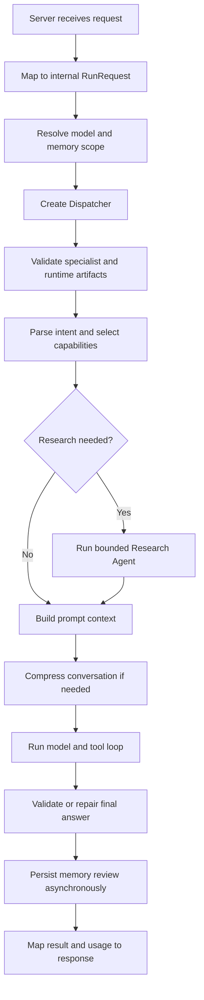

# Dispatch and Request Lifecycle

## Purpose

The server and dispatcher form the application spine. The server resolves request-scoped infrastructure such as model credentials and memory. The dispatcher decides what work is relevant, constructs bounded model input, and coordinates research, skills, tools, and the model loop.

## Main Locations

| Location | Responsibility |
| --- | --- |
| [`internal/server/server.go`](../../internal/server/server.go) | RPC implementation, model resolution, memory scope, result mapping |
| [`internal/server/dispatch.go`](../../internal/server/dispatch.go) | Protobuf-to-internal request conversion |
| [`internal/types/types.go`](../../internal/types/types.go) | Transport-neutral request and response structures |
| [`internal/dispatcher/dispatcher.go`](../../internal/dispatcher/dispatcher.go) | Per-run orchestration |
| [`internal/dispatcher/capability_selector.go`](../../internal/dispatcher/capability_selector.go) | Relevant capability selection |
| [`internal/dispatcher/tools.go`](../../internal/dispatcher/tools.go) | Tool construction for the selected capability set |
| [`internal/dispatcher/skills.go`](../../internal/dispatcher/skills.go) | Skill discovery and selection |
| [`internal/dispatcher/compact.go`](../../internal/dispatcher/compact.go) | Context compression integration |
| [`internal/dispatcher/direct_browser.go`](../../internal/dispatcher/direct_browser.go) | Deterministic fast path for direct browser commands |
| [`internal/dispatcher/capability_handoff.go`](../../internal/dispatcher/capability_handoff.go) | Typed client-action handoff and observation continuation |

## Internal Request Model

`internal/types.RunRequest` is the central transport-neutral input. It can contain:

- the user prompt and conversation messages;
- one or more model configurations and model roles;
- requested public capabilities;
- knowledge bases and uploaded files;
- skills, MCP servers, A2A agents, and configured internal agents;
- Sub-Agent definitions;
- visual inputs;
- project directory and sandbox settings;
- request context, locale, routing, retry, and approval policies.

The protobuf mapper copies and validates these fields before orchestration. Runtime code should depend on `internal/types`, not directly on generated protobuf types.

## Non-Streaming Request Flow

`Dispatcher.Run` follows this path. Research can degrade to partial evidence, but cancellation remains fatal. Final research answers are checked for objective failures such as empty output, pseudo-tool markup, missing citations, or asking for information that the plan already resolved.

## Streaming Request Flow

`Dispatcher.RunStream` adds two important behaviors before the ordinary model stream:

1. It checks whether a previous client Action is waiting for an Observation and completes that handoff.
2. It may handle a deterministic direct-browser command without making a research route compete with browser interaction.

The stream returned by Eino is consumed by the server and converted to typed protocol events. The server accumulates usage and terminal metadata while forwarding visible deltas.

If a model emits only tool-call chunks and the underlying ADK stream produces no visible final answer, the dispatcher can retry through the non-streaming path. This is recovery for a malformed provider stream, not permission to execute a tool twice. Idempotent action IDs and completed-observation state are therefore essential.

## Dispatcher Construction

`dispatcher.New` performs admission work before the first model call:

- consumes the reserved runtime artifact bundle from request context;
- parses a governed specialist envelope when this is a specialist run;
- discovers request and filesystem skills;
- prepares the context compressor;
- stores dependencies such as the capability registry and Research Agent.

Reserved governance objects are removed from generic context before prompt rendering. This prevents raw manifests from being treated as ordinary model text.

## Capability Preparation

The capability preparation stage has a strict order:

1. Parse the complete latest intent.
2. Select a primary route and fallback routes.
3. Derive the allowed public capability IDs.
4. Apply explicit request capability restrictions.
5. Apply specialist restrictions, if present.
6. Resolve public IDs through the capability registry.
7. Select only relevant skill tools.
8. Select eligible runtime artifacts against the already enabled capabilities.
9. Build private tool adapters for the model.

Later stages may reduce the set. No later stage may add authority that was not admitted earlier.

## Context Construction

The dispatcher combines distinct data classes rather than concatenating arbitrary strings:

| Context class | Source |
| --- | --- |
| System behavior | `internal/prompt` |
| Selected capability descriptions | `internal/capability` and resolved tools |
| Skill instructions | `internal/plugins` |
| Long-term memory snapshot | `internal/memory` |
| Ranked research evidence | `internal/research` |
| Knowledge and file excerpts | `internal/retriever` |
| Governed specialist slice | `internal/specialist` |
| Reviewed plans and strategies | `internal/runtimeartifact` |
| Latest device observation | request context and action protocol |

Untrusted data is wrapped in safety envelopes. It must not be placed into the same authority class as system instructions.

## Result Handling

The internal result contains visible content, finish reason, usage, model metadata, tool-call metadata, action count, and stream statistics. The server adds trace identity and maps it back to protobuf or SSE output.

Memory extraction runs after a successful user/assistant exchange. Its failure is observable but does not rewrite the already completed user response.

## Invariants

1. A dispatcher instance belongs to one run and must not leak mutable request state into another run.
2. Request context cancellation must reach research, models, tools, providers, and Sub-Agents.
3. The model receives only selected tools, not the complete registry.
4. A client Action is not success until a device Observation verifies it.
5. A terminal stream outcome is emitted once.
6. Usage from advisors and the primary model is aggregated rather than silently discarded.

## Safe Extension Points

Add request fields in `internal/types` only after deciding whether they are transport data, governed context, or model evidence. Update the protobuf mapper if the field crosses gRPC.

Add a new preparation stage in `dispatcher` before prompt construction. Keep the stage deterministic and test its capability effect separately.

Add a direct fast path only for commands with unambiguous semantics and typed verification. Ambiguous goals belong in the regular model and observation loop.

## Tests

Dispatcher tests cover capability selection, direct browser routing, research protocol behavior, skills, run parameters, artifact admission, and legacy Sub-Agent boundaries. Server tests cover mapping, usage, and trace propagation.
