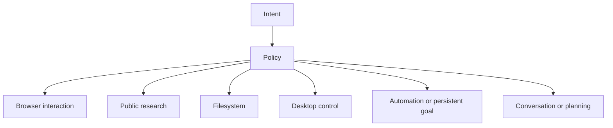

# Intent, Routing, and Effects

## Purpose

This layer decides what kind of work the user is asking for before tools are exposed to the model. It prevents unrelated capabilities from competing, especially the common failure where a browser command is mistaken for web research or ordinary advice opens the local browser.

## Main Locations

| Location | Responsibility |
| --- | --- |
| [`internal/intent/types.go`](../../internal/intent/types.go) | Structured intent vocabulary |
| [`internal/intent/parser.go`](../../internal/intent/parser.go) | Deterministic intent parser |
| [`internal/router/policy.go`](../../internal/router/policy.go) | Route priority and conflict policy |
| [`internal/router/router.go`](../../internal/router/router.go) | Capability allowlist and exclusion derivation |
| [`internal/router/route_plan.go`](../../internal/router/route_plan.go) | Route plan data structure |
| [`internal/effectspec/browser.go`](../../internal/effectspec/browser.go) | Effect-centric browser target and verification semantics |
| [`internal/dispatcher/capability_selector.go`](../../internal/dispatcher/capability_selector.go) | Final relevance filtering |

## Structured Intent

The parser translates the latest complete user request into a deterministic structure. It does not ask the LLM to choose its own authority.

The structure includes concepts such as:

| Concept | Examples |
| --- | --- |
| Domain | conversation, research, browser, filesystem, desktop, automation, orchestration, planning, task |
| Mode | chat, read, write, execute, research, plan |
| Signals | explicit browser interaction, local file work, desktop control, schedule, persistent goal, multi-step delegation |
| Entities | target application, URL, named site, file expression, temporal expression |
| Confidence/reason | Why the deterministic rule selected this interpretation |

The parser looks at the complete request and recent conversation refinements. It should not split one user goal into unrelated sentence-level tasks.

## Primary Route Selection

The policy chooses one primary route and ordered fallbacks.



Important conflict rules:

| User meaning | Primary route | Explicitly avoid |
| --- | --- | --- |
| "Open YouTube and play the second video" | Browser | Generic web search as the final executor |
| "Research recent browser automation approaches" | Research | Opening the user's local browser |
| "Explain how to exchange a driving licence" | Research or conversation | Desktop/browser action unless explicitly requested |
| "Open Music" | Desktop or browser based on target | Treating the command as factual research |
| "Edit this repository" | Filesystem/task | Browser tools |

Fallbacks describe recovery, not parallel authority. For example, an unknown named website can use search to discover an official URL, then return to the same browser task.

## Capability Narrowing

`RouteIntent` converts the route into:

- primary route;
- allowed capability families;
- excluded capability families;
- fallback order;
- a human-readable reason.

The dispatcher intersects this result with request configuration, registry availability, risk rules, specialist bounds, and relevance selection. This intersection model is central:

```text
effective capabilities
= requested
intersection route-allowed
intersection registry-available
intersection specialist-admitted
intersection policy-approved
```

No union operation is allowed after admission.

## Effect-Centric Browser Semantics

An action name is not a user outcome. `effectspec` describes what should become true and what must remain true.

For example, "play the second video" is represented conceptually as:

```text
TargetSpec
  source snapshot: current YouTube page
  collection: visible video result list
  selector: ordinal 2
  resolved entity: stable video reference

Desired effect
  resolved video playback_state == playing

Must preserve
  same browser session
  intended tab remains active

Forbidden effects
  opening an unrelated playlist
  selecting a navigation item called "second"
```

This gives the interaction layer something verifiable. A click that returns HTTP success but does not satisfy the postcondition is not a successful task.

## Why Parsing Is Deterministic

The model remains useful for planning and resolving ambiguous page semantics, but deterministic routing provides:

- reproducible authorization decisions;
- stable tests;
- lower token use;
- protection from prompt injection selecting dangerous tools;
- a clear reason when the wrong route is chosen.

Model advice may refine a query or plan within a code-owned budget. It must not silently override the primary route or grant a capability.

## Invariants

1. Browser control requires an explicit interaction intent.
2. Research never uses the user's visible browser as an implicit fetch engine.
3. File and desktop write operations require explicit execution intent.
4. Ambiguous references are resolved against an observation snapshot before execution.
5. Ordinals refer to a stable collection in a snapshot, not current DOM index after arbitrary navigation.
6. Success is an effect verified by evidence, not merely a successful function return.

## Safe Extension Points

To add a new domain, define the intent signal, add policy precedence, map it to capability families, and add conflict tests. Avoid adding site-specific keywords when a universal interaction pattern can express the same meaning.

To add a new effect type, define target resolution, desired effects, preservation constraints, forbidden effects, and verification requirements together. An effect without a verifier remains `unknown`, not `satisfied`.

## Tests

Use [`internal/intent/parser_test.go`](../../internal/intent/parser_test.go), [`internal/router/router_test.go`](../../internal/router/router_test.go), and [`internal/effectspec/browser_test.go`](../../internal/effectspec/browser_test.go) as the first regression suite. Add dispatcher tests when the route changes the actual exposed tool set.
