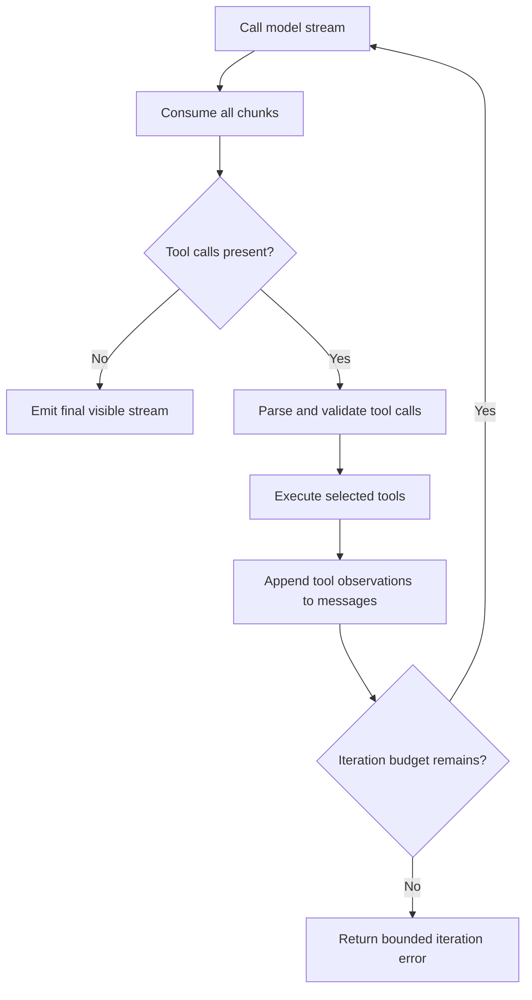

# Model, Prompt, and Streaming

## Purpose

This layer turns selected capabilities and bounded context into model calls. It also owns the explicit model-tool-observation loop, visible stream filtering, usage accounting, local-model startup, and recovery from malformed tool-call streams.

## Main Locations

| Location | Responsibility |
| --- | --- |
| [`internal/eino/chat.go`](../../internal/eino/chat.go) | Eino model client and agent/tool loop |
| [`internal/eino/model_observability.go`](../../internal/eino/model_observability.go) | Model spans, latency, stream statistics, and panic isolation |
| [`internal/eino/model_usage.go`](../../internal/eino/model_usage.go) | Usage collection and model identity |
| [`internal/eino/local_runtime.go`](../../internal/eino/local_runtime.go) | Local Ollama endpoint normalization and on-demand startup |
| [`internal/eino/tool_markup.go`](../../internal/eino/tool_markup.go) | Fallback parser for textual tool markup |
| [`internal/prompt/builder.go`](../../internal/prompt/builder.go) | Prompt section assembly |
| [`internal/prompt/sections.go`](../../internal/prompt/sections.go) | System behavior and context sections |
| [`internal/prompt/cache.go`](../../internal/prompt/cache.go) | Reusable static prompt caching |
| [`internal/language/resolve.go`](../../internal/language/resolve.go) | Response language resolution |

## Model Configuration

`eino.ModelConfig` is populated from the request or the configured fallback. It contains provider, model name, API key, API base, and model behavior options.

The Runtime uses OpenAI-compatible chat semantics. Local Ollama endpoints are normalized and can be started on demand. Model credentials are request-scoped and must not be recovered from unrelated process environment variables after the server has already resolved a user model binding.

## Prompt Assembly

The prompt builder assembles named sections with explicit authority boundaries.

Typical section order:

1. Runtime identity and non-negotiable safety rules.
2. Current date, locale, response language, and style.
3. Selected capabilities and rules for using them.
4. Relevant skills and reviewed runtime artifacts.
5. Conversation and task context.
6. Memory snapshot.
7. Research evidence and knowledge retrieval.
8. Specialist context or device observation.
9. Output-format requirements.

Static content can be cached. Dynamic user, memory, observation, and research content must remain request-local.

`language.Resolve` gives an explicit user language instruction priority over the frontend locale. Without an explicit request, the configured locale is used. This avoids hard-coding "Chinese question means Chinese answer" while still respecting direct language choices.

## Authority and Untrusted Data

The prompt must preserve these distinctions:

| Data | Authority |
| --- | --- |
| Runtime safety and policy | System authority |
| Reviewed declarative plan | Planning guidance within admitted capabilities |
| User request | User intent |
| Memory | Historical context, not permission |
| Web page, uploaded file, provider output | Untrusted evidence |
| Tool observation | Evidence about execution state |

External text is wrapped using Athena safety envelopes. Instructions found inside a web page or file cannot grant tools, alter policy, or redefine the user goal.

## Non-Streaming Generation

`Client.Generate` runs an Eino ADK agent and consumes its event iterator. It returns visible assistant content while suppressing internal bookkeeping. Safe direct outputs such as a typed user question or media result can be returned to the caller.

Device-bound Actions require the streaming path because the caller must display the Action, execute it on a device, and later return an Observation.

## Explicit Streaming Tool Loop

The streaming implementation uses an explicit loop instead of assuming the ADK will always finish tool execution correctly.



This is the critical sequence:

```text
stream tool-call parser
  -> tool executor
  -> observation
  -> model continuation
  -> final visible stream
```

A tool-role message is not a final assistant answer. After tool execution, the observation must be appended and the model must continue until it produces visible assistant output or a typed client Action.

## Visible Stream Filtering

Model providers may stream:

- assistant text chunks;
- reasoning chunks;
- tool-call argument chunks;
- usage-only chunks;
- empty protocol chunks.

Only user-visible assistant deltas are forwarded as answer content. Tool calls become typed tool/action events. Usage-only chunks update accounting. Empty protocol chunks are counted for diagnostics but not rendered.

The final result stores stream statistics such as event count, total chunks, visible chunks, tool-call chunks, reasoning chunks, and usage chunks. These counters explain cases where a provider consumed tokens but emitted no visible answer.

## Empty Tool-Call Recovery

Some providers finish a stream with `finish_reason=tool_calls` but expose no final visible assistant content after ADK processing. The Runtime detects this state instead of returning an apparently successful empty answer.

Recovery must satisfy all of these conditions:

- no visible content exists;
- tool-call activity was observed;
- no verified client Action is still pending;
- replay cannot duplicate a non-idempotent operation;
- the fallback remains inside the original iteration and time budgets.

## Observability and Usage

Every model generate or stream call creates an invocation span containing provider, model, tool count, start time, end time, elapsed milliseconds, finish reason, token usage, and stream counters. Panics are converted into failures at this boundary.

Advisor calls used by research also report usage. The server aggregates advisor and primary-model usage into the final response so model-level totals are meaningful.

## Local Model Lifecycle

`local_runtime.go` recognizes Ollama-compatible local endpoints. It can:

- normalize loopback API bases;
- check whether Ollama is reachable;
- request on-demand startup when supported;
- wait for health within a bounded timeout;
- return a causal connection error when startup fails.

The Runtime should not claim a model is available merely because it is configured.

## Invariants

1. Tool schemas are selected before binding to the model.
2. Tool output always re-enters the model as an observation unless it is a safe terminal direct output.
3. The model loop is bounded by iteration, time, and cancellation budgets.
4. Usage-only or tool-only streams cannot be reported as successful empty answers.
5. A client Action remains pending until the matching Observation arrives.
6. Model credentials and context remain request-scoped.

## Safe Extension Points

Add a model provider through the model-construction boundary, preserving the `ToolCallingChatModel` contract and observability wrapper.

Add a prompt section in `internal/prompt`, assign its authority class, bound its size, and add section tests. Do not concatenate raw external content directly into system instructions.

Add a new direct terminal tool output only when the result is safe to render without a model continuation and its protocol type is explicit.

## Tests

The Eino tests cover stream behavior, tool markup, multimodal input, local runtime handling, model observability, and usage. Prompt tests verify sections and skill rendering. Reproduce provider-specific empty streams with a fake `ToolCallingChatModel` rather than a live paid endpoint.
