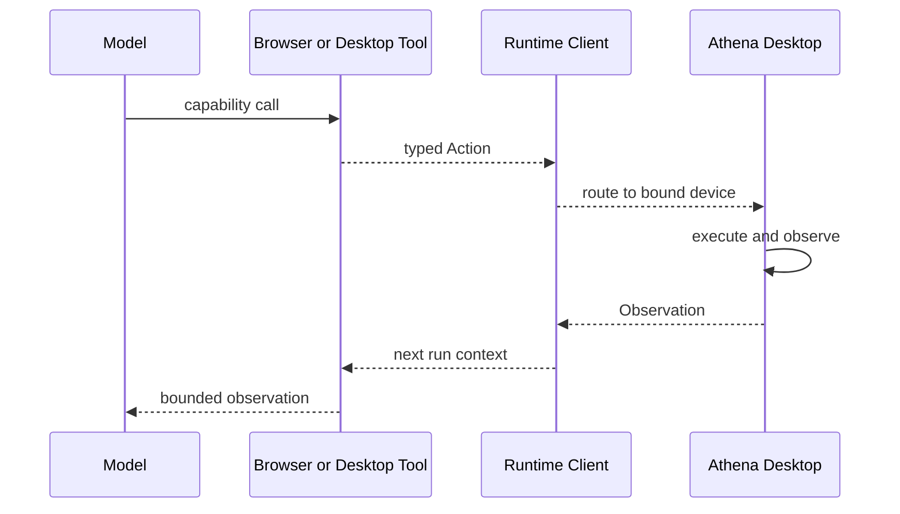

# Capabilities, Tools, and Skills

## Purpose

This subsystem separates what an agent is allowed to do from how the Runtime implements it and from the reusable instructions that teach the model how to do it well.

The three concepts are:

| Concept | Example | Meaning |
| --- | --- | --- |
| Capability | `internet.search` | Stable, provider-independent public authority |
| Tool | `internet_search` backed by `WebSearch` | Private executable adapter exposed to the model |
| Skill | `agent-browser/SKILL.md` | Reusable workflow, knowledge, templates, or scripts |

## Main Locations

| Location | Responsibility |
| --- | --- |
| [`internal/capability/catalog.go`](../../internal/capability/catalog.go) | Stable capability definitions and risk metadata |
| [`internal/capability/registry.go`](../../internal/capability/registry.go) | Resolution from public ID to implementation factory |
| [`manifest/capabilities.yaml`](../../manifest/capabilities.yaml) | Declarative capability catalog used by tooling and distribution |
| [`internal/tools`](../../internal/tools) | Built-in private tool implementations |
| [`internal/plugins`](../../internal/plugins) | Skill discovery and execution |
| [`skills`](../../skills) | Bundled skill content |
| [`internal/dispatcher/tools.go`](../../internal/dispatcher/tools.go) | Per-request tool construction |
| [`internal/dispatcher/skills.go`](../../internal/dispatcher/skills.go) | Per-request skill selection |

## Capability Catalog

The catalog defines stable IDs for capability families including:

- public internet search and fetch;
- filesystem read, search, write, and command execution;
- browser open, navigate, observe, action, login, screenshot, wait, close, and high-level task;
- desktop application and local file actions;
- planning, task, interaction, automation, and orchestration;
- image and video generation.

A definition includes description, output contract, read-only status, risk, provider identity, and availability. Callers configure these stable IDs rather than Go implementation names.

## Capability Registry

The registry holds built-in and external definitions plus factories that create Eino tools. It resolves dots and other unsupported characters into model-safe aliases such as `internet_search`.

Resolution is per request. A capability can be declared but unavailable because:

- its platform implementation is not installed;
- the request route excludes it;
- a specialist envelope excludes it;
- a signed provider failed admission;
- policy or risk constraints deny it.

External registrations can be reloaded and rolled back without mutating built-in capabilities.

## Built-In Tool Structure

[`internal/tools/base.go`](../../internal/tools/base.go) provides common validation, tracing, and result limits. [`internal/tools/registry.go`](../../internal/tools/registry.go) records private metadata. [`internal/tools/builder.go`](../../internal/tools/builder.go) creates implementations from the selected names.

Tool groups:

| Group | Important files | Behavior |
| --- | --- | --- |
| Filesystem | `glob.go`, `grep.go`, `file_read.go`, `file_edit.go`, `file_write.go`, `bash.go` | Scoped to the authorized project directory |
| Public web | `web_search.go`, `web_fetch.go` | Server-side public retrieval, not visible browser control |
| Browser | `browser_public.go`, `browser_request.go`, `browser_automation.go`, `browser_auth.go` | Produces typed client Actions and consumes observations |
| Desktop | `desktop_action.go` | Delegates to Athena Desktop; never controls the Runtime host |
| Media | `image_generation.go`, `video_generation.go`, `diffusers_worker.go` | Cloud or local media generation |
| Planning and interaction | `plan_mode.go`, `task.go`, `question.go`, `sleep.go` | Structured planning, delegation, questions, and waits |
| Durable work | `scheduled_task.go`, `persistent_goal.go` | Creates governed work through Runtime Client APIs |

## Filesystem Boundary

Filesystem tools resolve paths under `project_dir`. They must reject traversal or access outside authorized roots. Search and read tools are read-only. Edit, write, Bash, and generated-code execution have higher risk and must remain explicit capabilities.

Tool descriptions should tell the model what the tool guarantees, not encourage it to invent paths. Result limiting prevents a large repository search from consuming the complete model context.

## Browser and Desktop Handoff

Runtime can be remote, so it does not use local OS APIs for user-device actions.

The Action contains identity, task/session scope, operation, arguments, timeout, risk, and expected observation. The Observation reports actual state. A successful dispatch is not equivalent to a successful effect.

`browser.task` is the normal high-level entry for goals such as opening a site and playing a named item. Lower-level browser actions are repair primitives and should not all compete in the first model turn.

## Skills

`internal/plugins` loads request-provided skills and discovers `SKILL.md` files from configured directories. Request skills take precedence over discovered skills with the same identity.

A skill can provide:

- workflow instructions;
- references and templates;
- sandboxed scripts;
- output-file conventions;
- specialized helpers such as CSV analysis or PowerPoint generation.

Skills are selected progressively. The model should not receive every skill for every prompt.

`SkillRunner` executes a selected skill using a per-session temporary directory and configured sandbox limits. Generated files are returned as explicit output files. Skill content does not grant a capability; required tools still come from the admitted capability set.

## Result Limiting

[`internal/tools/result_limiter.go`](../../internal/tools/result_limiter.go) bounds tool results before they re-enter the model. A good tool result contains:

- a concise status;
- stable identifiers;
- the most relevant records;
- truncation metadata;
- a way to request the next page or narrower query.

Dumping a complete DOM, repository, or webpage into the model is an architectural error even if the provider accepts the token count.

## Invariants

1. Capability IDs are public contracts; tool names are implementation details.
2. Tools are built only from the effective request capability set.
3. Skills organize existing capabilities but never grant new ones.
4. Browser and desktop tools execute on the bound client device.
5. Tool inputs are validated before side effects.
6. Tool output is bounded and treated according to its trust class.
7. High-risk operations cannot be hidden behind a read-only capability description.

## Adding a Built-In Capability

1. Define the stable capability and risk metadata in `internal/capability`.
2. Keep `manifest/capabilities.yaml` synchronized.
3. Implement a private tool in `internal/tools` using the common base behavior.
4. Register its factory in the registry/builder path.
5. Add intent and router rules only if a new route or conflict exists.
6. Add input validation, result limiting, observability, and cancellation.
7. Add registry, tool, routing, and end-to-end dispatcher tests.

## Adding a Skill

Create a directory under `skills` with a clear `SKILL.md`. Declare prerequisites as capabilities, keep scripts sandbox-compatible, use templates for large deterministic assets, and test discovery plus output-file behavior. Do not place service credentials in skill files.
