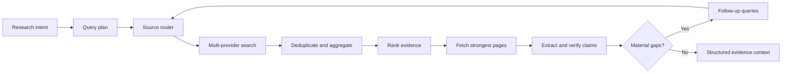

# Research and Evidence

## Purpose

The Research Agent handles questions that require current, sourced, multi-page knowledge. It is separate from Browser Runtime: research searches and fetches public information on the server, while browser capabilities interact with a user's visible authenticated session.

## Main Locations

| Location | Responsibility |
| --- | --- |
| [`internal/research/plan.go`](../../internal/research/plan.go) | Deterministic research-plan recognition and conversation refinement |
| [`internal/research/protocol.go`](../../internal/research/protocol.go) | Plans, observations, budgets, metrics, and protocol types |
| [`internal/research/agent_executor.go`](../../internal/research/agent_executor.go) | Stable dispatcher-facing Research Agent adapter |
| [`internal/research/decision`](../../internal/research/decision) | Intent analysis, query planning, gaps, follow-ups, synthesis advice |
| [`internal/research/searchsystem`](../../internal/research/searchsystem) | Source routing, providers, fetching, extraction, resilience |
| [`internal/research/evidence`](../../internal/research/evidence) | Aggregation, ranking, claims, conflicts, gaps, and cache |
| [`internal/research/evidence_context.go`](../../internal/research/evidence_context.go) | Bounded model context, answer validation, repair, and fallback |
| [`internal/dispatcher/research_advisor.go`](../../internal/dispatcher/research_advisor.go) | Optional bounded model advisor |

## Research Pipeline

## Plan Recognition

`research.Analyze` recognizes bounded task kinds:

| Kind | Typical request | Plan behavior |
| --- | --- | --- |
| News | "What happened today?" | Resolves current date and avoids asking for an already known day |
| Travel | Multi-day trip planning | Searches transport, weather, prices, and official details |
| Comparison | Product or technology choice | Combines official specifications and independent evidence |
| Procedure | Visa, licence conversion, government process | Treats identity, location, and current credential as constraints on one goal |
| Research | Explicit lookup, verification, source request, or seed URL | Uses official-source expansion and bounded synthesis |

Weather is intentionally not treated as a generic search phrase; it follows a location-aware capability path.

`AnalyzeConversation` carries short refinements such as a city, date, or travel preference into the prior research plan. This prevents a follow-up like "Tokyo" from becoming an unrelated new topic.

## Decision Layer

The decision package contains explicit roles:

| Role | Responsibility |
| --- | --- |
| Intent Analyzer | Confirm research class and constraints |
| Query Planner | Produce several source-aware queries |
| Gap Detector | Identify missing authority, diversity, freshness, or corroboration |
| Follow-up Planner | Create bounded next-round queries |
| Knowledge Synthesizer | Prepare an evidence-grounded answer plan |

V3 can consult the current request model as an advisor. Code still owns query IDs, provider allowlists, budgets, timeouts, source identities, and acceptance checks. Malformed model advice falls back to deterministic V2 behavior.

## Search System

The source router chooses providers based on the task:

| Source class | Best for |
| --- | --- |
| General public web | Broad discovery |
| GitHub | Repositories, releases, source, and technical implementation |
| Wikipedia | Stable orientation and entity disambiguation |
| arXiv | Research papers |
| News/GDELT | Time-sensitive news discovery |
| Direct fetch | User-provided or previously discovered URLs |

Provider calls are wrapped with timeout and circuit-breaker behavior. One provider failure produces a recorded partial failure; it does not necessarily abort the whole report. Request cancellation does abort the report.

Search results are filtered before fetching. The system should not download every discovered page. Authority, task relevance, freshness, domain diversity, and provider class determine the fetch order.

## Evidence Layer

The evidence pipeline:

1. normalizes and deduplicates URLs;
2. aggregates provider metadata;
3. ranks authority, relevance, freshness, and corroboration;
4. extracts bounded page content;
5. derives attributable claims;
6. detects contradictions;
7. records unresolved gaps;
8. computes confidence and a stop reason;
9. stores a reusable cache entry.

The final `research.Evidence` object contains sources, claims, contradictions, gaps, attempted queries, provider failures, observations, metrics, stop reason, and confidence.

## Budgets and Early Stop

Default budgets are bounded by configuration. Typical defaults permit up to six searches, eight page fetches, three rounds, and thirty seconds.

The agent stops early when it has enough:

- authoritative sources;
- independent domains;
- task-specific source classes;
- fresh evidence when required;
- corroboration for major claims;
- confidence to answer with disclosed limitations.

Budget exhaustion is a valid stop reason. It is not permission to hide evidence gaps.

## Research Cache

The evidence cache has memory and disk layers. Time-sensitive news uses a shorter lifetime than stable research. Cache keys include enough normalized plan information to prevent a different date or constraint from reusing an invalid report.

A cache hit remains evidence with provenance. It should be disclosed in metrics and can still be rejected if freshness requirements changed.

## Model Context and Answer Repair

`Evidence.ContextSection` serializes only ranked, bounded sources and wraps page content as untrusted evidence. It includes exact URLs, scores, claims, conflicts, gaps, metrics, and stop reason.

`NeedsRepair` detects narrow objective failures:

- empty answer;
- pseudo-tool markup;
- asking the user for sources already collected;
- omitting URLs when verified sources exist;
- replying in the wrong required language;
- asking for a news date already resolved;
- confusing news with weather.

The dispatcher can ask the model for one corrected answer. If a reliable synthesis still does not appear, `FallbackAnswer` returns a transparent source list and limitation rather than an empty result.

## Invariants

1. Search and browser interaction remain separate capability routes.
2. Raw pages are untrusted evidence.
3. Every synthesized factual claim should point to evidence IDs or disclose uncertainty.
4. Individual provider failures degrade; request cancellation propagates.
5. Search loops are budgeted and stop for an explicit reason.
6. A cached report preserves provenance and freshness semantics.
7. The model cannot invent source IDs or expand provider authority.

## Safe Extension Points

Add a search provider behind the `searchsystem` provider interface, assign its source class, add timeout/circuit behavior, normalize its result URLs, and test partial failure.

Add a research kind by defining deterministic recognition, constraints, source requirements, query templates, gap criteria, and answer validation together.

Improve ranking in the evidence package rather than sorting raw provider results inside the dispatcher.

## Tests

Plan tests cover intent recognition and refinements. Search-system tests cover providers and resilience. Evidence tests cover ranking, caching, gaps, and conflicts. Protocol and evidence-context tests protect budgets, safety wrapping, repair, and fallback behavior.
