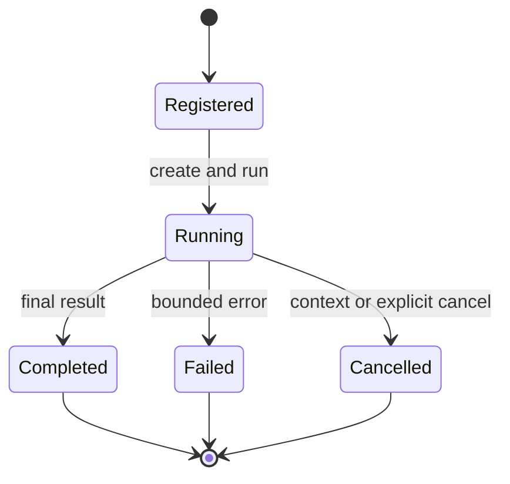

# Sub-Agents, Specialists, and Runtime Artifacts

## Purpose

These packages support delegation and reviewed reusable behavior without creating a second, weaker execution architecture. Every delegated execution must preserve the same capability, policy, observation, verification, and audit boundaries as the main agent.

## Main Locations

| Location | Responsibility |
| --- | --- |
| [`internal/subagent/sub_agent.go`](../../internal/subagent/sub_agent.go) | Configured Sub-Agent lifecycle and result |
| [`internal/subagent/sub_agent_manager.go`](../../internal/subagent/sub_agent_manager.go) | Registration, creation, task tracking, cancellation |
| [`internal/subagent/sub_agent_adapter.go`](../../internal/subagent/sub_agent_adapter.go) | ADK agent adapter |
| [`internal/subagent/agent_pool.go`](../../internal/subagent/agent_pool.go) | Bounded parallel Sub-Agent execution |
| [`internal/subagent/spawn_tool.go`](../../internal/subagent/spawn_tool.go) | Spawn, collect, list, cancel, and parallel-spawn tools |
| [`internal/subagent/delegate_tool.go`](../../internal/subagent/delegate_tool.go) | Synchronous delegation tool |
| [`internal/subagent/iteration_budget.go`](../../internal/subagent/iteration_budget.go) | Shared bounded iteration budget |
| [`internal/specialist/envelope.go`](../../internal/specialist/envelope.go) | Governed specialist admission envelope |
| [`internal/runtimeartifact/set.go`](../../internal/runtimeartifact/set.go) | Immutable reviewed skill/strategy artifact selection |

## Three Different Concepts

| Concept | Created by | Purpose | Authority behavior |
| --- | --- | --- | --- |
| Configured Sub-Agent | Request configuration | Reusable delegated agent profile | Receives only configured and admitted tools |
| Governed Specialist Run | Control plane using Athena DSO protocol | Execute a bounded delegated outcome | Capability and context subset only |
| Runtime Artifact | Reviewed build/manifest pipeline | Reuse declarative skill or strategy | Organizes admitted capabilities; grants none |

Do not use these names interchangeably. A Runtime Artifact is not an executing agent. A specialist envelope is an admission boundary, not an agent manager.

## Configured Sub-Agent Lifecycle

`SubAgentConfig` describes identity, instructions, model overrides, tools/capabilities, and execution bounds. The manager registers configurations and creates a fresh executing instance for a task.

The lifecycle is:



Synchronous delegation waits for the result. Asynchronous spawning returns a task ID; collect/list/cancel tools manage it. `AgentPool` runs several configured agents with a maximum concurrency bound.

The iteration budget is shared with the parent orchestration where appropriate. This prevents a parent and several children from multiplying an apparently small iteration limit into unbounded work.

## Sub-Agent Execution Rule

A Sub-Agent must use the same model-tool-observation-final loop as the main agent. It cannot bypass:

- capability resolution;
- input validation;
- risk and policy decisions;
- action identity and idempotency;
- device Observation;
- cancellation and timeout;
- final effect verification;
- trace and usage accounting.

Legacy convenience managers should be treated as adapters around this main chain, not as an independent authority path.

## Governed Specialist Envelope

`specialist.ParseContext` consumes reserved DSO context keys and validates:

- the immutable invocation manifest;
- the admitted capability view;
- the redacted context slice;
- the redacted payload hashes and byte count;
- references binding the manifest to the exact capability/context artifacts;
- capability availability;
- the current read-only specialist risk restriction.

The reserved objects are deleted from generic request context after parsing. Only the validated, rendered specialist context reaches the model.

`RestrictCapabilities` enforces subset semantics. If the request asks for a capability outside the admitted view, the run fails closed. The specialist cannot regain a capability omitted by the control plane.

External specialist evidence is labeled untrusted. Taint flags and content references remain visible in the rendered instruction.

## Runtime Artifacts

A runtime artifact bundle is carried under a reserved Athena protocol context key and pinned to an AgentBuild and RunManifest. `runtimeartifact.ParseContext` validates the immutable bundle and checks build/manifest identity against the request.

Artifacts contain human-reviewed declarative objects:

| Artifact | Purpose |
| --- | --- |
| Skill artifact | A task-graph template with required capabilities, preconditions, steps, and verification rules |
| Strategy artifact | Preference and fallback ordering among eligible skill artifacts |

`Set.Select` evaluates preconditions against request context and the already enabled capability set. Unknown predicates fail closed. Arbitrary regular expressions are not executed from artifact content.

Required capabilities are resolved only against available capabilities. The artifact cannot register a tool. If a requirement is missing, the skill is marked unavailable and its reason is retained.

The rendered artifact instruction tells the model that plans are reviewed guidance, not permission. It includes retry budgets, step dependencies, provider bindings, and verification expectations.

## Authority Monotonicity

The safe ordering is:

```text
platform registry authority
  -> request capability subset
  -> route capability subset
  -> specialist capability subset
  -> runtime artifact eligibility
  -> model-visible tool subset
```

Every arrow narrows or organizes authority. None expands it.

## Dynamic Specialist Architecture

The broader Athena design can create dynamic specialist proposals in a control plane, but Runtime should receive only admitted execution artifacts:

- immutable specialist manifest;
- redacted context slice;
- admitted capability view;
- lineage and task identity;
- policy decision and expiry;
- verification requirements.

Proposal generation, review, build promotion, Shadow, Canary, and rollback belong to governed orchestration services. Runtime is the enforcement point for an admitted run.

## Invariants

1. Delegation cannot grant additional capabilities.
2. A child run retains parent trace, task lineage, cancellation, and budgets.
3. A specialist sees only its redacted context slice.
4. Specialist capability views are immutable subsets.
5. Runtime artifacts are declarative and cannot execute generated code.
6. Artifact preconditions fail closed.
7. A delegated result is evidence for the parent, not automatically the parent's final answer.
8. Final outcome verification remains on the unified execution chain.

## Safe Extension Points

Add a Sub-Agent tool by keeping task IDs stable, honoring the shared budget, and returning a structured result rather than raw logs.

Add an artifact predicate by implementing deterministic bounded evaluation and tests for missing, malformed, and adversarial values. Never evaluate arbitrary source code or artifact-provided commands.

Extend specialist context only through the DSO protocol and hash-bound redaction metadata. Do not add an unvalidated generic map as an escape hatch.

## Tests

Specialist tests cover tampering, write-capability rejection, subset validation, and untrusted evidence rendering. Runtime artifact tests cover decoding, selection, rendering, and non-grant behavior. Dispatcher artifact and legacy Sub-Agent tests verify integration with the main chain.
