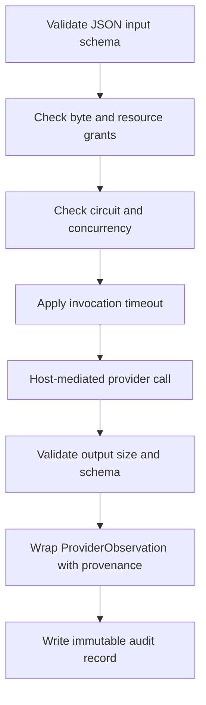

# Providers, Security, and Governance

## Purpose

Capability Providers allow independently distributed implementations to extend Runtime without giving an arbitrary package Runtime credentials, filesystem execution, or unbounded network access.

This is a plugin security system, not the `SKILL.md` loader in `internal/plugins`.

## Main Locations

| Location | Responsibility |
| --- | --- |
| [`internal/provider/loader.go`](../../internal/provider/loader.go) | Registry, package, signature, SBOM, scan, platform, and grant validation |
| [`internal/provider/manager.go`](../../internal/provider/manager.go) | Mediated invocation, network restrictions, resource bounds, circuit breaker |
| [`internal/provider/tool.go`](../../internal/provider/tool.go) | Eino tool adapter and schema validation |
| [`internal/provider/audit.go`](../../internal/provider/audit.go) | JSONL invocation audit sink |
| [`internal/provider/context.go`](../../internal/provider/context.go) | Owner/task provenance in context |
| [`internal/capability/registry.go`](../../internal/capability/registry.go) | Transactional external capability registration |

## Package Admission

Only registry entries with `ACTIVE` status are considered. A provider package must pass all checks before its capabilities become visible.

Admission validates:

1. safe provider and version path segments;
2. immutable `provider_id/version` package layout;
3. no symlink or executable-asset escape;
4. manifest digest matching the Registry entry;
5. strict manifest schema;
6. Registry permission and resource grants;
7. current OS/architecture support;
8. minimum Runtime version;
9. required SBOM;
10. signed asset payload digest;
11. trusted Ed25519 signing key;
12. machine scan report digest and validity;
13. provider health check;
14. transactional capability registration.

If one capability in a provider fails registration, that provider's external registrations are rolled back. Built-ins and unrelated providers remain intact.

Unsigned providers are forbidden. Setting `require_signature=false` does not create a development bypass; it makes provider loading fail.

## Registry Grants

The provider manifest declares requested behavior. The Registry entry grants a bounded subset. Effective authority comes from the grant, not from the package's wishes.

Grant classes include:

- exact network destinations;
- maximum input and output bytes;
- maximum memory envelope;
- maximum invocation time;
- maximum concurrency;
- declared read-only/risk floor;
- supported capabilities and observation contracts.

The loader validates that the manifest fits inside these grants.

## Mediated Execution

Runtime invokes an admitted provider through `Manager.invoke`:

For HTTP JSON providers, Runtime owns the HTTP client. The restricted client prevents private-network resolution, redirects outside granted destinations, and unbounded response bodies. Providers do not receive Runtime API keys by default.

The output is wrapped in a stable ProviderObservation containing provider, version, capability, observation contract, data, manifest digest, invocation ID, and trace ID.

## Circuit Isolation

Repeated provider failures open a provider-local circuit for a cooling period. This prevents one unhealthy extension from consuming every request timeout or destabilizing built-ins.

The circuit state belongs to a provider version. It must not disable unrelated providers or the complete capability family.

## Invocation Audit

Each attempt records:

- invocation, provider, version, and capability IDs;
- owner, task, and trace identity;
- permission and resource snapshots;
- manifest and input hashes;
- start, finish, and elapsed time;
- status and classified error;
- output/observation hashes and observation reference.

The audit sink is required. If Runtime cannot persist the audit outcome, invocation completion reports that failure rather than silently creating unaudited extension activity.

Audit records store hashes and metadata, not secret values.

## Threat Model

The boundary assumes a provider package may be buggy or malicious. It protects against:

- package path traversal and symlink escape;
- unsigned or modified assets;
- Registry privilege expansion;
- hidden executable payloads;
- server-side request forgery;
- redirect escape;
- private-network probing;
- oversized input/output;
- excessive concurrency and runtime;
- malformed schema output;
- panic propagation;
- audit omission.

It does not make unsafe capability semantics safe. A high-risk capability still needs correct policy and user approval even when its package is signed.

## Reload Behavior

The loopback-only admin endpoint can reload providers. Reload removes previous external registrations, validates the current Registry, and reports loaded and rejected identities. A rejected package is visible in the report and logs; it is not partially activated.

## Invariants

1. Signature and trust verification are mandatory.
2. The Registry grant is the upper authority bound.
3. Registration is transactional per provider.
4. Provider execution is mediated and resource-bounded.
5. Private-network and redirect escape fail closed.
6. Input and output schemas are enforced at runtime.
7. Every invocation has provenance and an audit outcome.
8. Provider failure isolation does not remove built-in capability availability.

## Safe Extension Points

Add a new provider runtime kind only with an explicit isolation model, grant mapping, timeout/cancellation semantics, output validation, and audit fields. Do not add arbitrary local process execution as a convenience runtime.

Add a grant field in the shared Athena protocol first, then validate it in loader and invocation paths and include it in audit snapshots.

## Tests

Loader tests should cover tampered manifests, keys, assets, SBOMs, scan reports, platform/version mismatch, grant expansion, unsafe paths, and rollback. Manager tests should cover schema validation, network restrictions, resource bounds, circuit behavior, panic isolation, and audit failures.
