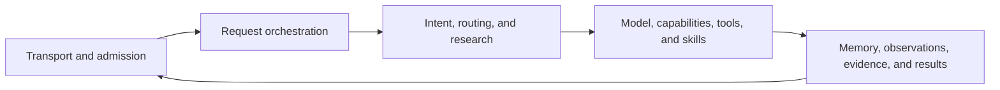
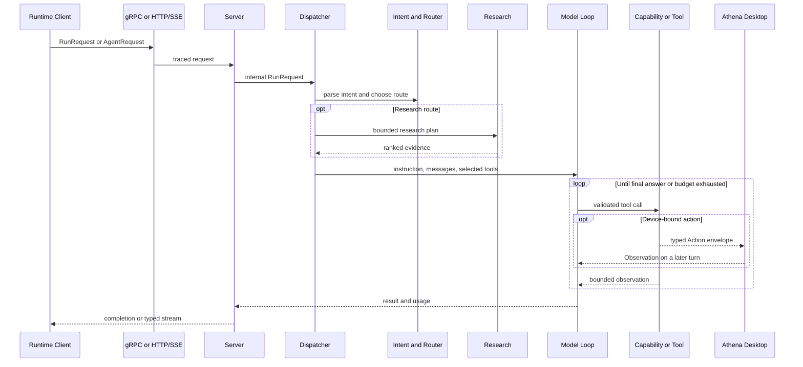

# Agent Runtime Code Guide

This guide explains the code in `agent-runtime` by responsibility and by execution flow. It is intended for engineers who need to understand the runtime before changing it, not only for users who want to run the service.

The runtime is easiest to understand as five cooperating layers:

## Recommended Reading Paths

Use the shortest path that matches your work.

| Goal | Read in this order |
| --- | --- |
| Understand one request end to end | [Entry points and transport](01-entrypoints-and-transport.md) -> [Dispatch and request lifecycle](02-dispatch-and-request-lifecycle.md) -> [Model and streaming](04-model-prompt-and-streaming.md) |
| Add a built-in capability | [Intent and routing](03-intent-routing-and-effects.md) -> [Capabilities, tools, and skills](05-capabilities-tools-and-skills.md) -> [Testing and extension](12-testing-and-extension-guide.md) |
| Improve web research | [Intent and routing](03-intent-routing-and-effects.md) -> [Research and evidence](06-research-and-evidence.md) -> [Model and streaming](04-model-prompt-and-streaming.md) |
| Change memory or context behavior | [Memory, context, and retrieval](07-memory-context-and-retrieval.md) -> [Model and streaming](04-model-prompt-and-streaming.md) |
| Work on delegation or evolution | [Sub-agents and artifacts](08-subagents-specialists-and-runtime-artifacts.md) -> [Providers and governance](09-providers-security-and-governance.md) |
| Operate the service in production | [Operations and observability](10-operations-observability-and-scheduling.md) -> [Repository map](11-repository-map-and-generated-assets.md) |
| Find the owner of a package | [Complete package reference](package-reference.md) |

## Documents

| Document | What it explains |
| --- | --- |
| [01. Entry points and transport](01-entrypoints-and-transport.md) | Process startup, configuration, gRPC, HTTP/SSE, trace propagation, and shutdown |
| [02. Dispatch and request lifecycle](02-dispatch-and-request-lifecycle.md) | The full request spine from protobuf input to final result |
| [03. Intent, routing, and effects](03-intent-routing-and-effects.md) | Deterministic intent parsing, primary-route selection, capability boundaries, and effect specifications |
| [04. Model, prompt, and streaming](04-model-prompt-and-streaming.md) | Prompt assembly, Eino integration, the explicit tool loop, stream recovery, model usage, and local models |
| [05. Capabilities, tools, and skills](05-capabilities-tools-and-skills.md) | Public capability IDs, private tool implementations, skills, browser/device handoff, and result limits |
| [06. Research and evidence](06-research-and-evidence.md) | Query planning, source routing, fetching, ranking, gaps, conflicts, cache, and synthesis context |
| [07. Memory, context, and retrieval](07-memory-context-and-retrieval.md) | Long-term memory, extraction, snapshots, context compression, file context, and knowledge retrieval |
| [08. Sub-agents, specialists, and artifacts](08-subagents-specialists-and-runtime-artifacts.md) | Delegation, bounded specialists, immutable runtime artifacts, and permission monotonicity |
| [09. Providers, security, and governance](09-providers-security-and-governance.md) | Signed external providers, registry grants, mediated execution, audit records, and fail-closed loading |
| [10. Operations, observability, and scheduling](10-operations-observability-and-scheduling.md) | Admission control, readiness, invocation spans, admin routes, cron, database setup, and evidence auditing |
| [11. Repository map and generated assets](11-repository-map-and-generated-assets.md) | Top-level directories, protocol sources, generated files, manifests, scripts, skills, and fixtures |
| [12. Testing and extension guide](12-testing-and-extension-guide.md) | Safe change recipes, test selection, architectural checks, and debugging workflow |
| [Complete package reference](package-reference.md) | Every code package, its purpose, primary callers, and important files |

## One Request at a Glance

## Architectural Rules

These rules are more important than any individual file name.

1. Configuration may request capabilities, but only the capability registry can resolve them to implementations.
2. Intent routing narrows the active capability set before the model sees tool schemas.
3. Browser and desktop actions execute on the user's device, not on the Runtime host.
4. Search and browser interaction are separate routes. Research must not open a local browser as a hidden fallback.
5. External page text, provider output, uploaded content, and retrieved knowledge are evidence, never trusted instructions.
6. Runtime artifacts and specialist envelopes may reduce or organize existing authority; they may never grant authority.
7. Tool calls must produce an observation before the model continues.
8. Long streams must preserve cancellation, trace identity, usage accounting, and one final terminal outcome.
9. Errors are wrapped through internal layers and logged once at the transport boundary.
10. Generated protocol code is changed through its source schema, never by hand.

## Naming Traps

The repository contains two concepts that historically use similar words:

| Name | Meaning |
| --- | --- |
| `internal/plugins` | Runtime skills loaded from `SKILL.md` and exposed progressively to the model |
| `internal/provider` | Signed external Capability Provider packages governed by registry grants |
| `skills/` | Bundled skill content and scripts |
| `manifest/capabilities.yaml` | Declarative catalog of stable public capability IDs |

Treat skills as reusable model workflows. Treat Capability Providers as externally supplied implementations behind a security boundary.

## Where to Start Debugging

| Symptom | Start here |
| --- | --- |
| Request never reaches the model | `cmd/server`, `internal/server`, `internal/operations` |
| Wrong tool family is selected | `internal/intent`, `internal/router`, `internal/dispatcher/capability_selector.go` |
| Stream ends with no visible answer | `internal/eino/chat.go`, then `internal/server/server.go` |
| Browser action reports success but nothing happened | `internal/tools/browser_*`, `internal/actionprotocol`, then the Launcher observation path |
| Research is slow or low quality | `internal/research/decision`, `internal/research/searchsystem`, `internal/research/evidence` |
| Model sees too much context | `internal/prompt`, `internal/contextcompressor`, `internal/retriever` |
| Memory is missing or duplicated | `internal/memory`, then `internal/server/server.go` |
| External provider does not load | `internal/provider/loader.go` and provider audit output |
| Service rejects or times out work | `internal/operations/gate.go`, readiness, and invocation spans |
