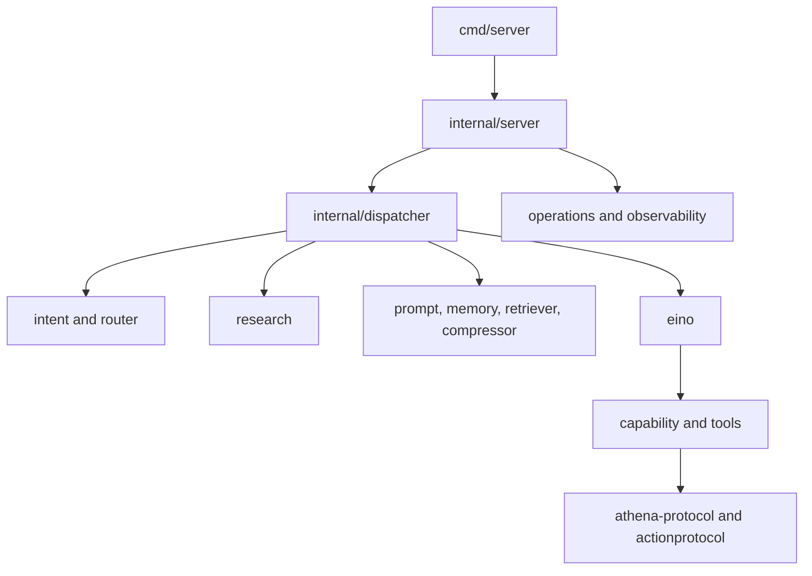

# Complete Package Reference

This reference maps every Go package in `agent-runtime` to its role, primary callers, and most useful starting files. Read the subsystem guides for behavior and invariants; use this page to locate ownership quickly.

## Executable Packages

| Package | Purpose | Primary collaborators | Start with |
| --- | --- | --- | --- |
| `cmd/server` | Compose and run the production gRPC and HTTP/SSE service | config, server, dispatcher, operations, provider, readiness, admin | [`main.go`](../../cmd/server/main.go) |
| `cmd/client` | Minimal gRPC client and executable example | generated Runtime client | [`main.go`](../../cmd/client/main.go) |
| `cmd/v03-evidence-audit` | Scan release evidence and archives for governance violations | evidenceaudit | [`main.go`](../../cmd/v03-evidence-audit/main.go) |

## Transport and Orchestration

| Package | Purpose | Called primarily by | Start with |
| --- | --- | --- | --- |
| `internal/server` | Implement Runtime RPCs, map requests, resolve models/memory, stream results | `cmd/server` | [`server.go`](../../internal/server/server.go), [`dispatch.go`](../../internal/server/dispatch.go) |
| `internal/dispatcher` | Orchestrate one run: route, select, research, prompt, compact, model loop, repair | server | [`dispatcher.go`](../../internal/dispatcher/dispatcher.go) |
| `internal/types` | Define transport-neutral request, response, model, skill, file, and capability DTOs | server, dispatcher, tools, plugins | [`types.go`](../../internal/types/types.go) |
| `internal/actionprotocol` | Create and parse typed Athena Action envelopes | dispatcher, browser/desktop tools | [`protocol.go`](../../internal/actionprotocol/protocol.go) |
| `internal/effectspec` | Express browser target resolution and effect/postcondition semantics | dispatcher and browser paths | [`browser.go`](../../internal/effectspec/browser.go) |

### `internal/server`

Owns the network-facing application boundary after transport admission. It should contain RPC semantics and mapping, not capability-specific business logic.

Important responsibilities:

- resolve request model configuration and trace context;
- load and snapshot memory scope;
- build a per-run dispatcher;
- consume completions or streams;
- aggregate usage and response metadata;
- trigger background memory review;
- map internal errors and results to protocol output.

### `internal/dispatcher`

Owns sequencing, not implementation details. Most additions should be a small preparation stage that delegates to another package.

Important files:

| File | Role |
| --- | --- |
| `dispatcher.go` | Main `Run` and `RunStream` lifecycle |
| `capability_selector.go` | Relevance-based capability narrowing |
| `tools.go` | Build selected tool adapters |
| `skills.go` | Discover and select skills |
| `compact.go` | Apply context compression |
| `direct_browser.go` | Deterministic browser fast path |
| `capability_handoff.go` | Client Action/Observation continuation |
| `research_advisor.go` | Bounded model advice for research |

## Intent and Decision Packages

| Package | Purpose | Called primarily by | Start with |
| --- | --- | --- | --- |
| `internal/intent` | Parse the latest complete user request into deterministic domain/mode/signals | dispatcher, router | [`types.go`](../../internal/intent/types.go), [`parser.go`](../../internal/intent/parser.go) |
| `internal/router` | Choose primary route, fallbacks, allowed and excluded capability families | dispatcher | [`policy.go`](../../internal/router/policy.go), [`router.go`](../../internal/router/router.go) |
| `internal/language` | Resolve explicit response language and frontend locale | prompt, research | [`resolve.go`](../../internal/language/resolve.go) |

Keep authorization-relevant routing deterministic. Model-generated advice may refine bounded plans but should not replace route policy.

## Model and Prompt Packages

| Package | Purpose | Called primarily by | Start with |
| --- | --- | --- | --- |
| `internal/eino` | Adapt models to Eino, execute explicit model/tool loops, filter streams, collect usage | dispatcher, subagent, plugins | [`chat.go`](../../internal/eino/chat.go) |
| `internal/prompt` | Assemble authority-aware system and context sections | dispatcher | [`builder.go`](../../internal/prompt/builder.go), [`sections.go`](../../internal/prompt/sections.go) |
| `internal/contextcompressor` | Detect context pressure and coordinate message compaction | dispatcher | [`compressor.go`](../../internal/contextcompressor/compressor.go), [`integration.go`](../../internal/contextcompressor/integration.go) |
| `internal/contextcompressor/compactors` | Implement micro, partial, and full compaction strategies | contextcompressor | [`micro.go`](../../internal/contextcompressor/compactors/micro.go), [`partial.go`](../../internal/contextcompressor/compactors/partial.go), [`full.go`](../../internal/contextcompressor/compactors/full.go) |
| `internal/contextcompressor/prompt` | Format summary requests and compacted state | compactors | [`templates.go`](../../internal/contextcompressor/prompt/templates.go) |

### `internal/eino`

Important files:

| File | Role |
| --- | --- |
| `chat.go` | Client construction, generate, stream, explicit tool continuation |
| `model_observability.go` | Timed model spans and stream diagnostics |
| `model_usage.go` | Model identity and usage collection |
| `local_runtime.go` | Ollama-compatible local lifecycle |
| `tool_markup.go` | Compatibility parsing for textual tool calls |

Do not place intent policy or provider-specific research inside this package. It should execute the already prepared run.

## Capability, Tool, Skill, and Provider Packages

| Package | Purpose | Called primarily by | Start with |
| --- | --- | --- | --- |
| `internal/capability` | Stable public capability catalog and implementation registry | dispatcher, server, provider, specialist | [`catalog.go`](../../internal/capability/catalog.go), [`registry.go`](../../internal/capability/registry.go) |
| `internal/tools` | Built-in private Eino tool implementations | capability registry, dispatcher | [`registry.go`](../../internal/tools/registry.go), [`builder.go`](../../internal/tools/builder.go) |
| `internal/plugins` | Discover, select, and execute `SKILL.md` workflows | dispatcher | [`loader.go`](../../internal/plugins/loader.go), [`skill.go`](../../internal/plugins/skill.go) |
| `internal/provider` | Admit and mediate signed external Capability Providers | `cmd/server`, capability registry | [`loader.go`](../../internal/provider/loader.go), [`manager.go`](../../internal/provider/manager.go) |

### `internal/tools`

| Files | Responsibility |
| --- | --- |
| `base.go`, `registry.go`, `builder.go`, `tools.go` | Shared contracts, metadata, validation, construction |
| `glob.go`, `grep.go`, `file_read.go`, `file_edit.go`, `file_write.go`, `bash.go` | Project-scoped filesystem and command tools |
| `web_search.go`, `web_fetch.go` | Server-side public web tools |
| `browser_public.go`, `browser_request.go`, `browser_automation.go`, `browser_auth.go` | Browser Action/Observation tools |
| `desktop_action.go` | User-device desktop handoff |
| `image_generation.go`, `video_generation.go`, `diffusers_worker.go` | Media generation |
| `plan_mode.go`, `task.go`, `question.go`, `sleep.go` | Planning and interaction |
| `scheduled_task.go`, `persistent_goal.go` | Governed durable work creation |
| `result_limiter.go` | Bound tool observations before model continuation |

### `internal/plugins`

Despite the historical package name, this package owns skills. It does not admit signed binary/network Capability Providers.

| File | Responsibility |
| --- | --- |
| `dirs.go` | Resolve skill directories |
| `loader.go` | Merge request and discovered skills |
| `skill.go` | SkillRunner and sandbox/model execution |
| `skill_config.go` | Skill configuration |
| `skill_planner.go`, `skill_generator.go` | Progressive skill planning/generation helpers |
| `skill_csv_data_analysis.go`, `skill_pptx.go` | Specialized deterministic integrations |

### `internal/provider`

| File | Responsibility |
| --- | --- |
| `loader.go` | Registry, trust, package, SBOM, scan, platform, and signature validation |
| `manager.go` | Resource-bounded invocation and circuit isolation |
| `tool.go` | Model-safe tool schema adapter |
| `audit.go` | Immutable JSONL invocation audit |
| `context.go` | Owner and task provenance |

## Research Packages

| Package | Purpose | Called primarily by | Start with |
| --- | --- | --- | --- |
| `internal/research` | Stable Research Agent facade, deterministic plan, protocol, and evidence context | dispatcher | [`plan.go`](../../internal/research/plan.go), [`agent_executor.go`](../../internal/research/agent_executor.go) |
| `internal/research/decision` | Query planning, gap detection, follow-up planning, synthesis advice | research executor | [`agent.go`](../../internal/research/decision/agent.go), [`v3.go`](../../internal/research/decision/v3.go) |
| `internal/research/searchsystem` | Provider routing, searching, fetching, extraction, timeout, circuit breaker | decision/research executor | [`system.go`](../../internal/research/searchsystem/system.go), [`providers.go`](../../internal/research/searchsystem/providers.go) |
| `internal/research/evidence` | Deduplicate, rank, derive claims, detect conflicts/gaps, and cache reports | research executor | [`pipeline.go`](../../internal/research/evidence/pipeline.go), [`cache.go`](../../internal/research/evidence/cache.go) |

The root research package is the dispatcher-facing API. Provider details should stay in `searchsystem`; evidence quality logic should stay in `evidence`.

## State and Retrieval Packages

| Package | Purpose | Called primarily by | Start with |
| --- | --- | --- | --- |
| `internal/memory` | Scoped durable memory, extraction, snapshots, and background review | server, prompt | [`store.go`](../../internal/memory/store.go), [`extractor.go`](../../internal/memory/extractor.go) |
| `internal/retriever` | Retrieve knowledge-base and file context for one run | dispatcher | [`retriever.go`](../../internal/retriever/retriever.go), [`retriever_file.go`](../../internal/retriever/retriever_file.go) |
| `internal/database` | Build the configured GORM/PostgreSQL connection | `cmd/server` | [`database.go`](../../internal/database/database.go) |

Memory owns durable user/agent history. Retriever owns transient external context. Database owns connection construction, not all schemas.

## Delegation and Governed Artifact Packages

| Package | Purpose | Called primarily by | Start with |
| --- | --- | --- | --- |
| `internal/subagent` | Configured delegated agent lifecycle, task tools, pool, and shared budget | dispatcher/Eino tools | [`sub_agent.go`](../../internal/subagent/sub_agent.go), [`sub_agent_manager.go`](../../internal/subagent/sub_agent_manager.go) |
| `internal/specialist` | Validate a bounded DSO specialist invocation envelope and capability subset | dispatcher | [`envelope.go`](../../internal/specialist/envelope.go) |
| `internal/runtimeartifact` | Validate and select reviewed declarative skills/strategies pinned by RunManifest | dispatcher | [`set.go`](../../internal/runtimeartifact/set.go) |

Sub-Agent code executes work. Specialist code validates admission. Runtime artifact code selects reviewed planning guidance. None may expand the capability set.

## Operations and Governance Packages

| Package | Purpose | Called primarily by | Start with |
| --- | --- | --- | --- |
| `internal/config` | Defaults, YAML loading, relative-path resolution, environment overrides, DB DSN | `cmd/server` | [`config.go`](../../internal/config/config.go) |
| `internal/constant` | Shared route names, defaults, limits, and environment keys | most infrastructure packages | [`constant.go`](../../internal/constant/constant.go) |
| `internal/operations` | Admission gate, deadlines, queueing, drain, health, and SLO snapshots | `cmd/server`, transports | [`gate.go`](../../internal/operations/gate.go), [`transport.go`](../../internal/operations/transport.go) |
| `internal/observability` | Structured start/end/elapsed invocation spans | model, tools, provider, research | [`invocation.go`](../../internal/observability/invocation.go) |
| `internal/readiness` | Production and GA readiness checks | `cmd/server` | [`report.go`](../../internal/readiness/report.go) |
| `internal/admin` | Loopback-only config, restart, local model, and provider reload HTTP handlers | `cmd/server` | [`handler.go`](../../internal/admin/handler.go) |
| `internal/cron` | Cron parser, task persistence, scheduler, and model-facing loop tools | tools/dispatcher and process lifecycle | [`scheduler.go`](../../internal/cron/scheduler.go), [`tasks.go`](../../internal/cron/tasks.go) |
| `internal/evidenceaudit` | Scan release evidence and archives without exposing secret values | audit command and gate scripts | [`scanner.go`](../../internal/evidenceaudit/scanner.go) |

## Generated and Compatibility Packages

| Package/path | Purpose | Edit policy |
| --- | --- | --- |
| `gen/agent/runtime/v1` | Generated Go client/server and message types for Runtime protobuf | Regenerate from `proto`, never hand edit |
| `third_party/google/protobuf` | Vendored protobuf schema dependencies | Preserve upstream source and notices |
| `pkg/errtrace` | Empty compatibility placeholder after error tracing moved to shared `logx` | Do not add a second error system without an explicit public API decision |

## Dependency Direction

The intended dependency direction is:

Infrastructure packages should not import `cmd`. Lower-level tool implementations should not call server handlers. Shared cross-repository contracts belong in protobuf or `athena-protocol`, not in an arbitrary `internal` package.

## Ownership Questions

Use these decisions when a change could fit several packages:

| Question | Owner |
| --- | --- |
| What did the user ask? | `intent` |
| Which route and capability families are allowed? | `router` |
| Which available capabilities are relevant now? | `dispatcher` selector |
| What stable authority exists? | `capability` |
| How is one operation executed? | `tools` or signed `provider` |
| How should the model perform a reusable workflow? | `plugins` skill |
| How does the model/tool loop continue? | `eino` |
| How is public evidence collected and judged? | `research` packages |
| What context is durable? | `memory` |
| What context is fetched for this run? | `retriever` |
| Can a request enter and how is it timed? | `operations` and `observability` |
| Can a specialist or artifact use this authority? | `specialist` and `runtimeartifact` subset checks |
