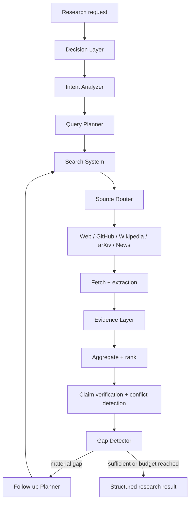

# Research Agent Architecture v2

Research Agent v2 is the code-owned research path used before model answer generation. It separates decisions, public-information capabilities, and evidence processing so a model cannot create an unbounded or unverifiable browsing loop.

## Layers

The Decision Layer owns intent, query planning, gap detection, follow-up planning, and stop decisions. The Search System only discovers and retrieves public information. The Evidence Layer owns canonicalization, ranking, claims, conflicts, and public-evidence caching.

## Provider Registry

| Provider | Source class | Authentication | Fallback |
| --- | --- | --- | --- |
| Public web | General and scoped web | None | None |
| GitHub REST search | Software repositories | Optional token | Scoped public-web query |
| Wikipedia API | General reference | None | Public web |
| arXiv Atom API | Academic papers | None | Scoped public-web query |
| GDELT DOC API | Current news | None | Scoped public-web query |

Each Provider has an independent timeout and circuit breaker. Repeated failures open only that Provider's circuit; other Providers continue. Provider responses are converted to a common `Hit` contract before candidate filtering and fetching.

## Evidence Policy

Evidence is ranked by authority, task relevance, real publication time when available, and cross-source corroboration. Fetch time is never treated as publication time. Similar claims with opposite polarity are conflicts, not corroboration. Technical research can require GitHub evidence; academic tasks can require an academic source.

The structured result includes ranked sources, attributable claims, unresolved conflicts, remaining gaps, confidence, stop reason, and budget usage. Raw page content is bounded and explicitly labeled untrusted before entering model context.

## Budgets and Cache

Defaults are six Provider searches, eight fetched pages, three research rounds, and thirty seconds. The loop stops early when evidence is sufficient. User cancellation remains fatal; individual source failures produce partial evidence.

Public evidence uses a process-memory hot cache backed by atomic JSON files. News defaults to a five-minute TTL and other research to one hour. Authenticated Browser Runtime content, credentials, cookies, and private pages must never enter this cache.

## Search and Browser Boundary

Search System is stateless and public: query, discover, fetch, filter, rank, and cite. Browser Runtime is stateful and interactive: login, click, type, CAPTCHA or 2FA handoff, download, and continued control of an existing page. Search may hand a selected URL to Browser Runtime, but it does not inherit browser credentials or sessions.
