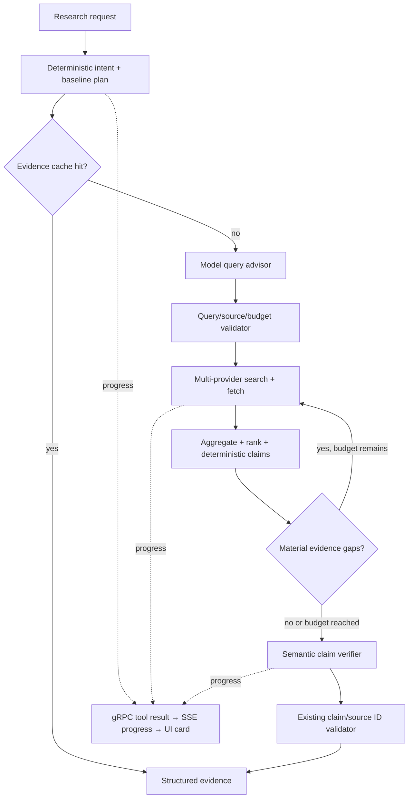

# Research Agent Architecture v3

[English](#english) | [简体中文](#简体中文)

## English

Research Agent v3 adds model-assisted query planning, semantic claim verification, and live progress reporting to the deterministic V2 pipeline. The model is an advisor, not the executor or policy authority.



### Safety and degradation

- The deterministic planner always creates the baseline plan first.
- Advisor queries are accepted only when their source is one of `general`, `official`, `github`, `academic`, or `news`, their text is bounded, they are not duplicates, and query budget remains.
- Semantic reviews can reference only claim IDs and source IDs already present in the evidence report. Invented references and unknown verdicts are ignored.
- Advisor timeout, malformed JSON, unsupported model behavior, or model failure records a source failure and falls back to the V2 result instead of failing the request.
- Cached evidence is checked before model advice, so cache hits spend no planner or verifier tokens.
- Advisor token usage is included in final prompt, completion, and total token accounting.

### Progress protocol

Runtime emits `ToolResultEvent` with `tool=research.progress`. Runtime Client promotes that compatibility event to the existing `progress` SSE type. A stable `research-<trace_id>` action ID updates one UI card through these stages:

`intent → planning → planned → searching → ranking → gap_analysis → verifying → synthesizing → complete`

The event contains percentage, round, attempted query count, source count, confidence, and completion state. Existing clients still see a valid tool result; V3 clients render a live research card.

### Configuration

```yaml
research:
  model_planning: true
  semantic_verification: true
  advisor_timeout_sec: 8
  max_advisor_claims: 8
```

Search, fetch, round, page, provider timeout, circuit breaker, and cache limits remain controlled by the V2 configuration.

## 简体中文

Research Agent v3 在 V2 的确定性研究流水线上增加了模型辅助查询规划、语义主张核验和实时进度展示。模型只担任顾问，不负责执行，也不能改变预算和安全策略。

### 核心规则

- 规则规划器始终先生成安全基线，模型只能补充剩余查询。
- 模型查询必须属于允许的来源类型、未重复、长度合规且未超过查询预算。
- 语义核验只能引用报告中已经存在的 `claim_id` 和 `source_id`，模型虚构的引用会被直接丢弃。
- 模型超时、返回非 JSON、能力不兼容或调用失败时自动降级到 V2，不会导致整次研究失败。
- 缓存命中发生在模型增强之前，因此不会重复消耗规划和核验 token。
- Advisor 的 token 会计入最终请求用量。

Runtime 通过兼容的 `research.progress` ToolResult 发送进度，Runtime Client 将其转换为现有 `progress` SSE。前端用稳定的 `research-<trace_id>` 更新同一张研究卡，展示阶段、百分比、轮次、查询数、来源数和置信度。旧客户端仍能把它作为普通工具结果处理，不会因协议升级而无法构建。
